# Paideia Agent

[English](README.md) | [한국어](README.ko.md)

Paideia Agent is a local-first AI talent foundry and agent runtime. It is designed to raise an AI talent through staged education, assessments, memory formation, work experience, and review, then package that talent as an installable local agent.

The project takes inspiration from modern agent systems such as [Hermes Agent](https://github.com/NousResearch/hermes-agent) and [OpenClaw](https://github.com/openclaw/openclaw), but its center of gravity is different: Paideia starts with education before agency. An agent is not just a prompt profile. It is the hired runtime form of a trained local AI talent.

> Research preview: this repository contains program code, public metadata, test fixtures, and documentation. Private training outputs, local memories, personal data, model checkpoints, and generated run artifacts stay outside the source tree.

## 3-Minute Offline Demo

Use this path when you want to verify the current MVP without API keys, private files, or network calls:

```powershell
python -m pip install -e ".[dev]"
$env:PYTHONPATH = "src"
ai22b-talent-foundry doctor-first-run --repo-root . --strict --output runs/first_run_doctor.json
ai22b-talent-foundry start-console --answers examples/graham_junior_onboarding.answers.json
```

The expected first-run result is a public-safe doctor report plus a Graham Junior onboarding session. This verifies the current core path: LLM/service choice, Graham-inspired curriculum selection, assessment and Reasoning Ledger packaging, hiring dossier/agent-kit readiness checks, and local runtime smoke tests. The demo uses the deterministic local engine unless you explicitly configure a live provider later.

## Current Public Preview

The GitHub `main` branch now contains the installable Paideia Agent preview:

- OpenClaw-style onboarding that asks the owner to choose an LLM service, chat surface, role-model curriculum, skill-migration posture, storage policy, runtime mode, and Agent ID policy.
- A directly testable Graham Junior securities-research sample plus additional role-model process tracks for software engineering, data analysis, cybersecurity, marketing, education, healthcare operations, management, legal/compliance research, blockchain protocol research, SRE, deep research, and accounting controls.
- Agent_warrent / Agent ID Card local export support, with manual owner-controlled registration only. Paideia prepares reviewed connector files but does not sign, upload, or register by itself.
- Hermes/OpenClaw/generic skill migration into a quarantined compatibility profile. Imported skills stay disabled until the owner reviews required capabilities and test evidence.
- Parent-controlled projection swarm cycles. A hired talent can split work into task projections, compare them on `projection_synthesis_board`, and promote only the reviewed parent synthesis into the learning ledger.
- Public-safe release gates: package install doctor, first-run doctor, public release readiness audit, source hygiene script, action-policy eval, LLM adapter contracts, and the full regression suite.

## Origin

Paideia Agent starts from a simple question: what if an AI agent could extend you, or what if a field role model's learning path could become the curriculum for a local AI talent that helps you work?

The project does not claim to clone real people. It reconstructs sourced growth conditions, curricula, tests, stress, failure, feedback, and work practice so each talent can form a reviewable Reasoning Ledger before it is hired as an agent.

Read the longer manifesto:

- [Project Manifesto](docs/project_manifesto.md)
- [프로젝트 선언문](docs/project_manifesto.ko.md)

Planning and contribution documents:

- [Roadmap](ROADMAP.md)
- [Contributing](CONTRIBUTING.md)
- [Security Threat Model](docs/security_threat_model.md)
- [Artifact Schema Inventory](schemas/README.md)

## What Makes It Different

Most agent runtimes begin with an assistant and add tools, memory, channels, and skills. Paideia begins with a curriculum:

- **Raise first, hire later**: a talent passes through growth records, courses, exams, reports, and review gates before becoming an agent.
- **Memory substrate, not full transcript replay**: the runtime selects bounded summaries, learning records, and procedural cues instead of injecting every old conversation.
- **Reasoning Ledger / Ariadne Thread**: a reviewable ledger of hypotheses, evidence, mistakes, corrected principles, study habits, and work patterns. It is not hidden chain-of-thought. The internal compatibility artifact is still named `reasoning_kibo.jsonl`.
- **Developmental Ecology / Life Trace / Growth Profile**: synthetic family climate, peer conflict, ordinary conversation, stress recovery, school life, aesthetic exposure, and domain curiosity are condensed into relationship, emotion, culture, aesthetic, and asymmetry memory.
- **Graduate package**: a raised talent can export an agent resume, transcript, memory pack, runtime manifest, and onboarding prompt before being used as an installable agent.
- **Role-model process replication**: a role model contributes sourced learning conditions and curriculum pressure, not a preloaded personality or worldview.
- **Parent-controlled projection swarm**: one hired talent can split work into task projections, synthesize their findings, and promote only reviewed learning back into the parent record.
- **Local-first ownership**: the owner keeps private data, generated memories, voice assets, local curricula, and installed agent bundles on their own machine.
- **Safe skill migration**: Hermes/OpenClaw/generic skills can be imported, but they are quarantined and disabled until reviewed.

## Bundled Role Models

The first deep track is still the directly testable Graham Junior sample:

```text
domain: securities_research
role_model: graham_value_investing
sample talent: grham-junior
```

This track is inspired by Benjamin Graham's publicly documented learning and value-investing lineage. It does not try to impersonate Graham, forecast markets from his birth data, or inject Graham-like conclusions. Instead, it reconstructs an educational path:

1. high-school foundations,
2. university-level finance, accounting, economics, and statistics,
3. graduate securities analysis, value investing, behavioral finance, and quant analysis,
4. doctoral-level research projects,
5. exams and reports that shape the talent's Reasoning Ledger over time.

Copyrighted textbooks are stored as metadata and reading plans only unless the owner provides a lawful local private copy.

The onboarding catalog now also includes selectable public-metadata role-model tracks for common agent use cases:

| Domain | Role model process | Good first agent use |
| --- | --- | --- |
| `software_agent_engineering` | `hopper_software_tooling`, `dijkstra_verified_programming` | coding, debugging, tool-building, correctness review |
| `data_analysis_bi` | `tukey_data_analysis` | data profiling, BI, experiment analysis |
| `customer_support_quality_ops` | `deming_quality_ops` | support quality, process improvement, incident learning |
| `cybersecurity` | `anderson_security_engineering` | threat modeling, security review, privacy/risk analysis |
| `marketing_sales` | `ogilvy_research_copywriting` | customer research, campaign briefs, copy testing |
| `healthcare_operations` | `nightingale_healthcare_statistics` | healthcare operations and safety dashboards, not medical advice |
| `education_tutoring` | `montessori_learning_design` | tutoring design, learner diagnosis, adaptive curriculum |
| `management_productivity` | `drucker_management_knowledge_work` | management memos, decision support, productivity systems |
| `legal_compliance_research` | `ginsburg_legal_research` | legal/compliance research summaries, not legal advice |
| `blockchain_protocol_research` | `finney_blockchain_protocol` | protocol research, wallet-safety review, not investment advice |
| `information_systems_research` | `shannon_information_theory` | information theory, compression, uncertainty modeling |
| `devops_sre_incident_response` | `hamilton_reliability_incident_response` | DevOps on-call, SRE incident review, reliability postmortems |
| `deep_research_knowledge_work` | `bush_deep_research_memex` | deep research, citation trails, knowledge synthesis |
| `finance_accounting_operations` | `washington_wylie_accounting_controls` | accounting operations, reconciliations, audit controls, not financial advice |

All of these are **process templates**, not impersonation targets. The catalog stores public facts, source links, curriculum pressure, and assessment ladders. It does not store copyrighted textbook bodies or inject a public figure's personality.

## Owner Self-Extension Intake

The owner self-extension path is local-only and metadata-first. Paideia can prepare a private-material intake manifest without reading file contents, exporting raw filenames, or writing absolute paths into public artifacts:

```powershell
ai22b-talent-foundry prepare-owner-self-extension-intake `
  --source-dir .\data\private\owner_materials `
  --owner "Boss" `
  --owner-consent `
  --copyright-attestation owner_provided_or_authorized_for_local_use `
  --output .\owner_self_extension_intake.json
```

The output records extension counts, size buckets, relative-path fingerprints, consent, and copyright/use-policy status. It does not train on the files by itself. Selected materials must still be reviewed before becoming a local private curriculum or Reasoning Ledger candidate.

## Architecture

```mermaid
flowchart LR
    Owner["Owner request"] --> Blueprint["Growth blueprint"]
    Blueprint --> Ecology["Developmental ecology + life trace"]
    Ecology --> GrowthProfile["Growth profile"]
    GrowthProfile --> Curriculum["Curriculum + simulations"]
    Curriculum --> Assessment["Exams, reports, feedback"]
    Assessment --> Kibo["Reasoning Ledger"]
    Assessment --> Dossier["Hiring dossier"]
    Dossier --> GraduatePackage["Graduate package"]
    Kibo --> Memory["Memory substrate"]
    GraduatePackage --> Kit["Paideia Agent kit"]
    Memory --> Kit
    Kit --> Doctor["Doctor check"]
    Doctor --> Agent["Installed hired agent"]
    Agent --> Work["Local work / chat / dataflow job"]
    Work --> Review["Quality review"]
    Review --> Kibo
```



## Repository Layout

```text
apps/ai-talent-foundry/     App-level examples, role-model catalogs, and foundry docs
src/ai22b/talent_foundry/   Core Paideia and agent-foundry Python modules
src/ai22b/from_scratch/     Tiny from-scratch model experiments
src/ai22b/knowledge/        Future retrieval and local knowledge layers
src/ai22b/voice/            Local voice rules and references
data/public/                Public research metadata and source indexes
data/private/               Private owner data placeholder, ignored by Git
docs/                       Research notes, architecture, privacy, and release hygiene
evals/                      Evaluation fixtures
examples/                   Public onboarding samples such as Graham Junior
models/                     Local model placeholders, ignored except .gitkeep
runs/                       Generated reports and runtime artifacts, ignored except .gitkeep
tests/                      Regression tests
```

## Install For Local Development

Use PowerShell from the repository root:

```powershell
python -m pip install -e .
$env:PYTHONPATH = "src"
```

Optional runtime extras are split by capability:

```powershell
python -m pip install -e ".[live-llm]"   # OpenAI Responses API live runs
python -m pip install -e ".[local-llm]"  # local Transformers models
python -m pip install -e ".[rag]"        # retrieval/eval lab tools
python -m pip install -e ".[dev]"        # tests
```

CI runs a package smoke test after `pip install -e ".[dev]"`. It verifies the installed distribution metadata, exposed console script entry points, callable script targets, optional extras split by runtime capability, and package metadata hygiene.

CI also runs a CLI smoke test for public-safe first-run commands. It verifies that `list-role-models`, `list-role-model-curricula`, `list-llm-services`, `build-llm-onboarding-checklist --llm-engine deterministic_local`, `build-llm-connection-profile --llm-engine deterministic_local`, `build-llm-live-setup-guide --llm-engine deterministic_local`, `show-llm-connection-status --llm-engine deterministic_local`, `doctor-llm-provider --llm-engine deterministic_local`, `doctor-llm-adapters`, `run-llm-application-smoke --llm-engine deterministic_local`, `run-agent-runtime-smoke --llm-engine deterministic_local`, `run-chat-runtime-smoke --llm-engine deterministic_local`, `doctor-llm-live-readiness --llm-engine deterministic_local`, `audit-tool-capabilities --strict`, `run-action-policy-eval`, `audit-public-release-readiness`, `build-source-sbom`, `doctor-package-install`, `doctor-runtime-contract`, and `doctor-first-run` execute without private files, API keys, or network access while writing reviewable JSON reports.

The source package declares an MIT license in `LICENSE` and `pyproject.toml`. Public release readiness is tracked separately from generated agent bundles; see [Public Release Readiness](docs/public_release_readiness.md) and [공개 릴리스 준비도](docs/public_release_readiness.ko.md).

Runtime artifacts are stored outside this source tree by default:

```powershell
$env:AI22B_STORAGE_ROOT = "$env:USERPROFILE\Documents\22B-AI-local-storage"
```

You can point storage somewhere else:

```powershell
$env:AI22B_STORAGE_ROOT = "D:\AI22B-storage"
```

## Quick Start

Run the bundled Graham Junior sample through the guided onboarding flow:

```powershell
ai22b-talent-foundry start-console `
  --answers examples\graham_junior_onboarding.answers.json
```

The interactive first-run path also has an OpenClaw-style alias:

```powershell
ai22b-talent-foundry onboard
```

This wizard uses config detection, QuickStart/Advanced mode, Model/Auth, Workspace, Gateway/Channels, Skills, Education Path, Runtime, Agent Identity, Health Check, and Finish steps.

This sample first selects the LLM service and chat surface, writes `llm_provider_matrix.json`, a selected-provider checklist, `llm_connection_profile.json`, `llm_live_setup_guide.json`, `onboarding_choice_manifest.json`, and `onboarding_launch_plan.json`, then lets that selected LLM act as the curriculum researcher for the Graham-inspired securities research track.

Open `onboarding_choice_manifest.json` when you want the choice receipt: selected LLM service, chat surface, gateway/channel posture, skill migration mode, role-model curriculum, storage policy, runtime mode, and Agent ID/Agent_warrent policy in one public-safe document. It records whether a local model path or private curriculum directory was supplied without storing those raw paths.

Open `onboarding_launch_plan.json` after the wizard if you want the OpenClaw-style "what do I do next?" view. It now includes an `operator_dashboard` and `next_action_queue` with Model/Auth, Onboarding Choices, Chat Surface, Education Path, Agent Identity, Health Check, and Learning Loop cards. It lists the selected LLM, selected chat surface, role-model education path, local Agent ID payload status, Agent_warrent registration request draft, first chat command, live-readiness suite, chat runtime smoke, next goal cycle, and onboarding doctor command without saving API keys, raw provider payloads, or hidden reasoning traces.

The CLI also prints a finish summary after `start-console` or `onboard`: console session path, choice manifest path, launch plan path, selected LLM/chat surface, onboarding doctor command, live-readiness command, first chat command, and the recommended finish action.

You can print the dashboard view directly from the launch plan. This renders the cards and next-action queue, but does not execute commands or call providers:

```powershell
ai22b-talent-foundry show-onboarding-dashboard `
  --launch-plan .\onboarding_launch_plan.json
```

You can also ask Paideia to read the launch plan and show the next action without executing it. The result includes the queue stage, queue position, safe-runner allowlist status, and the dashboard's primary next action:

```powershell
ai22b-talent-foundry show-onboarding-next-action `
  --launch-plan .\onboarding_launch_plan.json
```

To run a safe allowlisted local action from the launch plan, use explicit approval. Supported runner actions start with `doctor_onboarding_session`, `llm_live_readiness_suite`, `first_chat_offline`, and `next_goal_cycle`; Paideia calls internal functions rather than executing the launch-plan shell string. The readiness runner always forces no-network mode; live provider checks remain manual:

```powershell
ai22b-talent-foundry run-onboarding-next-action `
  --launch-plan .\onboarding_launch_plan.json `
  --action doctor_onboarding_session `
  --approve `
  --output .\onboarding_action_run.json
```

```powershell
ai22b-talent-foundry run-onboarding-next-action `
  --launch-plan .\onboarding_launch_plan.json `
  --action llm_live_readiness_suite `
  --approve `
  --action-output .\llm_live_readiness
```

```powershell
ai22b-talent-foundry run-onboarding-next-action `
  --launch-plan .\onboarding_launch_plan.json `
  --action first_chat_offline `
  --message "안녕, 오늘 맡길 업무를 같이 정리해보자." `
  --approve `
  --action-output .\first_chat_offline.json
```

```powershell
ai22b-talent-foundry run-onboarding-next-action `
  --launch-plan .\onboarding_launch_plan.json `
  --action next_goal_cycle `
  --message "다음 주 업무를 진행한다." `
  --approve `
  --action-output .\next_employment_goal_cycle.json
```

Verify a generated wizard session and its health artifacts, including the launch plan:

```powershell
ai22b-talent-foundry doctor-onboarding-session `
  --session .\console_session.json `
  --strict `
  --output .\onboarding_doctor.json
```

Verify that the current Python environment really exposes the installed package and console scripts:

```powershell
ai22b-talent-foundry doctor-package-install `
  --repo-root . `
  --strict `
  --output .\package_install_doctor.json
```

Verify the P0 runtime contract: a live-like agent loop must use the LLM as an application engine only, and unconfigured live providers must fail closed before tools, workspace artifacts, or learning promotion:

```powershell
ai22b-talent-foundry doctor-runtime-contract `
  --repo-root . `
  --strict `
  --output .\runtime_contract_doctor.json
```

Run the complete public-safe first-run doctor when you want one install-time report instead of separate checks:

```powershell
ai22b-talent-foundry doctor-first-run `
  --repo-root . `
  --strict `
  --output .\first_run_doctor.json
```

Add `--onboarding-session .\console_session.json` to fold a generated wizard session into the same report. The doctor verifies the role-model catalog, LLM provider matrix, deterministic checklist, connection profile, live setup guide, provider doctor, application smoke, full agent runtime smoke, one-command LLM live readiness suite, runtime contract doctor, tool capability audit, action policy eval, public release readiness, source SBOM, and package install doctor without live provider calls.

List every selectable LLM service and its no-network readiness posture:

```powershell
ai22b-talent-foundry list-llm-services `
  --output .\llm_services.json
```

Build a single-provider checklist without running the full onboarding flow:

```powershell
ai22b-talent-foundry build-llm-onboarding-checklist `
  --llm-engine deterministic_local `
  --output .\llm_onboarding_checklist.json
```

The checklist records the selected LLM service, chat surface, doctor command, live-check command, application smoke command, full agent runtime smoke command, and first chat command. It does not call the network; live provider checks require the explicit commands shown in the checklist.

Build a one-page connection profile for the selected provider when you want the exact environment variables, model argument, localhost endpoint, no-network doctor, explicit live-check sequence, and first live chat template:

```powershell
ai22b-talent-foundry build-llm-connection-profile `
  --llm-service openai_chatgpt_codex `
  --llm-model gpt-4.1-mini `
  --output .\llm_connection_profile.openai.json

ai22b-talent-foundry build-llm-connection-profile `
  --llm-service ollama_local `
  --llm-model llama3.1 `
  --output .\llm_connection_profile.ollama.json
```

The profile is public-safe by default. It records a placeholder for the `OPENAI_API_KEY` environment variable, but never stores the secret value itself and never contacts the API or localhost server while building the file.

Build the owner-facing live setup guide when you want the same information grouped as actionable setup cards and a safe runbook:

```powershell
ai22b-talent-foundry build-llm-live-setup-guide `
  --llm-service openai_chatgpt_codex `
  --llm-model gpt-4.1-mini `
  --output .\llm_live_setup_guide.openai.json
```

The guide records required model/key/localhost/local-model steps, the explicit `--live-check` gate, safe no-network doctor command, live readiness suite command, and first live chat template. It stores no API key values and performs no provider call while generating the file.

For a one-screen operator view, render the connection status card. It merges the checklist, connection profile, and setup guide into cards and a next-action queue without calling the provider:

```powershell
ai22b-talent-foundry show-llm-connection-status `
  --llm-service openai_chatgpt_codex `
  --llm-model gpt-4.1-mini `
  --output .\llm_connection_status.openai.json
```

The status card tells you whether the selected provider is `offline_ready`, `needs_owner_configuration`, or `ready_for_explicit_live_check`, then shows the recommended next action such as configuring required inputs, running the explicit live-readiness suite, or starting the first offline chat.

List available role models:

```powershell
ai22b-talent-foundry list-role-models
ai22b-talent-foundry list-role-models --domain software_agent_engineering
```

Check whether every selectable role model is actually connected to a curriculum, stage plan, assessment ladder, and hiring dossier path:

```powershell
ai22b-talent-foundry list-role-model-curricula
ai22b-talent-foundry list-role-model-curricula --domain software_agent_engineering
```

The curriculum catalog is the onboarding-ready view. It shows `curriculum_status`, stage counts, course counts, required hiring gates, first blueprint command, and public-safety flags without including private materials, copyrighted textbook bodies, API keys, or local absolute paths.

Create a Graham-inspired blueprint without modifying another talent:

```powershell
ai22b-talent-foundry blueprint `
  --request "Raise a separate Graham learning-path sample AI without modifying existing talents." `
  --talent-name "grham-junior" `
  --gender "male" `
  --owner "Boss" `
  --domain securities_research `
  --role-model graham_value_investing
```

Run the education-to-employment flow from a blueprint:

```powershell
ai22b-talent-foundry raise `
  --blueprint "$env:AI22B_STORAGE_ROOT\talent-foundry\runs\agent_training_blueprint.json"
```

`raise` now also writes `developmental_ecology.json`, `life_trace.jsonl`, `growth_profile.json`, `grade_learning_records.json`, and a memory substrate that links those growth records to chat. See [docs/developmental_ecology_v04.ko.md](docs/developmental_ecology_v04.ko.md) and [docs/growth_profile_v05.ko.md](docs/growth_profile_v05.ko.md).

Build a graduate package for review before using the installed agent:

```powershell
ai22b-talent-foundry build-graduate-package `
  --training-run "$env:AI22B_STORAGE_ROOT\talent-foundry\runs\grham_junior_sample\training_run.json" `
  --output-dir "$env:AI22B_STORAGE_ROOT\talent-foundry\runs\grham_junior_sample\graduate_package"
```

Compare multiple hired agents under one shared scene:

```powershell
ai22b-talent-foundry run-same-sky-eval `
  --agent ".\installed_agents\agents\grham_junior_agent_release_bundle\employment_record.json" `
  --scene ".\same_sky_scene.json" `
  --output ".\same_sky_eval.json"
```

Create a non-Graham talent with a local Ollama-compatible LLM adapter selected during onboarding:

```powershell
ai22b-talent-foundry onboard-agent `
  --request "Raise a developer-tool agent that learns through debugging, compilers, tests, and documentation." `
  --talent-name "hopper-junior" `
  --gender "male" `
  --owner "Boss" `
  --domain software_agent_engineering `
  --role-model hopper_software_tooling `
  --llm-service ollama_local `
  --llm-model "llama3.1:8b" `
  --llm-model-path "http://localhost:11434" `
  --chat-surface codex-bridge-chat
```

Build an installable Paideia Agent kit from a hired employment record:

```powershell
ai22b-talent-foundry build-paideia-agent-kit `
  --employment-record "$env:AI22B_STORAGE_ROOT\talent-foundry\runs\grham_junior_sample\installed_agents\agents\grham_junior_agent_release_bundle\employment_record.json" `
  --output-dir "$env:AI22B_STORAGE_ROOT\paideia-agent-kits\grham_junior_paideia_agent"
```

Doctor the kit before first use:

```powershell
ai22b-talent-foundry doctor-agent-program `
  --program "$env:AI22B_STORAGE_ROOT\paideia-agent-kits\grham_junior_paideia_agent\22b_paideia_agent_program.json"
```

The kit doctor now checks `llm_connection_profile.json` and `paideia_runtime_readiness.json` when they are present. Together they show the selected LLM engine, no-network provider preflight, first-run smoke commands, and fail-closed expectations before any live API or localhost model call is attempted.

Run the install-kit first-run smoke when you want proof that the kit can move from doctor checks into an actual offline first chat:

```powershell
ai22b-talent-foundry doctor-paideia-kit-first-run `
  --kit-dir "$env:AI22B_STORAGE_ROOT\paideia-agent-kits\grham_junior_paideia_agent" `
  --strict `
  --output "$env:AI22B_STORAGE_ROOT\paideia-agent-kits\grham_junior_paideia_agent\paideia_kit_first_run_doctor.json"
```

Chat through the local education records and Reasoning Ledger:

```powershell
ai22b-talent-foundry run-agent-program-chat `
  --program "$env:AI22B_STORAGE_ROOT\paideia-agent-kits\grham_junior_paideia_agent\22b_paideia_agent_program.json" `
  --message "Explain how you would begin a valuation memo."
```

Each installed-program chat output now includes `agent_program_chat_status_card`. This card ties the chat turn back to the installable Paideia program, selected LLM mode, chat surface, provider preflight, bounded memory route, learning decision, and public-safe proof flags. It lets an operator verify that the conversation went through the installed agent program instead of a loose prompt wrapper.

## Hermes/OpenClaw-Style Skill Migration

Hermes and OpenClaw both make skill and memory systems central to agent usefulness. Paideia supports migration from those ecosystems, but does not execute imported skills automatically.

```powershell
ai22b-talent-foundry migrate-agent-assets `
  --source C:\path\to\external-skill `
  --paideia-kit "$env:AI22B_STORAGE_ROOT\paideia-agent-kits\grham_junior_paideia_agent" `
  --source-runtime openclaw
```

Imported skills are copied to:

```text
skills/imported/<runtime>/<skill>/
```

Each import receives:

- a wrapper `SKILL.md`,
- a `paideia_skill_manifest.json`,
- a `paideia_compatibility_profile.json` that maps Hermes/OpenClaw assumptions into Paideia capability requests,
- a `paideia_skill_review.md` card for the owner review queue,
- a per-skill `safety_contract` and top-level migration `safety_contract`,
- `activation.status = disabled`,
- sensitive files such as `.env`, local credentials, private keys, token files, and certificate/key material are not copied,
- risk flags for suspicious patterns such as remote shell installers, credential access, recursive delete, and network listeners,
- a review checklist before promotion into a Paideia education axis or procedural skill.

The rule is simple: **migration is easy; activation is deliberate**. Imported code is never executed during migration, and default permissions stay `network=blocked`, `subprocess=blocked`, and `credential_access=blocked` until a reviewed allowlist exists. The compatibility profile keeps the activation gate locked until the owner reviews risk flags, rewrites blocked capability requests, declares a minimal allowlist, and runs a disposable workspace test.

## Agent Program Outputs

A Paideia Agent kit can include:

- `22b_paideia_agent_program.json`
- `paideia_agent_install_manifest.json`
- `paideia_onboarding.template.json`
- `llm_connection_profile.json`
- `llm_live_setup_guide.json`
- `paideia_runtime_readiness.json`
- `paideia_kit_first_run_doctor.json`
- `paideia_first_run_chat_smoke.json`
- `agent_warrent_registration_request.json`
- `doctor_paideia.ps1`
- `start_paideia_chat.ps1`
- `adapter_manifests/codex_native.json`
- `adapter_manifests/hermes_style.json`
- `adapter_manifests/openclaw_style.json`
- `memory_substrate.json`
- `learning_ledger.json`
- `language_development_program.json`
- `hiring_dossier.json`
- `HIRING_DOSSIER.ko.md`

Generated agent kits are local runtime artifacts. They are not committed to the public source repository by default.

## Onboarding Model

Paideia Agent follows the practical first-run pattern seen in installed agent programs:

1. choose an LLM service,
2. choose the chat surface,
3. select a role-model process or use the bundled Graham Junior sample,
4. let the selected LLM act as a researcher that turns the owner request into curriculum, assessment, and growth inputs,
5. review the hiring dossier before using the installed agent for work.

Supported initial LLM services include:

- `openai_chatgpt_codex`
- `anthropic_claude_api`
- `google_gemini_api`
- `mistral_api`
- `openrouter_api`
- `ollama_local`
- `lm_studio_local`
- `deterministic_local`
- `bigram_local`
- `transformers_local`
- `llama_cpp_local`

External API adapters require the user's own keys before live use. Local model adapters prefer localhost or local files. Supported initial chat surfaces include `codex-bridge-chat`, `cli-console`, `dataflow-job`, and a disabled `openclaw-style-gateway` adapter manifest.

## P0 Runtime Loop

The hired-agent runner now uses a structured runtime loop instead of a template-only response:

```text
request -> ActionIntent -> capability policy -> LLM planning -> local tool execution -> verification -> memory write decision -> audit log
```

Offline mode stays deterministic and local:

```powershell
ai22b-talent-foundry run-hired-agent `
  --employment-record .\employment_record.json `
  --task "Summarize the macro questions before a securities research memo." `
  --output .\last_hired_agent_run.json
```

Live mode calls the configured provider when credentials or localhost endpoints are available:

```powershell
[Environment]::SetEnvironmentVariable("OPENAI_API_KEY", "<your key>", "Process")
ai22b-talent-foundry run-hired-agent `
  --employment-record .\employment_record.json `
  --task "Draft a reviewable securities research checklist." `
  --llm-mode live `
  --llm-model gpt-4.1-mini
```

`--llm-mode auto` attempts the live provider first and falls back to the local manifest/bridge path if the provider is unavailable.

Live provider environment variables:

| Engine | Required environment | Required model input |
| --- | --- | --- |
| `openai_chatgpt_codex` | `OPENAI_API_KEY` | optional, defaults to `gpt-4.1-mini` |
| `anthropic_claude_api` | `ANTHROPIC_API_KEY` | `--llm-model` |
| `google_gemini_api` | `GEMINI_API_KEY` or `GOOGLE_API_KEY` | `--llm-model` |
| `mistral_api` | `MISTRAL_API_KEY` | `--llm-model` |
| `openrouter_api` | `OPENROUTER_API_KEY` | `--llm-model` |
| `ollama_local_http` | local Ollama server | `--llm-model`, optional `--llm-model-path` endpoint |
| `lm_studio_local_http` | local LM Studio server | `--llm-model`, optional `--llm-model-path` endpoint |

Onboarding exposes each LLM option as a readiness card, not only a label. The card includes `runtime_readiness`, the exact `doctor-llm-provider` command, an explicit `--live-check` command, default no-network live-check posture, secret export policy, data-transfer scope, fallback behavior, and cost/resource warnings. This keeps the LLM as a selectable language engine while the local talent records remain the agent identity.

For a concrete setup artifact, generate an LLM connection profile before the first live run:

```powershell
ai22b-talent-foundry build-llm-connection-profile `
  --llm-service openai_chatgpt_codex `
  --llm-model gpt-4.1-mini `
  --output .\llm_connection_profile.openai.json
```

The profile records `setup_requirements`, `readiness`, `verification_sequence`, `daily_use_commands`, `fail_closed_expectation`, and `data_policy`. API providers show the required environment-variable placeholder; local HTTP providers such as Ollama show the localhost endpoint. The file itself is generated without a live provider call.

For a more onboarding-like view, generate the live setup guide:

```powershell
ai22b-talent-foundry build-llm-live-setup-guide `
  --llm-service openai_chatgpt_codex `
  --llm-model gpt-4.1-mini `
  --output .\llm_live_setup_guide.openai.json
```

The setup guide wraps the same provider facts into `setup_cards`, a `readiness_gate`, `safe_runbook`, and `daily_use` commands so a non-expert operator can see exactly what to configure before the first live chat or agent run. It is generated without saving secrets or calling the provider.

Hiring an installed talent also writes the same no-network profile and live setup guide next to the `employment_record.json`, then links them through `entrypoints.llm_connection_profile` and `entrypoints.llm_live_setup_guide`. The employment record embeds public-safe summaries of both artifacts, so the selected LLM/chat setup stays attached to the hired agent, not only to the onboarding session. Later `run-hired-agent`, chat, workspace, dataflow, install-kit, and first-run doctor checks can be audited from the employment record folder without exporting secrets or calling a provider.

To verify adapter contracts across the supported provider families without calling live APIs or localhost servers, run:

```powershell
ai22b-talent-foundry doctor-llm-adapters `
  --strict `
  --output .\llm_adapter_contracts.json
```

This doctor checks direct client factory coverage, deterministic local generation, external API missing-credential fail-closed behavior, localhost adapter explicit-live posture, and local-model missing-path fail-closed behavior. It records `network_call_performed=false`, `external_provider_called=false`, `localhost_call_performed=false`, `raw_provider_payload_saved=false`, and `private_reasoning_trace=do_not_store`.

Before hiring or running a talent with a live/local provider, run the provider doctor:

```powershell
ai22b-talent-foundry doctor-llm-provider `
  --llm-engine openrouter_api `
  --llm-model openai/gpt-4.1-mini `
  --output .\llm_provider_doctor.json
```

Add `--live-check` only when you intentionally want Paideia to call the selected API or localhost server. The report records provider readiness, model requirements, credential environment presence, local path checks, and a public-safe smoke result without exporting secret values. Live provider result packets also redact API key, bearer token, and query-token values from success or failure fields before they are saved.

Add `--strict` when this doctor command is part of CI, release gating, or an onboarding checklist: the JSON report is still written, but the CLI returns exit code `2` if the selected provider is not ready.

For a direct runtime-path check, use `run-llm-application-smoke`. It sends the selected provider through the same Paideia application-engine function used by agent runs, then stores only a redacted runtime summary:

```powershell
ai22b-talent-foundry run-llm-application-smoke `
  --llm-engine openrouter_api `
  --llm-model openai/gpt-4.1-mini `
  --live-check `
  --strict `
  --output .\llm_application_smoke.json
```

For a direct local tool-permission check, use `audit-tool-capabilities`. It verifies the registered tool catalog, policy-to-registry synchronization, deny-by-default blocking with no granted capabilities, successful local execution only after explicit capability grants, skipped handling for unregistered tools, and the public-safe invariants that no network call, subprocess execution, arbitrary file read/write, raw provider payload, or hidden reasoning trace is stored:

```powershell
ai22b-talent-foundry audit-tool-capabilities `
  --strict `
  --output .\tool_capability_audit.json
```

For the full P0 runtime path, use `run-agent-runtime-smoke`. It sends the selected LLM through the actual agent loop: action intent policy, LLM application engine, registered tool executor, verification, review-gated memory candidate, runtime observability, and audit log. The default deterministic run makes no network calls; add `--live-check` only when you intentionally want the selected API or localhost provider to be called. If a live provider is not configured, the command fails closed before the agent loop starts, writes `status=needs_configuration`, and leaves no tool execution or memory candidate:

```powershell
ai22b-talent-foundry run-agent-runtime-smoke `
  --llm-engine deterministic_local `
  --strict `
  --output .\agent_runtime_smoke.json
```

The agent runtime smoke also writes `paideia-live-llm-agent-proof/v1`. This packet separates `offline_verified`, injected `live_like_client_verified`, real `built_in_live_provider_client`, adapter-context, and `needs_configuration` paths so reviewers can tell whether a result was an offline proof, a live-like contract test, an actual provider client run, or a fail-closed configuration gate. It keeps only summary fields and records that raw provider payloads, hidden reasoning traces, and automatic memory promotion were not stored.

The same smoke run materializes registered-tool outputs into a public-safe `agent_runtime_smoke_tool_artifacts` folder by default. Its report surfaces the artifact-manifest schema and status, file-existence checks, relative-path checks, evidence-packet artifact proof, and public-safe flags so first-run gates prove that registered tools produced reviewable local artifacts rather than only in-memory summaries.

Before daily conversation, `run-chat-runtime-smoke` runs the selected LLM and chat surface through the hired-chat path. It proves that the employment record, memory substrate, provider preflight, bounded reply generation, and review-gated learning posture are wired before a user starts chatting:

```powershell
ai22b-talent-foundry run-chat-runtime-smoke `
  --llm-engine deterministic_local `
  --strict `
  --output .\chat_runtime_smoke.json
```

For onboarding or release gating, `doctor-llm-live-readiness` runs the provider doctor, application-engine smoke, full agent-runtime smoke, and hired-chat runtime smoke as one suite. Without `--live-check` it is public-safe and no-network; with `--live-check` it intentionally calls the selected API or localhost server and returns exit code `2` in `--strict` mode if any provider, application, full-runtime, or chat-runtime step is not ready:

```powershell
ai22b-talent-foundry doctor-llm-live-readiness `
  --llm-engine openrouter_api `
  --llm-model openai/gpt-4.1-mini `
  --live-check `
  --strict `
  --output-dir .\llm_live_readiness
```

The suite writes `llm_live_readiness_suite.json`, `llm_provider_doctor.*.json`, `llm_application_smoke.*.json`, `agent_runtime_smoke.*.json`, `agent_runtime_tool_artifacts/*`, and `chat_runtime_smoke.*.json`. The summary includes `live_connection_status_card`, which says whether the selected LLM is ready for live chat and agent work, whether only offline/no-network checks have passed, and which step blocks live use first. The card also separates `live_provider_call_requested`, provider-client generation attempts, built-in provider-client calls, and doctor network transport. This makes a missing credential or model fail-closed case visibly different from a completed live provider call. The card also surfaces the `agent_runtime_status_card`, agent tool-artifact manifest proof, the agent `live_llm_agent_proof`, the chat `memory_lifecycle_status_card`, and the chat runtime card's memory-lifecycle summary so first-run operators can see the request -> policy -> LLM -> tools -> verification -> memory route without opening raw run files. It stores only summaries, never secret values, raw provider payloads, private training files, full session replay, or hidden reasoning traces.

The same provider gate is enforced by installed/hired workspace, job, and dataflow runs. If a hired agent is run in live mode without a configured provider key or local endpoint, Paideia records `needs_configuration`, skips workspace artifact creation, skips job deliverables, skips dataflow synthesis, and leaves no learning promotion candidate beyond a quarantined configuration record. `audit-release` now includes `fail_closed_runtime_contract`, which exercises direct agent, hired workspace, hired job, dataflow, and chat paths with an unconfigured live provider and requires all of them to stop before tools, workspace artifacts, fallback-as-live replies, or learning promotion.

Provider doctor reports now include a `smoke_contract` packet. It states whether an explicit live check was requested, whether a provider call was attempted, whether the call used the built-in provider client or an injected test/client override, whether the doctor itself made a network or localhost call, and whether the smoke passed, skipped, or failed closed. The contract also records the retention policy: no raw provider text, no raw provider payload, no hidden reasoning trace, and client-result summaries only. If the selected provider is unavailable during `--live-check`, Paideia marks the doctor report as `needs_configuration` and keeps only the redacted summary and failure reason.

The adapter regression suite uses fake SDK/HTTP success fixtures for OpenAI Responses, Anthropic, Gemini, OpenAI-compatible APIs, Ollama, and LM Studio. This proves the shared `LLMClient` path builds provider requests and parses successful responses without making live network calls during tests or saving raw provider payloads.

Every agent, hired job, and dataflow runtime result also embeds `llm_provider_preflight`. This no-network packet explains whether the selected provider was skipped for offline mode, needs configuration, or is ready for an explicit live attempt. It records missing model/key/path checks, next actions, secret non-export policy, and the fact that preflight itself did not call the provider.

Live provider attempts also carry a `paideia-llm-client-contract/v1` packet. It proves the provider result was kept as a summary-only client result, raw provider text and payloads were not saved, private reasoning fields were omitted, secrets were not exported, and the selected LLM stayed an application engine rather than the agent identity.

Completed, bridge-ready, and adapter-ready agent runs also include `llm_plan`. This is a reviewable packet with `assistant_reply`, short evidence-facing reasoning summaries, suggested next actions, and suggestion-only tool plans. Raw provider text and hidden reasoning traces are not stored; registered tools still execute only through the policy-checked local tool registry. Each run also records `llm_tool_plan_alignment`, proving that out-of-scope LLM tool suggestions were not executed.

Live chat turns also build a `memory_bridge` inside `chat_context`. The bridge compresses selected memory-route tiles, grade learning records, Reasoning Ledger summaries, life trace, growth profile, conversation development, and recent chat context before handing the turn to the selected LLM provider. This keeps the LLM as the language engine while the answer path stays anchored in the locally raised Paideia talent.

Post-run learning is also review-gated. `memory_write.review_candidate` records a summary-only `paideia-memory-review-candidate/v1` packet with evidence digests for the LLM plan, policy decision, tool execution, verification, and tool-plan alignment. It explicitly sets `automatic_promotion_allowed=false`; no run is promoted into the local learning ledger until verification and Boss/committee review approve it.

Chat runs use the same selected provider contract. `openai_chatgpt_codex` keeps the dedicated OpenAI Responses chat bridge, while Anthropic, Gemini, Mistral, OpenRouter, Ollama, and LM Studio chat through the shared `LLMClient` adapter path. Explicit `--llm-mode live` fails closed with `chat_status=needs_configuration` when the provider key or localhost endpoint is missing, so Paideia does not disguise a deterministic fallback as a live chat. `--llm-mode auto` may use deterministic fallback, but fallback-based chat learning is quarantined for Boss review. Every chat turn records `chat_execution_trace` with memory routing, provider preflight, live provider attempt/fallback, reply generation mode, and reviewed learning decision when `--learn-from-chat` is enabled. It also writes `chat_runtime_status_card`, a user-visible summary that states whether the turn completed live, completed offline, completed with fallback, or needs provider configuration; the same fields are surfaced by `run-chat-runtime-smoke`, `doctor-llm-live-readiness`, `doctor-first-run`, and the release audit.

Manifest-based workspace runs also accept the same provider flags. This lets a pre-hire or lab workspace run use the selected LLM adapter while still writing sandboxed local artifacts:

```powershell
ai22b-talent-foundry run-workspace-agent `
  --manifest .\agent_manifest.json `
  --task "Create a reviewable local research workspace result." `
  --workspace .\workspace `
  --output .\workspace_run.json `
  --llm-engine openrouter_api `
  --llm-mode offline `
  --llm-model openai/gpt-4.1-mini
```

Hired job, dataflow, and job-cycle commands now use the same runtime flags, so the LLM service chosen during onboarding or hiring is carried into real work artifacts:

```powershell
ai22b-talent-foundry run-hired-agent-job `
  --employment-record .\employment_record.json `
  --job-spec .\job_spec.json `
  --workspace .\workspace `
  --llm-mode live `
  --llm-model openai/gpt-4.1-mini

ai22b-talent-foundry run-hired-dataflow-job `
  --employment-record .\employment_record.json `
  --job-spec .\dataflow_job.json `
  --workspace .\workspace `
  --score 90 `
  --llm-mode auto `
  --llm-model openai/gpt-4.1-mini
```

Workspace runs also write four P0 runtime artifacts inside the allowed workspace root:

- `runtime_execution.json`: the action policy, LLM runtime result, registered tool execution, verification, and memory-write decision snapshot.
- `workspace_tool_results.json`: materialized registered-tool outputs written through `WorkspaceSandbox`, including evidence packets and review adapters as local review artifacts rather than hidden in-memory state.
- `rollback_manifest.json`: a manual-review rollback plan listing declared workspace outputs in safe delete order, never outside the workspace root.
- `workspace_sandbox.json`: filesystem allowlist, blocked network/subprocess policy, per-file and total resource limits, runtime budget, rollback notes, audit requirements, and the `WorkspaceSandbox` enforcement audit for writes, path escapes, output size, trace limits, network/subprocess attempts, and whole-run budget usage.

Hired job specs can also declare workspace-local input files:

```json
{
  "objective": "Review the local research note and produce a Boss-facing memo.",
  "input_files": [
    {
      "path": "company_note.txt",
      "description": "Owner-provided local company note",
      "purpose": "research_context"
    }
  ]
}
```

When `input_files` is present, Paideia reads only those declared UTF-8 text files through `WorkspaceSandbox.read_text` and writes `input_review.json`. The review records file names, relative paths when safe, byte counts, content hashes, short previews, read/reject status, and a no-network/no-subprocess adapter policy. It does not export local absolute paths. The execution proof requires `input_review.json` and at least one successful declared input read when a job declares inputs.

Every hired job writes `research_analysis.json` after the input review. This is a deterministic local analysis pass over the declared input previews, job objective, and deliverable descriptions. It extracts reviewable signals such as cash-flow strength, earnings misses, macro context, valuation, risk, liquidity, and policy boundaries, then creates deliverable-specific review questions. It stores content hashes and short signal summaries only; it does not call the network, run subprocesses, save raw provider payloads, or store hidden reasoning.

Hired jobs also write `deliverable_synthesis.json`, materialize declared `deliverables` as workspace files under `deliverables/*.md`, and write `deliverable_manifest.json`. The synthesis packet ties each deliverable to the LLM runtime summary, registered tool outputs, declared input review, local research analysis, selected memory route, policy decision, and workspace trace without storing private reasoning or raw provider payloads. The manifest records each deliverable id, description, relative path, byte count, content hash, synthesis digest, research-analysis digest, and no-private-reasoning/no-network policy. The execution proof verifies the research analysis, synthesis packet, and every declared deliverable file inside the workspace root before treating the job as P0-ready.

Every agent run now includes `runtime_observability`: estimated context size, estimated prompt tokens, selected-memory count, selected-tool count, provider usage presence, fallback state, review/promotion/quarantine counters, and privacy flags showing that full session replay and private reasoning traces were not stored. Dataflow jobs also write `runtime_observability.json` inside the workspace, so the memory-board claim can be measured instead of only described.

You can compare those records against a generic prompt-wrapper replay baseline:

```powershell
ai22b-talent-foundry compare-runtime-observability `
  --run .\last_hired_agent_run.json `
  --run .\last_hired_dataflow_run.json `
  --output .\runtime_observability_comparison.json
```

The report estimates how many prompt tokens Paideia used through bounded memory routing versus a proxy baseline that would replay the whole run artifact into a prompt. It stores file names and path fingerprints only, not local absolute paths or private reasoning traces.

After a workspace, hired-job, or dataflow run, create an execution proof before trusting the result:

```powershell
ai22b-talent-foundry verify-workspace-execution `
  --run .\last_hired_agent_job_run.json `
  --output .\workspace_execution_proof.json
```

The proof checks the source run schema/status, required workspace artifacts, sandbox enforcement, rollback manifests, LLM identity boundary, reviewable `llm_plan`, suggestion-only tool-plan alignment, provider preflight, agent `execution_contract`, review-gated memory candidate, private-reasoning retention policy, acceptance checklist, and dataflow transpose verification where applicable. Absolute local paths are fingerprinted instead of copied into the proof.

Parent-controlled projection swarms let one hired talent split a job into task-limited projections without creating separate agent identities:

```powershell
ai22b-talent-foundry assemble-hired-projection-swarm `
  --employment-record .\employment_record.json `
  --swarm-name "Graham Junior projection swarm" `
  --domain securities_research `
  --output .\hired_projection_swarm.json

ai22b-talent-foundry run-hired-projection-swarm-cycle `
  --swarm .\hired_projection_swarm.json `
  --objective "Review a quarterly research routine as one controlled swarm." `
  --workspace .\projection_swarm_workspace `
  --score 94 `
  --reviewed-by Boss `
  --status verified `
  --output .\hired_projection_swarm_cycle.json
```

The cycle writes `projection_learning_candidate` records for each projection, a `projection_synthesis_board` that compares accepted and held projection outputs, and one `parent_learning_update` for the parent body. Projection outputs do not write durable memory directly. Only the reviewed parent synthesis can enter the learning ledger and Reasoning Ledger candidate path.

Parent-controlled projection work now has a rollout evaluator:

```powershell
ai22b-talent-foundry evaluate-simulation-rollouts `
  --rollouts .\simulation_rollouts.json `
  --output .\simulation_rollout_evaluation.json
```

The evaluator ranks parallel episodes, selects a winner, marks promotion and quarantine candidates, and keeps `automatic_promotion_performed=false`. A winner is a reviewed learning candidate for the parent agent, not a separate agent or separate consciousness.

After the Boss reviews the winner, promote only that winner summary:

```powershell
ai22b-talent-foundry promote-simulation-rollout-winner `
  --employment-record .\employment_record.json `
  --evaluation .\simulation_rollout_evaluation.json `
  --score 94 `
  --reviewed-by Boss `
  --status verified `
  --output .\simulation_rollout_learning_update.json
```

This command writes a learning-ledger update and a Reasoning Ledger candidate from the reviewed winner summary only. It does not store the full rollout replay, private reasoning traces, or a separate projection identity.

Registered research tool execution includes an `evidence_packet` tool. It turns the user request, LLM draft, policy decision, and selected local memory summaries into reviewable evidence items, a checklist, unsupported-claim policy, and open questions. If a research work-session runs without this packet, verification marks the run for review instead of treating it as cleanly passed. Each registered tool result also carries `paideia-tool-result-record/v1`, a digest-only execution record that states the granted capability, output digest, declared side effects, and whether network, subprocess, raw-provider-payload, or hidden-reasoning storage occurred.

Every manifest agent run now also writes an `execution_contract`. It is the public-safe proof packet for the P0 loop: policy was checked before the LLM and tools, the LLM runtime was attempted or skipped by policy, registered tools were attempted or skipped by policy, evidence packets were present when research tools ran, verification status was recorded, and memory promotion stayed review-gated instead of automatic. Runs also include `agent_runtime_status_card`, a compact operator view of the whole request -> policy -> LLM -> registered tools -> verification -> memory decision path, and `tool_execution_status_card`, a focused view of selected, completed, skipped, blocked, and unregistered tools plus the evidence-packet result, network/subprocess defaults, and whether any external side effect was performed.

`run-agent` and `run-agent-runtime-smoke` now materialize registered-tool outputs into a public-safe `*_tool_artifacts` folder by default. The run JSON links `tool_execution.artifact_manifest` and `tool_execution_status_card.artifact_manifest`; those records contain only relative filenames, byte counts, SHA-256 digests, output digests, and public-safe flags. This gives operators a concrete local artifact trail for evidence packets and review adapters without enabling arbitrary file writes, network calls, subprocesses, raw provider payload storage, or hidden reasoning trace storage. `doctor-llm-live-readiness` and `doctor-first-run` surface the same manifest proof in their summary cards.

The manifest no longer exposes ghost tool permissions. `local_file_read`, `local_file_write`, `work_session`, `evidence_packet`, `assessment`, `memory_consolidation`, and projection-team tools are all registered with explicit capability scopes. File tools do not read or write arbitrary paths in generic agent runs; workspace reads and writes are delegated to `WorkspaceSandbox` and declared in rollback-aware or review artifacts. Job specs may include `resource_limits` such as `max_input_file_bytes`, `max_declared_outputs`, `max_total_output_bytes`, `max_runtime_seconds`, `allowed_network_hosts`, and `allowed_subprocess_commands`. The `assessment` tool is selected as a post-run review step, so every approved run can leave a review packet instead of silently promoting learning. Release audit now includes the `paideia-tool-capability-audit/v1` gate, so the public bundle proves the action-policy tool map and registered executor catalog stay synchronized, these tool scopes are explicit, deny-by-default, and safe before any user-provided private curriculum or live provider is involved. If a policy-selected tool is not registered, the execution contract records `unregistered_tool_selected:*` and the run requires review instead of looking successful.

The P0 action policy now records a structured `hybrid_structured_lexical_v4` inference packet for sensitive intents. It keeps raw text matching, then adds compact separator normalization so spaced or hyphenated attempts such as `매 수 주 문`, `업 로 드`, `승인없이`, or `place-buy-order` still map to action intents. Each inference also embeds a public-safe `paideia-action-intent-evidence/v1` packet with signal counts, confidence, decision basis, and raw-task-not-stored checks so policy decisions can be audited without saving the original request text. It also records public-safe `paideia-action-arguments/v1` packets, such as detected order side, securities references, upload destination class, data class, personal/family data category, destructive file target class, subprocess runtime class, or network destination class. It distinguishes direct commands from discussion-only or negated requests, so "do not place a buy order; analyze only" and "do not run rm -rf; explain the risk" are kept as safe research context instead of being treated as execution. Each decision also embeds `capability_authorization`, a deny-by-default packet that maps request → action → capability → approval → registered-tool eligibility. If a requested sensitive action is not outright blocked but still requires Boss approval, the run enters `needs_approval` and skips LLM planning, tool execution, and memory promotion until a `boss_approvals` artifact is present. Accepted approvals are recorded in `boss_approval_gate`, but runtime tool scopes still default to blocked network and subprocess access.

## Hiring Dossier

The hiring dossier is the resume-like record for a raised AI talent. It explains who the candidate is, what curriculum it completed, which exams and reports it passed, what its transcript says, which papers/projects were produced, what guardrails apply, and whether it is ready to be hired as a local agent.

Key files:

- `hiring_dossier.json`: structured dossier for tooling and adapters.
- `HIRING_DOSSIER.ko.md`: human-readable Korean dossier.
- `assessment_transcript.json`: exam/report scores and feedback.
- `learning_ledger.json`: verified learning experiences.
- `reasoning_kibo.jsonl`: internal compatibility file for the Reasoning Ledger.
- `grade_learning_records.json`: yearly coursework, assignment, exam, life-pressure, feedback, and Reasoning Ledger links.

The learning ledger carries a `memory_lifecycle` report. It records the write policy, promotion/quarantine criteria, manual deletion policy, recovery/migration posture, retrieval-quality status, and PII/secret/path hygiene checks. Active memory routes and hired chat turns also include a `memory_lifecycle_status_card`, a compact operator view showing selected memory counts, quarantine exclusion, route degradation, learning-write decisions, and hygiene checks. Quarantined experience is excluded from active context, and private reasoning traces remain forbidden.

Memory lifecycle operations are available through `maintain-hired-memory`:

```powershell
ai22b-talent-foundry maintain-hired-memory --employment-record <employment_record.json> --action audit
ai22b-talent-foundry maintain-hired-memory --employment-record <employment_record.json> --action delete-experience --experience-id <id> --reason owner_requested_forgetting
ai22b-talent-foundry maintain-hired-memory --employment-record <employment_record.json> --action recover
ai22b-talent-foundry maintain-hired-memory --employment-record <employment_record.json> --action migrate
```

Each operation writes `memory_lifecycle_maintenance.json`, appends `memory_lifecycle_maintenance_log.jsonl`, and keeps a local `learning_ledger.backup.json` for recovery. The maintenance record includes an `integrity` block with before/after ledger SHA-256 digests, backup digests, unreadable-ledger detection, and proof that recovery came from the backup digest when applicable.

## Research Basis

Paideia Agent keeps a source-to-design map so users can inspect which papers, reports, and reference programs shaped the product. See [Research Basis](docs/research_basis.md) or [연구 근거와 반영 내용](docs/research_basis.ko.md).

Two important design notes are split out for easier review:

- [Tesla-style dataflow board benchmark](docs/tesla_board_benchmark.md): maps Boss's Tesla AI-chip board analogy to memory locality, context packing, staged learning, and Reasoning Ledger updates.
- [Legacy 22B-AI system integration](docs/legacy_system_integration.md): explains that the earlier Shinyong growth system and from-scratch local model work are retained as Paideia's legacy foundation, not discarded.

## Validation

Run the main regression suite:

```powershell
$env:PYTHONPATH = "src"
python -B -m pytest `
  tests\test_talent_foundry.py `
  tests\test_talent_foundry_memory_substrate_chat.py `
  tests\test_talent_foundry_graham_kibo_lifecycle.py `
  tests\test_talent_foundry_graham.py `
  -q
```

Run the public-release hygiene check before publishing:

```powershell
.\scripts\check_public_repo_hygiene.ps1
```

The hygiene check blocks private data, local absolute paths, generated runs, model checkpoints, API keys, tokens, `node_modules`, build outputs, and owner-specific instructions.

Run the Python release-readiness audit when you want the same source-repository gate as a reviewable JSON artifact:

```powershell
ai22b-talent-foundry audit-public-release-readiness `
  --repo-root . `
  --strict `
  --output .\public_release_readiness.json

ai22b-talent-foundry build-source-sbom `
  --repo-root . `
  --output .\source_sbom.json

ai22b-talent-foundry build-llm-connection-profile `
  --llm-engine deterministic_local `
  --output .\llm_connection_profile.json

ai22b-talent-foundry build-llm-live-setup-guide `
  --llm-engine deterministic_local `
  --output .\llm_live_setup_guide.json

ai22b-talent-foundry doctor-package-install `
  --repo-root . `
  --strict `
  --output .\package_install_doctor.json

ai22b-talent-foundry doctor-runtime-contract `
  --repo-root . `
  --strict `
  --output .\runtime_contract_doctor.json

ai22b-talent-foundry doctor-first-run `
  --repo-root . `
  --strict `
  --output .\first_run_doctor.json
```

The readiness audit checks required public files, package license metadata, CI markers, release-readiness docs, the security policy, and the public hygiene policy without network calls or subprocess execution. The source SBOM records package metadata, optional dependency groups, console entrypoints, public candidate file hashes, and a repository digest. The connection profile and live setup guide prove the selected LLM setup path can be materialized without exporting secrets or calling a provider. The package install doctor verifies the current environment's installed distribution metadata, console scripts, optional extras, and callable targets. The runtime contract doctor verifies the live-like agent loop, registered tool boundary, memory review gate, and fail-closed live provider behavior without external provider calls. The first-run doctor bundles the public-safe install-time checks, including the no-network LLM live readiness suite, into a single report for new users. The SBOM is an inventory, not a vulnerability scan.

Run the P0 action-policy safety corpus before trusting a runtime change:

```powershell
ai22b-talent-foundry run-action-policy-eval `
  --output .\policy_eval_report.json
```

This uses public fixtures in `evals/policy_safety_cases.json` to check prompt-injection, trade execution, external upload, personal-data transfer, compact-normalized bypass attempts, negated analysis-only requests, and policy-discussion requests. The report records the shared action-policy decision model (`action_intent_capability_arguments_v3`) used by runtime, first-run doctor, and release audit. It does not call an LLM or the network.

Create a local Boss approval artifact when a sensitive action should move past the policy gate for one reviewed run. This still does not execute a network upload, subprocess, or trade by itself:

```powershell
ai22b-talent-foundry create-boss-approval `
  --capability network.external_upload `
  --action-type external_upload `
  --data-class agent_or_owner_data `
  --approved-by Boss `
  --output .\boss_approval_upload.json
```

Attach that artifact to a single manifest or workspace run with `--boss-approval`. The source manifest is not modified; the approval is merged only for that execution record, and the runtime still keeps network and subprocess defaults blocked unless a separate capability-scoped tool is implemented and reviewed:

```powershell
ai22b-talent-foundry run-agent `
  --manifest .\agent_manifest.json `
  --task "Prepare the reviewed upload packet, but keep external side effects blocked." `
  --boss-approval .\boss_approval_upload.json `
  --output .\agent_run_with_approval.json
```

The same repeatable flag is available on hired-agent surfaces such as `run-hired-agent`, `run-hired-workspace-agent`, `run-hired-agent-job`, `run-hired-dataflow-job`, and `run-hired-agent-job-cycle`.

Run the workspace execution proof verifier against a generated run artifact before calling a workspace/dataflow change P0-ready:

```powershell
ai22b-talent-foundry verify-workspace-execution `
  --run .\last_hired_dataflow_run.json `
  --output .\workspace_execution_proof.json
```

The GitHub Actions workflow in `.github/workflows/ci.yml` runs package compilation, the regression suite, and the same public hygiene check on pull requests and pushes.

## Safety Boundaries

Paideia is a local research and development system. It is not:

- a financial adviser,
- an autonomous trading system,
- a medical or legal decision system,
- a claim that simulated growth creates human consciousness,
- an impersonation engine for real people.

Securities-research talents may help organize evidence, compare sources, draft research memos, and explain valuation methods. They must not place trades, execute orders, or present personalized investment instructions.

## Documentation

- [Paideia Agent overview](docs/paideia_center.md)
- [Project Manifesto](docs/project_manifesto.md)
- [프로젝트 선언문](docs/project_manifesto.ko.md)
- [Manifesto alignment review and roadmap](docs/manifesto_alignment_review.ko.md)
- [Hermes/OpenClaw benchmark notes](docs/paideia_agent_benchmark.md)
- [English benchmark summary](docs/paideia_agent_benchmark.en.md)
- [Research basis](docs/research_basis.md)
- [OpenClaw-style onboarding](docs/openclaw_style_onboarding.ko.md)
- [Tesla-style dataflow board benchmark](docs/tesla_board_benchmark.md)
- [Legacy 22B-AI system integration](docs/legacy_system_integration.md)
- [Public release hygiene policy](docs/40_public_release_hygiene_ko.md)
- [Public release readiness](docs/public_release_readiness.md)
- [Korean README](README.ko.md)

## Inspiration And References

Paideia borrows useful operational patterns from agent runtimes while keeping a different philosophy:

- Hermes Agent foregrounds a learning loop, skills, persistent memory, MCP integration, and migration from OpenClaw.
- OpenClaw foregrounds workspace files, skills, multi-channel routing, and configurable local agent workspaces.
- Paideia keeps the education record as the source of identity and treats the LLM as an application engine, not the agent's self.
- Agent identity systems such as [Agent ID Card](https://www.agentidcard.org/) and Boss's [Agent_warrent / Agent Identity Layer](https://github.com/sinmb79/Agent_warrent) are supported as local identity export and verification paths. Registration and external upload must remain explicit user actions.

```powershell
ai22b-talent-foundry export-agent-id-card-payload `
  --installed-manifest .\installed_agent_manifest.json `
  --employment-record .\employment_record.json `
  --output .\agent_id_card_payload.json

ai22b-talent-foundry export-agent-identity-envelope `
  --installed-manifest .\installed_agent_manifest.json `
  --employment-record .\employment_record.json `
  --output .\agent_identity_envelope.json

ai22b-talent-foundry export-agent-warrent-registration-request `
  --installed-manifest .\installed_agent_manifest.json `
  --employment-record .\employment_record.json `
  --owner-key-id owk_your_owner_key `
  --output .\agent_warrent_registration_request.json

ai22b-talent-foundry build-agent-warrent-connector-kit `
  --registration-request .\agent_warrent_registration_request.json `
  --output-dir .\agent_warrent_connector `
  --server-url https://api.agentidcard.org

ai22b-talent-foundry verify-agent-id-card `
  --payload .\agent_id_card_payload.json `
  --envelope .\agent_identity_envelope.json `
  --output .\agent_identity_verification.json

ai22b-talent-foundry import-agent-id-card-registration `
  --envelope .\agent_identity_envelope.json `
  --registration-result .\agent_id_card_registration_result.json `
  --output .\agent_identity_registration_receipt.json `
  --updated-envelope .\agent_identity_envelope.registered.json
```

Every `hire-installed` run now creates `agent_id_card_payload.json`, `agent_identity_envelope.json`, `agent_identity_verification.json`, and an unsigned `agent_warrent_registration_request.json` next to the `employment_record.json`, then links them through `entrypoints` and an `agent_identity` summary. Paideia Agent install kits also include `agent_warrent_connector/`, which contains a connector manifest, the copied registration request, a registration-body template, and `agent_warrent_submit_template.py` for owner-controlled signing and optional submission through the Agent_warrent Python SDK. The same commands below can regenerate or inspect the artifacts manually. The generated identity artifacts are local-unregistered by default. `export-agent-warrent-registration-request` builds the Agent_warrent `POST /agents/register` body draft from the local envelope, including canonical payload JSON and signing instructions, but it does not sign, register, upload, or call the network. `build-agent-warrent-connector-kit` also performs no signing or network call; it only prepares the reviewed bridge files. The automatically generated request uses owner-key and signature placeholders, so `submit_ready=false` until the owner signs it outside Paideia. `verify-agent-id-card` performs no network call and fails if required identity fields are missing, if credential-like values, raw owner emails, or local absolute paths leak into the artifacts, or if the external registration policy is not manual-owner-action-only. After the owner manually registers outside Paideia, `import-agent-id-card-registration` can bind the returned AIL ID, signed credential metadata, signal glyph, behavior fingerprint, and verification status back into a local envelope. It stores only a credential fingerprint by default; raw credential tokens require the explicit `--include-credential-token` flag.

Primary references:

- Hermes Agent repository: https://github.com/NousResearch/hermes-agent
- Hermes Agent documentation: https://hermes-agent.nousresearch.com/docs/
- OpenClaw repository: https://github.com/openclaw/openclaw
- OpenClaw active memory documentation: https://docs.openclaw.ai/concepts/active-memory
