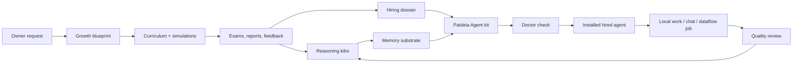

# 22B Paideia

22B Paideia is a local-first AI talent foundry and agent runtime. It is designed to raise an AI talent through staged education, assessments, memory formation, work experience, and review, then package that talent as an installable local agent.

The project takes inspiration from modern agent systems such as [Hermes Agent](https://github.com/NousResearch/hermes-agent) and [OpenClaw](https://github.com/openclaw/openclaw), but its center of gravity is different: Paideia starts with education before agency. An agent is not just a prompt profile. It is the hired runtime form of a trained local AI talent.

> Research preview: this repository contains program code, public metadata, test fixtures, and documentation. Private training outputs, local memories, personal data, model checkpoints, and generated run artifacts stay outside the source tree.

## What Makes It Different

Most agent runtimes begin with an assistant and add tools, memory, channels, and skills. Paideia begins with a curriculum:

- **Raise first, hire later**: a talent passes through growth records, courses, exams, reports, and review gates before becoming an agent.
- **Memory substrate, not full transcript replay**: the runtime selects bounded summaries, learning records, and procedural cues instead of injecting every old conversation.
- **Reasoning kibo**: a reviewable ledger of hypotheses, evidence, mistakes, corrected principles, study habits, and work patterns. It is not hidden chain-of-thought.
- **Role-model process replication**: a role model contributes sourced learning conditions and curriculum pressure, not a preloaded personality or worldview.
- **Local-first ownership**: the owner keeps private data, generated memories, voice assets, local curricula, and installed agent bundles on their own machine.
- **Safe skill migration**: Hermes/OpenClaw/generic skills can be imported, but they are quarantined and disabled until reviewed.

## Current Deep Track

The first deep track is:

```text
domain: securities_research
role_model: graham_value_investing
sample talent: grham-junior
```

This track is inspired by Benjamin Graham's publicly documented learning and value-investing lineage. It does not try to impersonate Graham, forecast markets from his birth data, or inject Graham-like conclusions. Instead, it reconstructs an educational path:

1. high-school foundations,
2. university-level finance, accounting, economics, and statistics,
3. graduate securities analysis, value investing, behavioral finance, and quant analysis,
4. doctoral-level research projects,
5. exams and reports that shape the talent's reasoning kibo over time.

Copyrighted textbooks are stored as metadata and reading plans only unless the owner provides a lawful local private copy.

## Architecture



## Repository Layout

```text
apps/ai-talent-foundry/     App-level examples, role-model catalogs, and foundry docs
src/ai22b/talent_foundry/   Core Paideia and agent-foundry Python modules
src/ai22b/from_scratch/     Tiny from-scratch model experiments
src/ai22b/knowledge/        Future retrieval and local knowledge layers
src/ai22b/voice/            Local voice rules and references
data/public/                Public research metadata and source indexes
data/private/               Private owner data placeholder, ignored by Git
docs/                       Research notes, architecture, privacy, and release hygiene
evals/                      Evaluation fixtures
models/                     Local model placeholders, ignored except .gitkeep
runs/                       Generated reports and runtime artifacts, ignored except .gitkeep
tests/                      Regression tests
```

## Install For Local Development

Use PowerShell from the repository root:

```powershell
python -m pip install -e .
$env:PYTHONPATH = "src"
```

Runtime artifacts are stored outside this source tree by default:

```powershell
$env:AI22B_STORAGE_ROOT = "$env:USERPROFILE\Documents\22B-AI-local-storage"
```

You can point storage somewhere else:

```powershell
$env:AI22B_STORAGE_ROOT = "D:\AI22B-storage"
```

## Quick Start

List available role models:

```powershell
ai22b-talent-foundry list-role-models --domain securities_research
```

Create a Graham-inspired blueprint without modifying another talent:

```powershell
ai22b-talent-foundry blueprint `
  --request "Raise a separate Graham learning-path sample AI without modifying existing talents." `
  --talent-name "grham-junior" `
  --gender "male" `
  --owner "Boss" `
  --domain securities_research `
  --role-model graham_value_investing
```

Run the education-to-employment flow from a blueprint:

```powershell
ai22b-talent-foundry raise `
  --blueprint "$env:AI22B_STORAGE_ROOT\talent-foundry\runs\agent_training_blueprint.json"
```

Build an installable Paideia Agent kit from a hired employment record:

```powershell
ai22b-talent-foundry build-paideia-agent-kit `
  --employment-record "$env:AI22B_STORAGE_ROOT\talent-foundry\runs\grham_junior_sample\installed_agents\agents\grham_junior_agent_release_bundle\employment_record.json" `
  --output-dir "$env:AI22B_STORAGE_ROOT\paideia-agent-kits\grham_junior_paideia_agent"
```

Doctor the kit before first use:

```powershell
ai22b-talent-foundry doctor-agent-program `
  --program "$env:AI22B_STORAGE_ROOT\paideia-agent-kits\grham_junior_paideia_agent\22b_paideia_agent_program.json"
```

Chat through the local education records and reasoning kibo:

```powershell
ai22b-talent-foundry run-agent-program-chat `
  --program "$env:AI22B_STORAGE_ROOT\paideia-agent-kits\grham_junior_paideia_agent\22b_paideia_agent_program.json" `
  --message "Explain how you would begin a valuation memo."
```

## Hermes/OpenClaw-Style Skill Migration

Hermes and OpenClaw both make skill and memory systems central to agent usefulness. Paideia supports migration from those ecosystems, but does not execute imported skills automatically.

```powershell
ai22b-talent-foundry migrate-agent-assets `
  --source C:\path\to\external-skill `
  --paideia-kit "$env:AI22B_STORAGE_ROOT\paideia-agent-kits\grham_junior_paideia_agent" `
  --source-runtime openclaw
```

Imported skills are copied to:

```text
skills/imported/<runtime>/<skill>/
```

Each import receives:

- a wrapper `SKILL.md`,
- a `paideia_skill_manifest.json`,
- `activation.status = disabled`,
- risk flags for suspicious patterns such as remote shell installers, credential access, recursive delete, and network listeners,
- a review checklist before promotion into a Paideia education axis or procedural skill.

The rule is simple: **migration is easy; activation is deliberate**.

## Agent Program Outputs

A Paideia Agent kit can include:

- `22b_paideia_agent_program.json`
- `paideia_agent_install_manifest.json`
- `paideia_onboarding.template.json`
- `doctor_paideia.ps1`
- `start_paideia_chat.ps1`
- `adapter_manifests/codex_native.json`
- `adapter_manifests/hermes_style.json`
- `adapter_manifests/openclaw_style.json`
- `memory_substrate.json`
- `learning_ledger.json`
- `language_development_program.json`
- `hiring_dossier.json`
- `HIRING_DOSSIER.ko.md`

Generated agent kits are local runtime artifacts. They are not committed to the public source repository by default.

## Validation

Run the main regression suite:

```powershell
$env:PYTHONPATH = "src"
python -B -m pytest `
  tests\test_talent_foundry.py `
  tests\test_talent_foundry_memory_substrate_chat.py `
  tests\test_talent_foundry_graham_kibo_lifecycle.py `
  tests\test_talent_foundry_graham.py `
  -q
```

Run the public-release hygiene check before publishing:

```powershell
.\scripts\check_public_repo_hygiene.ps1
```

The hygiene check blocks private data, local absolute paths, generated runs, model checkpoints, API keys, tokens, `node_modules`, build outputs, and owner-specific instructions.

## Safety Boundaries

Paideia is a local research and development system. It is not:

- a financial adviser,
- an autonomous trading system,
- a medical or legal decision system,
- a claim that simulated growth creates human consciousness,
- an impersonation engine for real people.

Securities-research talents may help organize evidence, compare sources, draft research memos, and explain valuation methods. They must not place trades, execute orders, or present personalized investment instructions.

## Documentation

- [22B Paideia overview](docs/paideia_center.md)
- [Hermes/OpenClaw benchmark notes](docs/paideia_agent_benchmark.md)
- [English benchmark summary](docs/paideia_agent_benchmark.en.md)
- [Public release hygiene policy](docs/40_public_release_hygiene_ko.md)
- [Korean README](README.ko.md)

## Inspiration And References

Paideia borrows useful operational patterns from agent runtimes while keeping a different philosophy:

- Hermes Agent foregrounds a learning loop, skills, persistent memory, MCP integration, and migration from OpenClaw.
- OpenClaw foregrounds workspace files, skills, multi-channel routing, and configurable local agent workspaces.
- Paideia keeps the education record as the source of identity and treats the LLM as an application engine, not the agent's self.

Primary references:

- Hermes Agent repository: https://github.com/NousResearch/hermes-agent
- Hermes Agent documentation: https://hermes-agent.nousresearch.com/docs/
- OpenClaw repository: https://github.com/openclaw/openclaw
- OpenClaw active memory documentation: https://docs.openclaw.ai/concepts/active-memory
