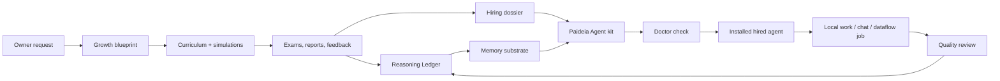

# Paideia Agent

[English](README.md) | [한국어](README.ko.md)

Paideia Agent is a local-first AI talent foundry and agent runtime. It is designed to raise an AI talent through staged education, assessments, memory formation, work experience, and review, then package that talent as an installable local agent.

The project takes inspiration from modern agent systems such as [Hermes Agent](https://github.com/NousResearch/hermes-agent) and [OpenClaw](https://github.com/openclaw/openclaw), but its center of gravity is different: Paideia starts with education before agency. An agent is not just a prompt profile. It is the hired runtime form of a trained local AI talent.

> Research preview: this repository contains program code, public metadata, test fixtures, and documentation. Private training outputs, local memories, personal data, model checkpoints, and generated run artifacts stay outside the source tree.

## Origin

Paideia Agent starts from a simple question: what if an AI agent could extend you, or what if a field role model's learning path could become the curriculum for a local AI talent that helps you work?

The project does not claim to clone real people. It reconstructs sourced growth conditions, curricula, tests, stress, failure, feedback, and work practice so each talent can form a reviewable Reasoning Ledger before it is hired as an agent.

Read the longer manifesto:

- [Project Manifesto](docs/project_manifesto.md)
- [프로젝트 선언문](docs/project_manifesto.ko.md)

## What Makes It Different

Most agent runtimes begin with an assistant and add tools, memory, channels, and skills. Paideia begins with a curriculum:

- **Raise first, hire later**: a talent passes through growth records, courses, exams, reports, and review gates before becoming an agent.
- **Memory substrate, not full transcript replay**: the runtime selects bounded summaries, learning records, and procedural cues instead of injecting every old conversation.
- **Reasoning Ledger / Ariadne Thread**: a reviewable ledger of hypotheses, evidence, mistakes, corrected principles, study habits, and work patterns. It is not hidden chain-of-thought. The internal compatibility artifact is still named `reasoning_kibo.jsonl`.
- **Role-model process replication**: a role model contributes sourced learning conditions and curriculum pressure, not a preloaded personality or worldview.
- **Parent-controlled projection swarm**: one hired talent can split work into task projections, synthesize their findings, and promote only reviewed learning back into the parent record.
- **Local-first ownership**: the owner keeps private data, generated memories, voice assets, local curricula, and installed agent bundles on their own machine.
- **Safe skill migration**: Hermes/OpenClaw/generic skills can be imported, but they are quarantined and disabled until reviewed.

## Bundled Role Models

The first deep track is still the directly testable Graham Junior sample:

```text
domain: securities_research
role_model: graham_value_investing
sample talent: grham-junior
```

This track is inspired by Benjamin Graham's publicly documented learning and value-investing lineage. It does not try to impersonate Graham, forecast markets from his birth data, or inject Graham-like conclusions. Instead, it reconstructs an educational path:

1. high-school foundations,
2. university-level finance, accounting, economics, and statistics,
3. graduate securities analysis, value investing, behavioral finance, and quant analysis,
4. doctoral-level research projects,
5. exams and reports that shape the talent's Reasoning Ledger over time.

Copyrighted textbooks are stored as metadata and reading plans only unless the owner provides a lawful local private copy.

The onboarding catalog now also includes selectable public-metadata role-model tracks for common agent use cases:

| Domain | Role model process | Good first agent use |
| --- | --- | --- |
| `software_agent_engineering` | `hopper_software_tooling`, `dijkstra_verified_programming` | coding, debugging, tool-building, correctness review |
| `data_analysis_bi` | `tukey_data_analysis` | data profiling, BI, experiment analysis |
| `customer_support_quality_ops` | `deming_quality_ops` | support quality, process improvement, incident learning |
| `cybersecurity` | `anderson_security_engineering` | threat modeling, security review, privacy/risk analysis |
| `marketing_sales` | `ogilvy_research_copywriting` | customer research, campaign briefs, copy testing |
| `healthcare_operations` | `nightingale_healthcare_statistics` | healthcare operations and safety dashboards, not medical advice |
| `education_tutoring` | `montessori_learning_design` | tutoring design, learner diagnosis, adaptive curriculum |
| `management_productivity` | `drucker_management_knowledge_work` | management memos, decision support, productivity systems |
| `legal_compliance_research` | `ginsburg_legal_research` | legal/compliance research summaries, not legal advice |
| `blockchain_protocol_research` | `finney_blockchain_protocol` | protocol research, wallet-safety review, not investment advice |
| `information_systems_research` | `shannon_information_theory` | information theory, compression, uncertainty modeling |

All of these are **process templates**, not impersonation targets. The catalog stores public facts, source links, curriculum pressure, and assessment ladders. It does not store copyrighted textbook bodies or inject a public figure's personality.

## Architecture



## Repository Layout

```text
apps/ai-talent-foundry/     App-level examples, role-model catalogs, and foundry docs
src/ai22b/talent_foundry/   Core Paideia and agent-foundry Python modules
src/ai22b/from_scratch/     Tiny from-scratch model experiments
src/ai22b/knowledge/        Future retrieval and local knowledge layers
src/ai22b/voice/            Local voice rules and references
data/public/                Public research metadata and source indexes
data/private/               Private owner data placeholder, ignored by Git
docs/                       Research notes, architecture, privacy, and release hygiene
evals/                      Evaluation fixtures
examples/                   Public onboarding samples such as Graham Junior
models/                     Local model placeholders, ignored except .gitkeep
runs/                       Generated reports and runtime artifacts, ignored except .gitkeep
tests/                      Regression tests
```

## Install For Local Development

Use PowerShell from the repository root:

```powershell
python -m pip install -e .
$env:PYTHONPATH = "src"
```

Runtime artifacts are stored outside this source tree by default:

```powershell
$env:AI22B_STORAGE_ROOT = "$env:USERPROFILE\Documents\22B-AI-local-storage"
```

You can point storage somewhere else:

```powershell
$env:AI22B_STORAGE_ROOT = "D:\AI22B-storage"
```

## Quick Start

Run the bundled Graham Junior sample through the guided onboarding flow:

```powershell
ai22b-talent-foundry start-console `
  --answers examples\graham_junior_onboarding.answers.json
```

The interactive first-run path also has an OpenClaw-style alias:

```powershell
ai22b-talent-foundry onboard
```

This wizard uses config detection, QuickStart/Advanced mode, Model/Auth, Workspace, Gateway/Channels, Skills, Education Path, Runtime, Agent Identity, Health Check, and Finish steps.

This sample first selects the LLM service and chat surface, then lets that selected LLM act as the curriculum researcher for the Graham-inspired securities research track.

List available role models:

```powershell
ai22b-talent-foundry list-role-models
ai22b-talent-foundry list-role-models --domain software_agent_engineering
```

Create a Graham-inspired blueprint without modifying another talent:

```powershell
ai22b-talent-foundry blueprint `
  --request "Raise a separate Graham learning-path sample AI without modifying existing talents." `
  --talent-name "grham-junior" `
  --gender "male" `
  --owner "Boss" `
  --domain securities_research `
  --role-model graham_value_investing
```

Run the education-to-employment flow from a blueprint:

```powershell
ai22b-talent-foundry raise `
  --blueprint "$env:AI22B_STORAGE_ROOT\talent-foundry\runs\agent_training_blueprint.json"
```

Create a non-Graham talent with a local Ollama-compatible LLM adapter selected during onboarding:

```powershell
ai22b-talent-foundry onboard-agent `
  --request "Raise a developer-tool agent that learns through debugging, compilers, tests, and documentation." `
  --talent-name "hopper-junior" `
  --gender "male" `
  --owner "Boss" `
  --domain software_agent_engineering `
  --role-model hopper_software_tooling `
  --llm-service ollama_local `
  --llm-model "llama3.1:8b" `
  --llm-model-path "http://localhost:11434" `
  --chat-surface codex-bridge-chat
```

Build an installable Paideia Agent kit from a hired employment record:

```powershell
ai22b-talent-foundry build-paideia-agent-kit `
  --employment-record "$env:AI22B_STORAGE_ROOT\talent-foundry\runs\grham_junior_sample\installed_agents\agents\grham_junior_agent_release_bundle\employment_record.json" `
  --output-dir "$env:AI22B_STORAGE_ROOT\paideia-agent-kits\grham_junior_paideia_agent"
```

Doctor the kit before first use:

```powershell
ai22b-talent-foundry doctor-agent-program `
  --program "$env:AI22B_STORAGE_ROOT\paideia-agent-kits\grham_junior_paideia_agent\22b_paideia_agent_program.json"
```

Chat through the local education records and Reasoning Ledger:

```powershell
ai22b-talent-foundry run-agent-program-chat `
  --program "$env:AI22B_STORAGE_ROOT\paideia-agent-kits\grham_junior_paideia_agent\22b_paideia_agent_program.json" `
  --message "Explain how you would begin a valuation memo."
```

## Hermes/OpenClaw-Style Skill Migration

Hermes and OpenClaw both make skill and memory systems central to agent usefulness. Paideia supports migration from those ecosystems, but does not execute imported skills automatically.

```powershell
ai22b-talent-foundry migrate-agent-assets `
  --source C:\path\to\external-skill `
  --paideia-kit "$env:AI22B_STORAGE_ROOT\paideia-agent-kits\grham_junior_paideia_agent" `
  --source-runtime openclaw
```

Imported skills are copied to:

```text
skills/imported/<runtime>/<skill>/
```

Each import receives:

- a wrapper `SKILL.md`,
- a `paideia_skill_manifest.json`,
- `activation.status = disabled`,
- risk flags for suspicious patterns such as remote shell installers, credential access, recursive delete, and network listeners,
- a review checklist before promotion into a Paideia education axis or procedural skill.

The rule is simple: **migration is easy; activation is deliberate**.

## Agent Program Outputs

A Paideia Agent kit can include:

- `22b_paideia_agent_program.json`
- `paideia_agent_install_manifest.json`
- `paideia_onboarding.template.json`
- `doctor_paideia.ps1`
- `start_paideia_chat.ps1`
- `adapter_manifests/codex_native.json`
- `adapter_manifests/hermes_style.json`
- `adapter_manifests/openclaw_style.json`
- `memory_substrate.json`
- `learning_ledger.json`
- `language_development_program.json`
- `hiring_dossier.json`
- `HIRING_DOSSIER.ko.md`

Generated agent kits are local runtime artifacts. They are not committed to the public source repository by default.

## Onboarding Model

Paideia Agent follows the practical first-run pattern seen in installed agent programs:

1. choose an LLM service,
2. choose the chat surface,
3. select a role-model process or use the bundled Graham Junior sample,
4. let the selected LLM act as a researcher that turns the owner request into curriculum, assessment, and growth inputs,
5. review the hiring dossier before using the installed agent for work.

Paideia now mirrors OpenClaw's `provider/model` selection style. Built-in direct adapters include:

- `openai_chatgpt_codex`
- `anthropic_claude_api`
- `google_gemini_api`
- `mistral_api`
- `openrouter_api`
- `ollama_local`
- `lm_studio_local`
- OpenAI-compatible OpenClaw providers such as `deepseek_api`, `groq_api`, `gmi_api`, `novita_api`, `huggingface_api`, `kilocode_gateway`, `xai_api`, `perplexity_api`, `together_ai`, `fireworks_api`, `deepinfra_api`, `cerebras_api`, `moonshot_api`, `qwen_api`, `z_ai_api`, `venice_api`, `nvidia_api`, `vllm_local`, `sglang_local`, `litellm_gateway`, and `vercel_ai_gateway`
- OpenClaw-compatible native/proxy providers such as `ollama_cloud` and `synthetic_api`
- `deterministic_local`
- `bigram_local`
- `transformers_local`
- `llama_cpp_local`

The CLI also accepts OpenClaw-style model selectors directly:

```powershell
ai22b-talent-foundry hire-installed `
  --installed-manifest "<installed_agent_manifest.json>" `
  --role "Research agent" `
  --llm-service "openrouter/meta-llama/llama-3.1-8b" `
  --chat-surface codex-bridge-chat
```

For OpenClaw parity discovery:

```powershell
ai22b-talent-foundry list-openclaw-compat `
  --output "$env:AI22B_STORAGE_ROOT\talent-foundry\runs\openclaw_compat.json"
```

External API adapters require the user's own keys before live use. Local model adapters prefer localhost or local files. Chat surfaces include `codex-bridge-chat`, `cli-console`, `dataflow-job`, a disabled `openclaw-style-gateway`, and OpenClaw channel manifests such as `openclaw-channel-telegram`, `openclaw-channel-discord`, `openclaw-channel-slack`, `openclaw-channel-whatsapp`, `openclaw-channel-signal`, `openclaw-channel-microsoft-teams`, `openclaw-channel-google-chat`, `openclaw-channel-imessage`, `openclaw-channel-matrix`, `openclaw-channel-mattermost`, and `openclaw-channel-webchat`.

The provider catalog follows OpenClaw's canonical `provider/model` IDs where possible, including `lmstudio/*`, `zai/*`, `kilocode/*`, `gmi/*`, `novita/*`, `huggingface/*`, and `ollama-cloud/*`. Provider-specific plugin-only surfaces such as `volcengine-plan`, `byteplus-plan`, `qwen-oauth`, `pixverse`, and `ds4` remain visible in onboarding as manifest-only entries until a concrete plugin is configured.

OpenClaw-style channels can now be routed through a local Paideia gateway envelope. The core returns a sendable outbound envelope; actual platform plugins remain responsible for bot tokens, pairing, and final delivery.

```powershell
ai22b-talent-foundry build-openclaw-gateway-config `
  --employment-record "<employment_record.json>" `
  --channel telegram `
  --channel webchat `
  --output "$env:AI22B_STORAGE_ROOT\talent-foundry\runs\openclaw_gateway_config.json"

ai22b-talent-foundry run-openclaw-channel-message `
  --employment-record "<employment_record.json>" `
  --channel telegram `
  --conversation-id "telegram-test" `
  --sender-id "boss" `
  --message "Can you answer through the channel gateway?" `
  --output "$env:AI22B_STORAGE_ROOT\talent-foundry\runs\telegram_channel_run.json"
```

External channel plugins can post normalized OpenClaw-style messages to a local HTTP gateway:

```powershell
ai22b-talent-foundry run-openclaw-channel-gateway-server `
  --employment-record "<employment_record.json>" `
  --channel telegram `
  --channel discord `
  --channel slack `
  --port 8722 `
  --output-dir "$env:AI22B_STORAGE_ROOT\talent-foundry\runs\channel-gateway"
```

The server exposes `GET /health`, `GET /openclaw/gateway-config`, and `POST /openclaw/channel-message`. By default it returns a channel-specific outbound envelope and does not send to Telegram/Discord/Slack itself; platform plugins keep control of tokens, pairing, allowlists, and final delivery. This follows OpenClaw's deterministic routing pattern: reply to the origin channel/session rather than letting the model choose a destination.

Raw platform events can be translated through a deny-by-default ingress layer before routing:

```powershell
ai22b-talent-foundry build-openclaw-channel-access-config `
  --channel telegram `
  --allow-sender "telegram:12345" `
  --output "$env:AI22B_STORAGE_ROOT\talent-foundry\runs\channel_access.json"

ai22b-talent-foundry translate-openclaw-platform-event `
  --channel telegram `
  --event ".\telegram_update.json" `
  --access-config "$env:AI22B_STORAGE_ROOT\talent-foundry\runs\channel_access.json" `
  --output "$env:AI22B_STORAGE_ROOT\talent-foundry\runs\telegram_translation.json"
```

The HTTP gateway also accepts `POST /openclaw/platform-event/telegram`, `/discord`, and `/slack` when started with `--access-config`. Unlisted senders or conversations receive a `403` translation result instead of being routed into the talent.

To see how every OpenClaw channel maps into Paideia, generate the connector readiness catalog:

```powershell
ai22b-talent-foundry list-openclaw-channel-connectors `
  --output "$env:AI22B_STORAGE_ROOT\talent-foundry\runs\channel_connectors.json"

ai22b-talent-foundry doctor-openclaw-channel-connectors `
  --output "$env:AI22B_STORAGE_ROOT\talent-foundry\runs\channel_connector_doctor.json"
```

Telegram, Discord, Slack, and WebChat have direct Paideia adapters. All other OpenClaw channels remain selectable and can use the normalized gateway envelope today, while raw platform integration is marked with the required bridge/plugin setup such as WhatsApp QR pairing, signal-cli, Matrix bot credentials, Bot Framework, or regional platform tokens.

To inspect or send the returned outbound envelope, use the dry-run-first delivery adapter:

```powershell
ai22b-talent-foundry build-openclaw-channel-delivery-config `
  --output "$env:AI22B_STORAGE_ROOT\talent-foundry\runs\channel_delivery_config.json"

ai22b-talent-foundry send-openclaw-channel-outbound `
  --channel-run "$env:AI22B_STORAGE_ROOT\talent-foundry\runs\channel-gateway\telegram_20260531_000000_000000.json" `
  --mode dry-run `
  --output "$env:AI22B_STORAGE_ROOT\talent-foundry\runs\telegram_delivery_dry_run.json"
```

`--mode live` performs the external API call only when the required environment variables are present: `TELEGRAM_BOT_TOKEN` for Telegram `sendMessage`, `SLACK_BOT_TOKEN` for Slack `chat.postMessage`, or `DISCORD_WEBHOOK_URL`/`DISCORD_BOT_TOKEN` for Discord webhook or bot delivery. Secret values are never written to delivery artifacts.

For a browser chat test without any external channel token, start the local WebChat loopback server and open the printed URL:

```powershell
ai22b-talent-foundry run-openclaw-webchat-server `
  --employment-record "<employment_record.json>" `
  --port 8722 `
  --output-dir "$env:AI22B_STORAGE_ROOT\talent-foundry\runs\webchat"
```

The server binds to `127.0.0.1` by default. Each message is translated into the same OpenClaw-style channel envelope, routed through the installed Paideia talent, and saved as a local `webchat_*.json` run.

Every onboarding run now writes `llm_service_health.json`. This file records whether the chosen provider is ready for bridge mode, needs an API key, needs a local model path, or is only a manifest until the local server is running. It never stores secret values and does not perform a network probe.

You can run the same check directly:

```powershell
ai22b-talent-foundry check-llm-service `
  --llm-service ollama_local `
  --llm-model "llama3.1:8b" `
  --llm-model-path "http://localhost:11434" `
  --output "$env:AI22B_STORAGE_ROOT\talent-foundry\runs\llm_service_health.json"
```

## Owner Self-Extension

For the "copy myself as an agent" path, Paideia can scan owner-approved local files and create a private manifest without ingesting full contents into the public repo:

```powershell
ai22b-talent-foundry ingest-owner-self-extension `
  --source-dir "C:\path\to\owner-approved-materials" `
  --output "$env:AI22B_STORAGE_ROOT\talent-foundry\runs\owner_self_extension_manifest.json"
```

The default manifest stores relative paths, file sizes, hashes, extension/category counts, and short keyword samples. It avoids absolute source paths and full file bodies. Use `--include-review-snippets` only for a local review artifact that must never be committed publicly.

## Simulation Rollout Execution

Paideia's swarm idea is implemented as parent-controlled simulation rollouts. A hired agent can rehearse multiple stressful episodes, then merge only reviewed summaries and procedural cues back into the local Reasoning Ledger:

```powershell
ai22b-talent-foundry run-simulation-rollouts `
  --employment-record "<employment_record.json>" `
  --rollouts "<simulation_rollouts.json>" `
  --workspace "$env:AI22B_STORAGE_ROOT\talent-foundry\runs\simulation_rollout_workspace" `
  --reviewed-by "Boss" `
  --output "$env:AI22B_STORAGE_ROOT\talent-foundry\runs\simulation_rollout_execution.json"
```

Promotion candidates receive verified quality labels and can update the Reasoning Ledger. Review-required episodes are quarantined until the owner or reviewer approves them.

## Hiring Dossier

The hiring dossier is the resume-like record for a raised AI talent. It explains who the candidate is, what curriculum it completed, which exams and reports it passed, what its transcript says, which papers/projects were produced, what guardrails apply, and whether it is ready to be hired as a local agent.

Key files:

- `hiring_dossier.json`: structured dossier for tooling and adapters.
- `HIRING_DOSSIER.ko.md`: human-readable Korean dossier.
- `assessment_transcript.json`: exam/report scores and feedback.
- `learning_ledger.json`: verified learning experiences.
- `reasoning_kibo.jsonl`: internal compatibility file for the Reasoning Ledger.

## Research Basis

Paideia Agent keeps a source-to-design map so users can inspect which papers, reports, and reference programs shaped the product. See [Research Basis](docs/research_basis.md) or [연구 근거와 반영 내용](docs/research_basis.ko.md).

Two important design notes are split out for easier review:

- [Tesla-style dataflow board benchmark](docs/tesla_board_benchmark.md): maps Boss's Tesla AI-chip board analogy to memory locality, context packing, staged learning, and Reasoning Ledger updates.
- [Legacy 22B-AI system integration](docs/legacy_system_integration.md): explains that the earlier Shinyong growth system and from-scratch local model work are retained as Paideia's legacy foundation, not discarded.

## Validation

Run the main regression suite:

```powershell
$env:PYTHONPATH = "src"
python -B -m pytest `
  tests\test_talent_foundry.py `
  tests\test_talent_foundry_memory_substrate_chat.py `
  tests\test_talent_foundry_graham_kibo_lifecycle.py `
  tests\test_talent_foundry_graham.py `
  -q
```

Run the public-release hygiene check before publishing:

```powershell
.\scripts\check_public_repo_hygiene.ps1
```

The hygiene check blocks private data, local absolute paths, generated runs, model checkpoints, API keys, tokens, `node_modules`, build outputs, and owner-specific instructions.

## Safety Boundaries

Paideia is a local research and development system. It is not:

- a financial adviser,
- an autonomous trading system,
- a medical or legal decision system,
- a claim that simulated growth creates human consciousness,
- an impersonation engine for real people.

Securities-research talents may help organize evidence, compare sources, draft research memos, and explain valuation methods. They must not place trades, execute orders, or present personalized investment instructions.

## Documentation

- [Paideia Agent overview](docs/paideia_center.md)
- [Project Manifesto](docs/project_manifesto.md)
- [프로젝트 선언문](docs/project_manifesto.ko.md)
- [Manifesto alignment review and roadmap](docs/manifesto_alignment_review.ko.md)
- [Hermes/OpenClaw benchmark notes](docs/paideia_agent_benchmark.md)
- [English benchmark summary](docs/paideia_agent_benchmark.en.md)
- [Research basis](docs/research_basis.md)
- [OpenClaw-style onboarding](docs/openclaw_style_onboarding.ko.md)
- [Tesla-style dataflow board benchmark](docs/tesla_board_benchmark.md)
- [Legacy 22B-AI system integration](docs/legacy_system_integration.md)
- [Public release hygiene policy](docs/40_public_release_hygiene_ko.md)
- [Korean README](README.ko.md)

## Inspiration And References

Paideia borrows useful operational patterns from agent runtimes while keeping a different philosophy:

- Hermes Agent foregrounds a learning loop, skills, persistent memory, MCP integration, and migration from OpenClaw.
- OpenClaw foregrounds workspace files, skills, multi-channel routing, and configurable local agent workspaces.
- Paideia keeps the education record as the source of identity and treats the LLM as an application engine, not the agent's self.
- Agent identity systems such as [Agent ID Card](https://www.agentidcard.org/) are a planned external identity integration path. Registration and external upload must remain explicit user actions.

Primary references:

- Hermes Agent repository: https://github.com/NousResearch/hermes-agent
- Hermes Agent documentation: https://hermes-agent.nousresearch.com/docs/
- OpenClaw repository: https://github.com/openclaw/openclaw
- OpenClaw active memory documentation: https://docs.openclaw.ai/concepts/active-memory
