# Paideia Agent

[English](README.md) | [한국어](README.ko.md)

Paideia Agent is a local-first AI talent foundry and agent runtime. It is designed to raise an AI talent through staged education, assessments, memory formation, work experience, and review, then package that talent as an installable local agent.

The project takes inspiration from modern agent systems such as [Hermes Agent](https://github.com/NousResearch/hermes-agent) and [OpenClaw](https://github.com/openclaw/openclaw), but its center of gravity is different: Paideia starts with education before agency. An agent is not just a prompt profile. It is the hired runtime form of a trained local AI talent.

> Research preview: this repository contains program code, public metadata, test fixtures, and documentation. Private training outputs, local memories, personal data, model checkpoints, and generated run artifacts stay outside the source tree.

## Origin

Paideia Agent starts from a simple question: what if an AI agent could extend you, or what if a field role model's learning path could become the curriculum for a local AI talent that helps you work?

The project does not claim to clone real people. It reconstructs sourced growth conditions, curricula, tests, stress, failure, feedback, and work practice so each talent can form a reviewable Reasoning Ledger before it is hired as an agent.

Read the longer manifesto:

- [Project Manifesto](docs/project_manifesto.md)
- [프로젝트 선언문](docs/project_manifesto.ko.md)

## What Makes It Different

Most agent runtimes begin with an assistant and add tools, memory, channels, and skills. Paideia begins with a curriculum:

- **Raise first, hire later**: a talent passes through growth records, courses, exams, reports, and review gates before becoming an agent.
- **Memory substrate, not full transcript replay**: the runtime selects bounded summaries, learning records, and procedural cues instead of injecting every old conversation.
- **Reasoning Ledger / Ariadne Thread**: a reviewable ledger of hypotheses, evidence, mistakes, corrected principles, study habits, and work patterns. It is not hidden chain-of-thought. The internal compatibility artifact is still named `reasoning_kibo.jsonl`.
- **Developmental Ecology / Life Trace / Growth Profile**: synthetic family climate, peer conflict, ordinary conversation, stress recovery, school life, aesthetic exposure, and domain curiosity are condensed into relationship, emotion, culture, aesthetic, and asymmetry memory.
- **Graduate package**: a raised talent can export an agent resume, transcript, memory pack, runtime manifest, and onboarding prompt before being used as an installable agent.
- **Role-model process replication**: a role model contributes sourced learning conditions and curriculum pressure, not a preloaded personality or worldview.
- **Parent-controlled projection swarm**: one hired talent can split work into task projections, synthesize their findings, and promote only reviewed learning back into the parent record.
- **Local-first ownership**: the owner keeps private data, generated memories, voice assets, local curricula, and installed agent bundles on their own machine.
- **Safe skill migration**: Hermes/OpenClaw/generic skills can be imported, but they are quarantined and disabled until reviewed.

## Bundled Role Models

The first deep track is still the directly testable Graham Junior sample:

```text
domain: securities_research
role_model: graham_value_investing
sample talent: grham-junior
```

This track is inspired by Benjamin Graham's publicly documented learning and value-investing lineage. It does not try to impersonate Graham, forecast markets from his birth data, or inject Graham-like conclusions. Instead, it reconstructs an educational path:

1. high-school foundations,
2. university-level finance, accounting, economics, and statistics,
3. graduate securities analysis, value investing, behavioral finance, and quant analysis,
4. doctoral-level research projects,
5. exams and reports that shape the talent's Reasoning Ledger over time.

Copyrighted textbooks are stored as metadata and reading plans only unless the owner provides a lawful local private copy.

The onboarding catalog now also includes selectable public-metadata role-model tracks for common agent use cases:

| Domain | Role model process | Good first agent use |
| --- | --- | --- |
| `software_agent_engineering` | `hopper_software_tooling`, `dijkstra_verified_programming` | coding, debugging, tool-building, correctness review |
| `data_analysis_bi` | `tukey_data_analysis` | data profiling, BI, experiment analysis |
| `customer_support_quality_ops` | `deming_quality_ops` | support quality, process improvement, incident learning |
| `cybersecurity` | `anderson_security_engineering` | threat modeling, security review, privacy/risk analysis |
| `marketing_sales` | `ogilvy_research_copywriting` | customer research, campaign briefs, copy testing |
| `healthcare_operations` | `nightingale_healthcare_statistics` | healthcare operations and safety dashboards, not medical advice |
| `education_tutoring` | `montessori_learning_design` | tutoring design, learner diagnosis, adaptive curriculum |
| `management_productivity` | `drucker_management_knowledge_work` | management memos, decision support, productivity systems |
| `legal_compliance_research` | `ginsburg_legal_research` | legal/compliance research summaries, not legal advice |
| `blockchain_protocol_research` | `finney_blockchain_protocol` | protocol research, wallet-safety review, not investment advice |
| `information_systems_research` | `shannon_information_theory` | information theory, compression, uncertainty modeling |

All of these are **process templates**, not impersonation targets. The catalog stores public facts, source links, curriculum pressure, and assessment ladders. It does not store copyrighted textbook bodies or inject a public figure's personality.

## Owner Self-Extension Intake

The owner self-extension path is local-only and metadata-first. Paideia can prepare a private-material intake manifest without reading file contents, exporting raw filenames, or writing absolute paths into public artifacts:

```powershell
ai22b-talent-foundry prepare-owner-self-extension-intake `
  --source-dir .\data\private\owner_materials `
  --owner "Boss" `
  --owner-consent `
  --copyright-attestation owner_provided_or_authorized_for_local_use `
  --output .\owner_self_extension_intake.json
```

The output records extension counts, size buckets, relative-path fingerprints, consent, and copyright/use-policy status. It does not train on the files by itself. Selected materials must still be reviewed before becoming a local private curriculum or Reasoning Ledger candidate.

## Architecture

```mermaid
flowchart LR
    Owner["Owner request"] --> Blueprint["Growth blueprint"]
    Blueprint --> Ecology["Developmental ecology + life trace"]
    Ecology --> GrowthProfile["Growth profile"]
    GrowthProfile --> Curriculum["Curriculum + simulations"]
    Curriculum --> Assessment["Exams, reports, feedback"]
    Assessment --> Kibo["Reasoning Ledger"]
    Assessment --> Dossier["Hiring dossier"]
    Dossier --> GraduatePackage["Graduate package"]
    Kibo --> Memory["Memory substrate"]
    GraduatePackage --> Kit["Paideia Agent kit"]
    Memory --> Kit
    Kit --> Doctor["Doctor check"]
    Doctor --> Agent["Installed hired agent"]
    Agent --> Work["Local work / chat / dataflow job"]
    Work --> Review["Quality review"]
    Review --> Kibo
```



## Repository Layout

```text
apps/ai-talent-foundry/     App-level examples, role-model catalogs, and foundry docs
src/ai22b/talent_foundry/   Core Paideia and agent-foundry Python modules
src/ai22b/from_scratch/     Tiny from-scratch model experiments
src/ai22b/knowledge/        Future retrieval and local knowledge layers
src/ai22b/voice/            Local voice rules and references
data/public/                Public research metadata and source indexes
data/private/               Private owner data placeholder, ignored by Git
docs/                       Research notes, architecture, privacy, and release hygiene
evals/                      Evaluation fixtures
examples/                   Public onboarding samples such as Graham Junior
models/                     Local model placeholders, ignored except .gitkeep
runs/                       Generated reports and runtime artifacts, ignored except .gitkeep
tests/                      Regression tests
```

## Install For Local Development

Use PowerShell from the repository root:

```powershell
python -m pip install -e .
$env:PYTHONPATH = "src"
```

Optional runtime extras are split by capability:

```powershell
python -m pip install -e ".[live-llm]"   # OpenAI Responses API live runs
python -m pip install -e ".[local-llm]"  # local Transformers models
python -m pip install -e ".[rag]"        # retrieval/eval lab tools
python -m pip install -e ".[dev]"        # tests
```

Runtime artifacts are stored outside this source tree by default:

```powershell
$env:AI22B_STORAGE_ROOT = "$env:USERPROFILE\Documents\22B-AI-local-storage"
```

You can point storage somewhere else:

```powershell
$env:AI22B_STORAGE_ROOT = "D:\AI22B-storage"
```

## Quick Start

Run the bundled Graham Junior sample through the guided onboarding flow:

```powershell
ai22b-talent-foundry start-console `
  --answers examples\graham_junior_onboarding.answers.json
```

The interactive first-run path also has an OpenClaw-style alias:

```powershell
ai22b-talent-foundry onboard
```

This wizard uses config detection, QuickStart/Advanced mode, Model/Auth, Workspace, Gateway/Channels, Skills, Education Path, Runtime, Agent Identity, Health Check, and Finish steps.

This sample first selects the LLM service and chat surface, then lets that selected LLM act as the curriculum researcher for the Graham-inspired securities research track.

List available role models:

```powershell
ai22b-talent-foundry list-role-models
ai22b-talent-foundry list-role-models --domain software_agent_engineering
```

Create a Graham-inspired blueprint without modifying another talent:

```powershell
ai22b-talent-foundry blueprint `
  --request "Raise a separate Graham learning-path sample AI without modifying existing talents." `
  --talent-name "grham-junior" `
  --gender "male" `
  --owner "Boss" `
  --domain securities_research `
  --role-model graham_value_investing
```

Run the education-to-employment flow from a blueprint:

```powershell
ai22b-talent-foundry raise `
  --blueprint "$env:AI22B_STORAGE_ROOT\talent-foundry\runs\agent_training_blueprint.json"
```

`raise` now also writes `developmental_ecology.json`, `life_trace.jsonl`, `growth_profile.json`, and a memory substrate that links those growth records to chat. See [docs/developmental_ecology_v04.ko.md](docs/developmental_ecology_v04.ko.md) and [docs/growth_profile_v05.ko.md](docs/growth_profile_v05.ko.md).

Build a graduate package for review before using the installed agent:

```powershell
ai22b-talent-foundry build-graduate-package `
  --training-run "$env:AI22B_STORAGE_ROOT\talent-foundry\runs\grham_junior_sample\training_run.json" `
  --output-dir "$env:AI22B_STORAGE_ROOT\talent-foundry\runs\grham_junior_sample\graduate_package"
```

Compare multiple hired agents under one shared scene:

```powershell
ai22b-talent-foundry run-same-sky-eval `
  --agent ".\installed_agents\agents\grham_junior_agent_release_bundle\employment_record.json" `
  --scene ".\same_sky_scene.json" `
  --output ".\same_sky_eval.json"
```

Create a non-Graham talent with a local Ollama-compatible LLM adapter selected during onboarding:

```powershell
ai22b-talent-foundry onboard-agent `
  --request "Raise a developer-tool agent that learns through debugging, compilers, tests, and documentation." `
  --talent-name "hopper-junior" `
  --gender "male" `
  --owner "Boss" `
  --domain software_agent_engineering `
  --role-model hopper_software_tooling `
  --llm-service ollama_local `
  --llm-model "llama3.1:8b" `
  --llm-model-path "http://localhost:11434" `
  --chat-surface codex-bridge-chat
```

Build an installable Paideia Agent kit from a hired employment record:

```powershell
ai22b-talent-foundry build-paideia-agent-kit `
  --employment-record "$env:AI22B_STORAGE_ROOT\talent-foundry\runs\grham_junior_sample\installed_agents\agents\grham_junior_agent_release_bundle\employment_record.json" `
  --output-dir "$env:AI22B_STORAGE_ROOT\paideia-agent-kits\grham_junior_paideia_agent"
```

Doctor the kit before first use:

```powershell
ai22b-talent-foundry doctor-agent-program `
  --program "$env:AI22B_STORAGE_ROOT\paideia-agent-kits\grham_junior_paideia_agent\22b_paideia_agent_program.json"
```

Chat through the local education records and Reasoning Ledger:

```powershell
ai22b-talent-foundry run-agent-program-chat `
  --program "$env:AI22B_STORAGE_ROOT\paideia-agent-kits\grham_junior_paideia_agent\22b_paideia_agent_program.json" `
  --message "Explain how you would begin a valuation memo."
```

## Hermes/OpenClaw-Style Skill Migration

Hermes and OpenClaw both make skill and memory systems central to agent usefulness. Paideia supports migration from those ecosystems, but does not execute imported skills automatically.

```powershell
ai22b-talent-foundry migrate-agent-assets `
  --source C:\path\to\external-skill `
  --paideia-kit "$env:AI22B_STORAGE_ROOT\paideia-agent-kits\grham_junior_paideia_agent" `
  --source-runtime openclaw
```

Imported skills are copied to:

```text
skills/imported/<runtime>/<skill>/
```

Each import receives:

- a wrapper `SKILL.md`,
- a `paideia_skill_manifest.json`,
- `activation.status = disabled`,
- risk flags for suspicious patterns such as remote shell installers, credential access, recursive delete, and network listeners,
- a review checklist before promotion into a Paideia education axis or procedural skill.

The rule is simple: **migration is easy; activation is deliberate**.

## Agent Program Outputs

A Paideia Agent kit can include:

- `22b_paideia_agent_program.json`
- `paideia_agent_install_manifest.json`
- `paideia_onboarding.template.json`
- `doctor_paideia.ps1`
- `start_paideia_chat.ps1`
- `adapter_manifests/codex_native.json`
- `adapter_manifests/hermes_style.json`
- `adapter_manifests/openclaw_style.json`
- `memory_substrate.json`
- `learning_ledger.json`
- `language_development_program.json`
- `hiring_dossier.json`
- `HIRING_DOSSIER.ko.md`

Generated agent kits are local runtime artifacts. They are not committed to the public source repository by default.

## Onboarding Model

Paideia Agent follows the practical first-run pattern seen in installed agent programs:

1. choose an LLM service,
2. choose the chat surface,
3. select a role-model process or use the bundled Graham Junior sample,
4. let the selected LLM act as a researcher that turns the owner request into curriculum, assessment, and growth inputs,
5. review the hiring dossier before using the installed agent for work.

Supported initial LLM services include:

- `openai_chatgpt_codex`
- `anthropic_claude_api`
- `google_gemini_api`
- `mistral_api`
- `openrouter_api`
- `ollama_local`
- `lm_studio_local`
- `deterministic_local`
- `bigram_local`
- `transformers_local`
- `llama_cpp_local`

External API adapters require the user's own keys before live use. Local model adapters prefer localhost or local files. Supported initial chat surfaces include `codex-bridge-chat`, `cli-console`, `dataflow-job`, and a disabled `openclaw-style-gateway` adapter manifest.

## P0 Runtime Loop

The hired-agent runner now uses a structured runtime loop instead of a template-only response:

```text
request -> ActionIntent -> capability policy -> LLM planning -> local tool execution -> verification -> memory write decision -> audit log
```

Offline mode stays deterministic and local:

```powershell
ai22b-talent-foundry run-hired-agent `
  --employment-record .\employment_record.json `
  --task "Summarize the macro questions before a securities research memo." `
  --output .\last_hired_agent_run.json
```

Live mode calls the configured provider when credentials or localhost endpoints are available:

```powershell
$env:OPENAI_API_KEY = "<your key>"
ai22b-talent-foundry run-hired-agent `
  --employment-record .\employment_record.json `
  --task "Draft a reviewable securities research checklist." `
  --llm-mode live `
  --llm-model gpt-4.1-mini
```

`--llm-mode auto` attempts the live provider first and falls back to the local manifest/bridge path if the provider is unavailable.

Live provider environment variables:

| Engine | Required environment | Required model input |
| --- | --- | --- |
| `openai_chatgpt_codex` | `OPENAI_API_KEY` | optional, defaults to `gpt-4.1-mini` |
| `anthropic_claude_api` | `ANTHROPIC_API_KEY` | `--llm-model` |
| `google_gemini_api` | `GEMINI_API_KEY` or `GOOGLE_API_KEY` | `--llm-model` |
| `mistral_api` | `MISTRAL_API_KEY` | `--llm-model` |
| `openrouter_api` | `OPENROUTER_API_KEY` | `--llm-model` |
| `ollama_local_http` | local Ollama server | `--llm-model`, optional `--llm-model-path` endpoint |
| `lm_studio_local_http` | local LM Studio server | `--llm-model`, optional `--llm-model-path` endpoint |

Onboarding exposes each LLM option as a readiness card, not only a label. The card includes `runtime_readiness`, the exact `doctor-llm-provider` command, an explicit `--live-check` command, default no-network live-check posture, secret export policy, data-transfer scope, fallback behavior, and cost/resource warnings. This keeps the LLM as a selectable language engine while the local talent records remain the agent identity.

Before hiring or running a talent with a live/local provider, run the provider doctor:

```powershell
ai22b-talent-foundry doctor-llm-provider `
  --llm-engine openrouter_api `
  --llm-model openai/gpt-4.1-mini `
  --output .\llm_provider_doctor.json
```

Add `--live-check` only when you intentionally want Paideia to call the selected API or localhost server. The report records provider readiness, model requirements, credential environment presence, local path checks, and a public-safe smoke result without exporting secret values. Live provider result packets also redact API key, bearer token, and query-token values from success or failure fields before they are saved.

Every agent, hired job, and dataflow runtime result also embeds `llm_provider_preflight`. This no-network packet explains whether the selected provider was skipped for offline mode, needs configuration, or is ready for an explicit live attempt. It records missing model/key/path checks, next actions, secret non-export policy, and the fact that preflight itself did not call the provider.

Chat runs use the same selected provider contract. `openai_chatgpt_codex` keeps the dedicated OpenAI Responses chat bridge, while Anthropic, Gemini, Mistral, OpenRouter, Ollama, and LM Studio chat through the shared `LLMClient` adapter path. Every chat turn records `chat_execution_trace` with memory routing, live provider attempt/fallback, reply generation mode, and reviewed learning decision when `--learn-from-chat` is enabled.

Hired job, dataflow, and job-cycle commands now use the same runtime flags, so the LLM service chosen during onboarding or hiring is carried into real work artifacts:

```powershell
ai22b-talent-foundry run-hired-agent-job `
  --employment-record .\employment_record.json `
  --job-spec .\job_spec.json `
  --workspace .\workspace `
  --llm-mode live `
  --llm-model openai/gpt-4.1-mini

ai22b-talent-foundry run-hired-dataflow-job `
  --employment-record .\employment_record.json `
  --job-spec .\dataflow_job.json `
  --workspace .\workspace `
  --score 90 `
  --llm-mode auto `
  --llm-model openai/gpt-4.1-mini
```

Workspace runs also write three P0 runtime artifacts inside the allowed workspace root:

- `runtime_execution.json`: the action policy, LLM runtime result, registered tool execution, verification, and memory-write decision snapshot.
- `rollback_manifest.json`: a manual-review rollback plan listing declared workspace outputs in safe delete order, never outside the workspace root.
- `workspace_sandbox.json`: filesystem allowlist, blocked network/subprocess policy, per-file and total resource limits, runtime budget, rollback notes, audit requirements, and the `WorkspaceSandbox` enforcement audit for writes, path escapes, output size, trace limits, network/subprocess attempts, and whole-run budget usage.

Every agent run now includes `runtime_observability`: estimated context size, estimated prompt tokens, selected-memory count, selected-tool count, provider usage presence, fallback state, review/promotion/quarantine counters, and privacy flags showing that full session replay and private reasoning traces were not stored. Dataflow jobs also write `runtime_observability.json` inside the workspace, so the memory-board claim can be measured instead of only described.

After a workspace, hired-job, or dataflow run, create an execution proof before trusting the result:

```powershell
ai22b-talent-foundry verify-workspace-execution `
  --run .\last_hired_agent_job_run.json `
  --output .\workspace_execution_proof.json
```

The proof checks the source run schema/status, required workspace artifacts, sandbox enforcement, rollback manifests, LLM identity boundary, provider preflight, private-reasoning retention policy, acceptance checklist, and dataflow transpose verification where applicable. Absolute local paths are fingerprinted instead of copied into the proof.

Parent-controlled projection work now has a rollout evaluator:

```powershell
ai22b-talent-foundry evaluate-simulation-rollouts `
  --rollouts .\simulation_rollouts.json `
  --output .\simulation_rollout_evaluation.json
```

The evaluator ranks parallel episodes, selects a winner, marks promotion and quarantine candidates, and keeps `automatic_promotion_performed=false`. A winner is a reviewed learning candidate for the parent agent, not a separate agent or separate consciousness.

Registered research tool execution includes an `evidence_packet` tool. It turns the user request, LLM draft, policy decision, and selected local memory summaries into reviewable evidence items, a checklist, unsupported-claim policy, and open questions. If a research work-session runs without this packet, verification marks the run for review instead of treating it as cleanly passed.

The manifest no longer exposes ghost tool permissions. `local_file_read`, `local_file_write`, `work_session`, `evidence_packet`, `assessment`, `memory_consolidation`, and projection-team tools are all registered with explicit capability scopes. File tools do not read or write arbitrary paths in generic agent runs; workspace writes are delegated to `WorkspaceSandbox` and declared in rollback-aware artifacts. Job specs may include `resource_limits` such as `max_declared_outputs`, `max_total_output_bytes`, `max_runtime_seconds`, `allowed_network_hosts`, and `allowed_subprocess_commands`. The `assessment` tool is selected as a post-run review step, so every approved run can leave a review packet instead of silently promoting learning.

The P0 action policy now records a structured `hybrid_structured_lexical_v2` inference packet for sensitive intents. It distinguishes direct commands from discussion-only or negated requests, so "do not place a buy order; analyze only" is kept as safe research context instead of being treated as trade execution. If a requested sensitive action is not outright blocked but still requires Boss approval, the run enters `needs_approval` and skips LLM planning, tool execution, and memory promotion until approval exists.

## Hiring Dossier

The hiring dossier is the resume-like record for a raised AI talent. It explains who the candidate is, what curriculum it completed, which exams and reports it passed, what its transcript says, which papers/projects were produced, what guardrails apply, and whether it is ready to be hired as a local agent.

Key files:

- `hiring_dossier.json`: structured dossier for tooling and adapters.
- `HIRING_DOSSIER.ko.md`: human-readable Korean dossier.
- `assessment_transcript.json`: exam/report scores and feedback.
- `learning_ledger.json`: verified learning experiences.
- `reasoning_kibo.jsonl`: internal compatibility file for the Reasoning Ledger.

The learning ledger carries a `memory_lifecycle` report. It records the write policy, promotion/quarantine criteria, manual deletion policy, recovery/migration posture, retrieval-quality status, and PII/secret/path hygiene checks. Quarantined experience is excluded from active context, and private reasoning traces remain forbidden.

Memory lifecycle operations are available through `maintain-hired-memory`:

```powershell
ai22b-talent-foundry maintain-hired-memory --employment-record <employment_record.json> --action audit
ai22b-talent-foundry maintain-hired-memory --employment-record <employment_record.json> --action delete-experience --experience-id <id> --reason owner_requested_forgetting
ai22b-talent-foundry maintain-hired-memory --employment-record <employment_record.json> --action recover
ai22b-talent-foundry maintain-hired-memory --employment-record <employment_record.json> --action migrate
```

Each operation writes `memory_lifecycle_maintenance.json`, appends `memory_lifecycle_maintenance_log.jsonl`, and keeps a local `learning_ledger.backup.json` for recovery.

## Research Basis

Paideia Agent keeps a source-to-design map so users can inspect which papers, reports, and reference programs shaped the product. See [Research Basis](docs/research_basis.md) or [연구 근거와 반영 내용](docs/research_basis.ko.md).

Two important design notes are split out for easier review:

- [Tesla-style dataflow board benchmark](docs/tesla_board_benchmark.md): maps Boss's Tesla AI-chip board analogy to memory locality, context packing, staged learning, and Reasoning Ledger updates.
- [Legacy 22B-AI system integration](docs/legacy_system_integration.md): explains that the earlier Shinyong growth system and from-scratch local model work are retained as Paideia's legacy foundation, not discarded.

## Validation

Run the main regression suite:

```powershell
$env:PYTHONPATH = "src"
python -B -m pytest `
  tests\test_talent_foundry.py `
  tests\test_talent_foundry_memory_substrate_chat.py `
  tests\test_talent_foundry_graham_kibo_lifecycle.py `
  tests\test_talent_foundry_graham.py `
  -q
```

Run the public-release hygiene check before publishing:

```powershell
.\scripts\check_public_repo_hygiene.ps1
```

The hygiene check blocks private data, local absolute paths, generated runs, model checkpoints, API keys, tokens, `node_modules`, build outputs, and owner-specific instructions.

Run the P0 action-policy safety corpus before trusting a runtime change:

```powershell
ai22b-talent-foundry run-action-policy-eval `
  --output .\policy_eval_report.json
```

This uses public fixtures in `evals/policy_safety_cases.json` to check prompt-injection, trade execution, external upload, personal-data transfer, negated analysis-only requests, and policy-discussion requests. It does not call an LLM or the network.

Run the workspace execution proof verifier against a generated run artifact before calling a workspace/dataflow change P0-ready:

```powershell
ai22b-talent-foundry verify-workspace-execution `
  --run .\last_hired_dataflow_run.json `
  --output .\workspace_execution_proof.json
```

The GitHub Actions workflow in `.github/workflows/ci.yml` runs package compilation, the regression suite, and the same public hygiene check on pull requests and pushes.

## Safety Boundaries

Paideia is a local research and development system. It is not:

- a financial adviser,
- an autonomous trading system,
- a medical or legal decision system,
- a claim that simulated growth creates human consciousness,
- an impersonation engine for real people.

Securities-research talents may help organize evidence, compare sources, draft research memos, and explain valuation methods. They must not place trades, execute orders, or present personalized investment instructions.

## Documentation

- [Paideia Agent overview](docs/paideia_center.md)
- [Project Manifesto](docs/project_manifesto.md)
- [프로젝트 선언문](docs/project_manifesto.ko.md)
- [Manifesto alignment review and roadmap](docs/manifesto_alignment_review.ko.md)
- [Hermes/OpenClaw benchmark notes](docs/paideia_agent_benchmark.md)
- [English benchmark summary](docs/paideia_agent_benchmark.en.md)
- [Research basis](docs/research_basis.md)
- [OpenClaw-style onboarding](docs/openclaw_style_onboarding.ko.md)
- [Tesla-style dataflow board benchmark](docs/tesla_board_benchmark.md)
- [Legacy 22B-AI system integration](docs/legacy_system_integration.md)
- [Public release hygiene policy](docs/40_public_release_hygiene_ko.md)
- [Korean README](README.ko.md)

## Inspiration And References

Paideia borrows useful operational patterns from agent runtimes while keeping a different philosophy:

- Hermes Agent foregrounds a learning loop, skills, persistent memory, MCP integration, and migration from OpenClaw.
- OpenClaw foregrounds workspace files, skills, multi-channel routing, and configurable local agent workspaces.
- Paideia keeps the education record as the source of identity and treats the LLM as an application engine, not the agent's self.
- Agent identity systems such as [Agent ID Card](https://www.agentidcard.org/) and Boss's [Agent_warrent / Agent Identity Layer](https://github.com/sinmb79/Agent_warrent) are supported as local identity export and verification paths. Registration and external upload must remain explicit user actions.

```powershell
ai22b-talent-foundry export-agent-id-card-payload `
  --installed-manifest .\installed_agent_manifest.json `
  --employment-record .\employment_record.json `
  --output .\agent_id_card_payload.json

ai22b-talent-foundry export-agent-identity-envelope `
  --installed-manifest .\installed_agent_manifest.json `
  --employment-record .\employment_record.json `
  --output .\agent_identity_envelope.json

ai22b-talent-foundry verify-agent-id-card `
  --payload .\agent_id_card_payload.json `
  --envelope .\agent_identity_envelope.json `
  --output .\agent_identity_verification.json

ai22b-talent-foundry import-agent-id-card-registration `
  --envelope .\agent_identity_envelope.json `
  --registration-result .\agent_id_card_registration_result.json `
  --output .\agent_identity_registration_receipt.json `
  --updated-envelope .\agent_identity_envelope.registered.json
```

The generated `agent_id_card_payload.json` and `agent_identity_envelope.json` are local-unregistered artifacts. `verify-agent-id-card` performs no network call and fails if required identity fields are missing, if credential-like values, raw owner emails, or local absolute paths leak into the artifacts, or if the external registration policy is not manual-owner-action-only. After the owner manually registers outside Paideia, `import-agent-id-card-registration` can bind the returned AIL ID and signed verification status back into a local envelope. It stores only a credential fingerprint by default; raw credential tokens require the explicit `--include-credential-token` flag.

Primary references:

- Hermes Agent repository: https://github.com/NousResearch/hermes-agent
- Hermes Agent documentation: https://hermes-agent.nousresearch.com/docs/
- OpenClaw repository: https://github.com/openclaw/openclaw
- OpenClaw active memory documentation: https://docs.openclaw.ai/concepts/active-memory
