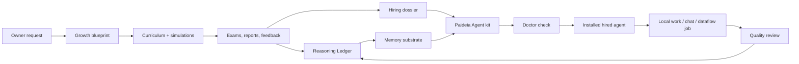

# Paideia Agent

[English](README.md) | [한국어](README.ko.md)

Paideia Agent is a local-first AI talent foundry and agent runtime. It is designed to raise an AI talent through staged education, assessments, memory formation, work experience, and review, then package that talent as an installable local agent.

The project takes inspiration from modern agent systems such as [Hermes Agent](https://github.com/NousResearch/hermes-agent) and [OpenClaw](https://github.com/openclaw/openclaw), but its center of gravity is different: Paideia starts with education before agency. An agent is not just a prompt profile. It is the hired runtime form of a trained local AI talent.

> Research preview: this repository contains program code, public metadata, test fixtures, and documentation. Private training outputs, local memories, personal data, model checkpoints, and generated run artifacts stay outside the source tree.

## Origin

Paideia Agent starts from a simple question: what if an AI agent could extend you, or what if a field role model's learning path could become the curriculum for a local AI talent that helps you work?

The project does not claim to clone real people. It reconstructs sourced growth conditions, curricula, tests, stress, failure, feedback, and work practice so each talent can form a reviewable Reasoning Ledger before it is hired as an agent.

Read the longer manifesto:

- [Project Manifesto](docs/project_manifesto.md)
- [프로젝트 선언문](docs/project_manifesto.ko.md)

## What Makes It Different

Most agent runtimes begin with an assistant and add tools, memory, channels, and skills. Paideia begins with a curriculum:

- **Raise first, hire later**: a talent passes through growth records, courses, exams, reports, and review gates before becoming an agent.
- **Memory substrate, not full transcript replay**: the runtime selects bounded summaries, learning records, and procedural cues instead of injecting every old conversation.
- **Reasoning Ledger / Ariadne Thread**: a reviewable ledger of hypotheses, evidence, mistakes, corrected principles, study habits, and work patterns. It is not hidden chain-of-thought. The internal compatibility artifact is still named `reasoning_kibo.jsonl`.
- **Role-model process replication**: a role model contributes sourced learning conditions and curriculum pressure, not a preloaded personality or worldview.
- **Parent-controlled projection swarm**: one hired talent can split work into task projections, synthesize their findings, and promote only reviewed learning back into the parent record.
- **Local-first ownership**: the owner keeps private data, generated memories, voice assets, local curricula, and installed agent bundles on their own machine.
- **Safe skill migration**: Hermes/OpenClaw/generic skills can be imported, but they are quarantined and disabled until reviewed.

## Bundled Role Models

The first deep track is still the directly testable Graham Junior sample:

```text
domain: securities_research
role_model: graham_value_investing
sample talent: grham-junior
```

This track is inspired by Benjamin Graham's publicly documented learning and value-investing lineage. It does not try to impersonate Graham, forecast markets from his birth data, or inject Graham-like conclusions. Instead, it reconstructs an educational path:

1. high-school foundations,
2. university-level finance, accounting, economics, and statistics,
3. graduate securities analysis, value investing, behavioral finance, and quant analysis,
4. doctoral-level research projects,
5. exams and reports that shape the talent's Reasoning Ledger over time.

Copyrighted textbooks are stored as metadata and reading plans only unless the owner provides a lawful local private copy.

The onboarding catalog now also includes selectable public-metadata role-model tracks for common agent use cases:

| Domain | Role model process | Good first agent use |
| --- | --- | --- |
| `software_agent_engineering` | `hopper_software_tooling`, `dijkstra_verified_programming` | coding, debugging, tool-building, correctness review |
| `data_analysis_bi` | `tukey_data_analysis` | data profiling, BI, experiment analysis |
| `customer_support_quality_ops` | `deming_quality_ops` | support quality, process improvement, incident learning |
| `cybersecurity` | `anderson_security_engineering` | threat modeling, security review, privacy/risk analysis |
| `marketing_sales` | `ogilvy_research_copywriting` | customer research, campaign briefs, copy testing |
| `healthcare_operations` | `nightingale_healthcare_statistics` | healthcare operations and safety dashboards, not medical advice |
| `education_tutoring` | `montessori_learning_design` | tutoring design, learner diagnosis, adaptive curriculum |
| `management_productivity` | `drucker_management_knowledge_work` | management memos, decision support, productivity systems |
| `legal_compliance_research` | `ginsburg_legal_research` | legal/compliance research summaries, not legal advice |
| `blockchain_protocol_research` | `finney_blockchain_protocol` | protocol research, wallet-safety review, not investment advice |
| `information_systems_research` | `shannon_information_theory` | information theory, compression, uncertainty modeling |

All of these are **process templates**, not impersonation targets. The catalog stores public facts, source links, curriculum pressure, and assessment ladders. It does not store copyrighted textbook bodies or inject a public figure's personality.

## Architecture



## Repository Layout

```text
apps/ai-talent-foundry/     App-level examples, role-model catalogs, and foundry docs
src/ai22b/talent_foundry/   Core Paideia and agent-foundry Python modules
src/ai22b/from_scratch/     Tiny from-scratch model experiments
src/ai22b/knowledge/        Future retrieval and local knowledge layers
src/ai22b/voice/            Local voice rules and references
data/public/                Public research metadata and source indexes
data/private/               Private owner data placeholder, ignored by Git
docs/                       Research notes, architecture, privacy, and release hygiene
evals/                      Evaluation fixtures
examples/                   Public onboarding samples such as Graham Junior
models/                     Local model placeholders, ignored except .gitkeep
runs/                       Generated reports and runtime artifacts, ignored except .gitkeep
tests/                      Regression tests
```

## Install For Local Development

Use PowerShell from the repository root:

```powershell
python -m pip install -e .
$env:PYTHONPATH = "src"
```

Runtime artifacts are stored outside this source tree by default:

```powershell
$env:AI22B_STORAGE_ROOT = "$env:USERPROFILE\Documents\22B-AI-local-storage"
```

You can point storage somewhere else:

```powershell
$env:AI22B_STORAGE_ROOT = "D:\AI22B-storage"
```

## Quick Start

Run the bundled Graham Junior sample through the guided onboarding flow:

```powershell
ai22b-talent-foundry start-console `
  --answers examples\graham_junior_onboarding.answers.json
```

For a one-command product smoke test, run the Graham Junior quickstart report. It raises the sample, writes the transcript and hiring dossier, opens a first local chat turn, and runs the OpenClaw channel flow doctor. You can override the LLM with any OpenClaw-style `provider/model` or the Gateway bridge:

```powershell
ai22b-talent-foundry run-graham-junior-quickstart `
  --llm-service "openclaw-gateway/openrouter/meta-llama/llama-3.1-8b" `
  --llm-model-path "http://127.0.0.1:18789" `
  --chat-surface openclaw-channel-webchat `
  --channel webchat
```

The interactive first-run path also has an OpenClaw-style alias:

```powershell
ai22b-talent-foundry onboard
```

This wizard uses config detection, QuickStart/Advanced mode, Model/Auth, Workspace, Gateway/Channels, Skills, Education Path, Runtime, Agent Identity, Health Check, and Finish steps.

This sample first selects the LLM service and chat surface, then lets that selected LLM act as the curriculum researcher for the Graham-inspired securities research track. Each onboarding run now also writes an OpenClaw runtime bundle with provider/channel doctors, a provider auth doctor for API-key/OAuth/local-server/Gateway readiness, a channel pairing doctor for QR/session/local-bridge readiness, a reviewable `openclaw_config_patch.json`, WebChat/channel gateway setup files, a bridge setup kit with plugin plans and smoke-test payloads, native OpenClaw handoff commands, and a Gateway LLM doctor when `openclaw_gateway_http` is selected.

List available role models:

```powershell
ai22b-talent-foundry list-role-models
ai22b-talent-foundry list-role-models --domain software_agent_engineering
```

Create a Graham-inspired blueprint without modifying another talent:

```powershell
ai22b-talent-foundry blueprint `
  --request "Raise a separate Graham learning-path sample AI without modifying existing talents." `
  --talent-name "grham-junior" `
  --gender "male" `
  --owner "Boss" `
  --domain securities_research `
  --role-model graham_value_investing
```

Run the education-to-employment flow from a blueprint:

```powershell
ai22b-talent-foundry raise `
  --blueprint "$env:AI22B_STORAGE_ROOT\talent-foundry\runs\agent_training_blueprint.json"
```

Create a non-Graham talent with a local Ollama-compatible LLM adapter selected during onboarding:

```powershell
ai22b-talent-foundry onboard-agent `
  --request "Raise a developer-tool agent that learns through debugging, compilers, tests, and documentation." `
  --talent-name "hopper-junior" `
  --gender "male" `
  --owner "Boss" `
  --domain software_agent_engineering `
  --role-model hopper_software_tooling `
  --llm-service ollama_local `
  --llm-model "llama3.1:8b" `
  --llm-model-path "http://localhost:11434" `
  --chat-surface codex-bridge-chat
```

Build an installable Paideia Agent kit from a hired employment record:

```powershell
ai22b-talent-foundry build-paideia-agent-kit `
  --employment-record "$env:AI22B_STORAGE_ROOT\talent-foundry\runs\grham_junior_sample\installed_agents\agents\grham_junior_agent_release_bundle\employment_record.json" `
  --output-dir "$env:AI22B_STORAGE_ROOT\paideia-agent-kits\grham_junior_paideia_agent"
```

The kit scripts include a small runtime resolver. If Paideia is not already installed in Python, register the local source checkout once:

```powershell
powershell -ExecutionPolicy Bypass -File .\install_paideia_runtime.ps1 -SourceRepo "C:\path\to\Paideia-Agent"
```

Or install from the public GitHub repository:

```powershell
powershell -ExecutionPolicy Bypass -File .\install_paideia_runtime.ps1 -InstallFromGit
```

Pass `-GitUrl` with the public Paideia Agent repository URL before using the Git install path.

The generated `paideia_runtime.local.json` may contain a local source path. Keep it local and do not publish it.

Each generated kit includes an OpenClaw provider/channel menu snapshot:

```powershell
powershell -ExecutionPolicy Bypass -File .\refresh_openclaw_onboarding_menu.ps1
powershell -ExecutionPolicy Bypass -File .\refresh_openclaw_onboarding_menu.ps1 -RefreshDocs
```

The `OPENCLAW_ONBOARDING_MENU.md` file lists every OpenClaw-compatible provider/channel known to Paideia, plus the free-form `provider/model` and `openclaw-channel-<channel>` selectors that let OpenClaw Gateway own future providers or chat plugins Paideia has not hard-coded yet.

Doctor the kit before first use:

```powershell
ai22b-talent-foundry doctor-agent-program `
  --program "$env:AI22B_STORAGE_ROOT\paideia-agent-kits\grham_junior_paideia_agent\22b_paideia_agent_program.json"
```

Chat through the local education records and Reasoning Ledger:

```powershell
ai22b-talent-foundry run-agent-program-chat `
  --program "$env:AI22B_STORAGE_ROOT\paideia-agent-kits\grham_junior_paideia_agent\22b_paideia_agent_program.json" `
  --message "Explain how you would begin a valuation memo."
```

The generated kit also includes OpenClaw-style runtime entrypoints that can be run from inside the kit folder:

```powershell
powershell -ExecutionPolicy Bypass -File .\build_openclaw_runtime_bundle.ps1 -Channel webchat
powershell -ExecutionPolicy Bypass -File .\build_openclaw_live_smoke_plan.ps1 -Channel webchat
powershell -ExecutionPolicy Bypass -File .\run_openclaw_smoke_sequence.ps1 -Channel webchat
powershell -ExecutionPolicy Bypass -File .\start_openclaw_webchat.ps1 -Port 8722
```

`build_openclaw_live_smoke_plan.ps1` writes a no-secret operator sequence before any real provider key, Gateway, or external channel is used. `run_openclaw_smoke_sequence.ps1` executes the safe installed-kit checks in order: runtime bundle, smoke plan, offline context chat, static runtime preflight with channel-flow dry run, and offline channel-message routing. It skips Gateway/live LLM/live channel probes unless you add `-IncludeLive`. `start_openclaw_webchat.ps1` starts the local browser chat surface on `127.0.0.1` by default and exposes `/api/runtime` plus `/api/smoke-plan` for quick inspection.

## Hermes/OpenClaw-Style Skill Migration

Hermes and OpenClaw both make skill and memory systems central to agent usefulness. Paideia supports migration from those ecosystems, but does not execute imported skills automatically.

```powershell
ai22b-talent-foundry migrate-agent-assets `
  --source C:\path\to\external-skill `
  --paideia-kit "$env:AI22B_STORAGE_ROOT\paideia-agent-kits\grham_junior_paideia_agent" `
  --source-runtime openclaw
```

Imported skills are copied to:

```text
skills/imported/<runtime>/<skill>/
```

Each import receives:

- a wrapper `SKILL.md`,
- a `paideia_skill_manifest.json`,
- `activation.status = disabled`,
- risk flags for suspicious patterns such as remote shell installers, credential access, recursive delete, and network listeners,
- a review checklist before promotion into a Paideia education axis or procedural skill.

The rule is simple: **migration is easy; activation is deliberate**.

## Agent Program Outputs

A Paideia Agent kit can include:

- `22b_paideia_agent_program.json`
- `paideia_agent_install_manifest.json`
- `paideia_onboarding.template.json`
- `openclaw_onboarding_menu.json`
- `OPENCLAW_ONBOARDING_MENU.md`
- `paideia_runtime.ps1`
- `install_paideia_runtime.ps1`
- `doctor_paideia.ps1`
- `start_paideia_chat.ps1`
- `refresh_openclaw_onboarding_menu.ps1`
- `build_openclaw_runtime_bundle.ps1`
- `build_openclaw_live_smoke_plan.ps1`
- `run_openclaw_smoke_sequence.ps1`
- `start_openclaw_webchat.ps1`
- `adapter_manifests/codex_native.json`
- `adapter_manifests/hermes_style.json`
- `adapter_manifests/openclaw_style.json`
- `memory_substrate.json`
- `learning_ledger.json`
- `language_development_program.json`
- `hiring_dossier.json`
- `HIRING_DOSSIER.ko.md`

Generated agent kits are local runtime artifacts. They are not committed to the public source repository by default.

## Onboarding Model

Paideia Agent follows the practical first-run pattern seen in installed agent programs:

1. choose an LLM service,
2. choose the chat surface,
3. select a role-model process or use the bundled Graham Junior sample,
4. let the selected LLM act as a researcher that turns the owner request into curriculum, assessment, and growth inputs,
5. review the hiring dossier before using the installed agent for work.

Paideia now mirrors OpenClaw's `provider/model` selection style. Built-in direct adapters include:

- `openai_chatgpt_codex`
- `anthropic_claude_api`
- `google_gemini_api`
- `mistral_api`
- `openrouter_api`
- `openclaw_gateway_http` for an installed OpenClaw Gateway's OpenAI-compatible `/v1/chat/completions` endpoint
- `ollama_local`
- `lm_studio_local`
- OpenAI-compatible OpenClaw providers such as `deepseek_api`, `groq_api`, `gmi_api`, `novita_api`, `huggingface_api`, `kilocode_gateway`, `xai_api`, `perplexity_api`, `together_ai`, `fireworks_api`, `deepinfra_api`, `cerebras_api`, `moonshot_api`, `qwen_api`, `z_ai_api`, `venice_api`, `nvidia_api`, `arcee_api`, `chutes_api`, `qianfan_api`, `stepfun_api`, `stepfun_plan_api`, `volcengine_api`, `volcengine_plan_api`, `xiaomi_api`, `xiaomi_token_plan_api`, `vllm_local`, `sglang_local`, `litellm_gateway`, and `vercel_ai_gateway`
- OpenClaw-compatible native/proxy providers such as `ollama_cloud`, `synthetic_api`, `minimax_api`, and `inferrs_local`
- `deterministic_local`
- `bigram_local`
- `transformers_local`
- `llama_cpp_local`

The CLI also accepts OpenClaw-style model selectors directly:

```powershell
ai22b-talent-foundry hire-installed `
  --installed-manifest "<installed_agent_manifest.json>" `
  --role "Research agent" `
  --llm-service "openrouter/meta-llama/llama-3.1-8b" `
  --chat-surface codex-bridge-chat
```

After hiring, the same selection can be used by the work runtime, not only by chat. Keep the default offline mode for deterministic/local smoke tests; add `--live-llm` only when the provider key, local server, or OpenClaw Gateway is ready:

```powershell
ai22b-talent-foundry run-hired-agent `
  --employment-record "<employment_record.json>" `
  --task "Draft a valuation memo outline." `
  --live-llm

ai22b-talent-foundry run-hired-agent-job `
  --employment-record "<employment_record.json>" `
  --job-spec "<job_spec.json>" `
  --workspace "$env:AI22B_STORAGE_ROOT\talent-foundry\workspaces\job-001" `
  --llm-mode live
```

When OpenClaw itself should own all provider authentication and routing, use the Gateway bridge. Paideia sends the trained talent context to `openclaw/default` and passes the backend model as `x-openclaw-model`, matching OpenClaw's agent-first HTTP contract:

```powershell
ai22b-talent-foundry hire-installed `
  --installed-manifest "<installed_agent_manifest.json>" `
  --role "Research agent" `
  --llm-service openclaw_gateway_http `
  --llm-model "openrouter/meta-llama/llama-3.1-8b" `
  --llm-model-path "http://127.0.0.1:18789/v1" `
  --chat-surface openclaw-channel-webchat
```

Before live chat, run the Gateway LLM doctor. The default mode is static and does not call the network; add `--probe-gateway --probe-chat` only after OpenClaw Gateway is running and the operator has set any required `OPENCLAW_GATEWAY_TOKEN` or `OPENCLAW_GATEWAY_PASSWORD` environment variable:

```powershell
ai22b-talent-foundry doctor-openclaw-gateway-llm `
  --employment-record "<employment_record.json>" `
  --config-patch "$env:AI22B_STORAGE_ROOT\talent-foundry\runs\openclaw_runtime_bundle\openclaw_config_patch.json" `
  --output "$env:AI22B_STORAGE_ROOT\talent-foundry\runs\openclaw_gateway_llm_doctor.json"

ai22b-talent-foundry doctor-openclaw-gateway-llm `
  --employment-record "<employment_record.json>" `
  --probe-gateway `
  --probe-chat `
  --output "$env:AI22B_STORAGE_ROOT\talent-foundry\runs\openclaw_gateway_llm_doctor.live.json"
```

For OpenClaw parity discovery:

```powershell
ai22b-talent-foundry list-openclaw-compat `
  --output "$env:AI22B_STORAGE_ROOT\talent-foundry\runs\openclaw_compat.json"

ai22b-talent-foundry audit-openclaw-parity `
  --output "$env:AI22B_STORAGE_ROOT\talent-foundry\runs\openclaw_parity_audit.json" `
  --fail-on-missing

ai22b-talent-foundry audit-openclaw-parity `
  --refresh-docs `
  --output "$env:AI22B_STORAGE_ROOT\talent-foundry\runs\openclaw_parity_live_docs.json" `
  --fail-on-missing

ai22b-talent-foundry build-openclaw-support-matrix `
  --output "$env:AI22B_STORAGE_ROOT\talent-foundry\runs\openclaw_support_matrix.json"

ai22b-talent-foundry build-openclaw-onboarding-menu `
  --output "$env:AI22B_STORAGE_ROOT\talent-foundry\runs\openclaw_onboarding_menu.json" `
  --markdown-output "$env:AI22B_STORAGE_ROOT\talent-foundry\runs\OPENCLAW_ONBOARDING_MENU.md"

ai22b-talent-foundry doctor-openclaw-selection `
  --llm-service "openclaw-gateway/openrouter/meta-llama/llama-3.1-8b" `
  --llm-model-path "http://127.0.0.1:18789/v1" `
  --chat-surface openclaw-channel-webchat `
  --channel telegram `
  --output "$env:AI22B_STORAGE_ROOT\talent-foundry\runs\openclaw_selection_doctor.json" `
  --summary-output "$env:AI22B_STORAGE_ROOT\talent-foundry\runs\OPENCLAW_SELECTION_SUMMARY.md"

ai22b-talent-foundry list-openclaw-provider-connectors `
  --output "$env:AI22B_STORAGE_ROOT\talent-foundry\runs\provider_connectors.json"

ai22b-talent-foundry doctor-openclaw-provider-connectors `
  --output "$env:AI22B_STORAGE_ROOT\talent-foundry\runs\provider_connector_doctor.json"

ai22b-talent-foundry doctor-openclaw-provider-auth `
  --provider qwen-oauth `
  --provider arcee `
  --openclaw-config "$env:USERPROFILE\.openclaw\openclaw.json" `
  --output "$env:AI22B_STORAGE_ROOT\talent-foundry\runs\provider_auth_doctor.json"
```

External API adapters require the user's own keys before live use. Local model adapters prefer localhost or local files. Chat surfaces include `codex-bridge-chat`, `cli-console`, `dataflow-job`, a disabled `openclaw-style-gateway`, and OpenClaw channel manifests such as `openclaw-channel-telegram`, `openclaw-channel-discord`, `openclaw-channel-slack`, `openclaw-channel-whatsapp`, `openclaw-channel-signal`, `openclaw-channel-microsoft-teams`, `openclaw-channel-google-chat`, `openclaw-channel-imessage`, `openclaw-channel-matrix`, `openclaw-channel-mattermost`, and `openclaw-channel-webchat`.

The support matrix is the installer-facing summary: it marks every OpenClaw provider and channel as Paideia direct-ready, OpenClaw Gateway-ready, local-server ready, or plugin/OAuth/bridge required. The onboarding menu turns that full matrix into a first-run picker: the terminal shows a compact recommended list, while `OPENCLAW_ONBOARDING_MENU.md` contains every OpenClaw provider and channel. Every onboarding run now writes `openclaw_support_matrix.json`, `openclaw_onboarding_menu.json`, and the markdown menu, then embeds the selected provider/channel support level into `onboarding_session.json`, so the user can see whether the chosen LLM/chat path is direct, Gateway-routed, local-server based, or plugin-owned. `doctor-openclaw-selection` is the pre-onboarding check for one exact provider/model plus chat-channel combination; it performs no external network calls and stores no secrets. Pass `--bridge-setup-dir <dir>` to also write the env template, provider plugin/OAuth plan, channel plugin plan, deny-by-default access config, and smoke-test payloads for that exact selection. The guided console now writes `openclaw_selection_doctor.json`, `OPENCLAW_SELECTION_SUMMARY.md`, and an `openclaw_bridge_setup/` kit before raising the talent, then prints a short terminal preview with the provider, LLM health, channel support levels, bridge setup kit path, and summary path.

The provider catalog follows OpenClaw's canonical `provider/model` IDs where possible, including `lmstudio/*`, `zai/*`, `kilocode/*`, `gmi/*`, `novita/*`, `huggingface/*`, `ollama-cloud/*`, `arcee/*`, `chutes/*`, `qianfan/*`, `stepfun/*`, `volcengine-plan/*`, and `xiaomi/*`. The provider connector doctor separates Paideia live adapters from OpenClaw provider-plugin surfaces such as Bedrock, Copilot, Qwen OAuth, Gemini CLI OAuth, media generation providers, and other OAuth/custom-runner integrations. `audit-openclaw-parity` compares Paideia's local catalog against the checked OpenClaw provider/channel documentation snapshot and fails when a supported provider or channel is missing. Live parity mode also reports unknown provider/channel doc slugs so a newly added OpenClaw LLM or chat surface cannot be silently ignored. Secret values are never serialized.

`doctor-openclaw-provider-auth` is the LLM-side equivalent of the channel pairing doctor. It separates direct API-key providers, local model servers, Codex host bridge use, OpenClaw OAuth/account-session providers, cloud profile providers, and media/custom-runner plugins. When a provider must remain OpenClaw-owned, the doctor points the user toward `openclaw onboard`, model auth review, Gateway startup, and `doctor-openclaw-gateway-llm`. It records only env-var presence, redacted config hints, and readiness categories; secret values and local config paths are not serialized.

When a user enters an OpenClaw `provider/model` that Paideia cannot call directly because it needs an OpenClaw provider plugin, OAuth profile, media tool, or custom runner, Paideia now auto-routes that selector through `openclaw_gateway_http`. The original selector is preserved as `openclaw_model`, so OpenClaw can own the provider auth and backend call while Paideia contributes the local talent context and Reasoning Ledger.

If OpenClaw adds a provider or channel before Paideia's static catalog is updated, Paideia still preserves OpenClaw-style selections instead of rejecting them. Unknown `provider/model` values are treated as Gateway-owned external providers, and unknown `openclaw-channel-*` surfaces are kept as Gateway-owned external channels. The doctors mark those paths as unverified by Paideia and point the owner back to OpenClaw's own provider/channel setup, but the local talent identity and memory context can still be handed to the Gateway.

For OpenClaw-style key resolution, Paideia checks `OPENCLAW_LIVE_<PROVIDER>_KEY`, `<PROVIDER>_API_KEYS`, `<PROVIDER>_API_KEY`, and provider-specific env vars such as `ARCEEAI_API_KEY`, `VOLCANO_ENGINE_API_KEY`, `DASHSCOPE_API_KEY`, or `XIAOMI_TOKEN_PLAN_API_KEY`. Comma or semicolon key lists use the first non-empty key for live smoke tests.

If you already have an OpenClaw config, import it first. Paideia reads the selected `provider/model`, configured channel keys, `channels.modelByChannel`, and `bindings[]`, then writes Paideia-safe selections and setup steps without storing provider keys or bot tokens.

```powershell
ai22b-talent-foundry import-openclaw-config `
  --config "$env:USERPROFILE\.openclaw\openclaw.json" `
  --output-dir "$env:AI22B_STORAGE_ROOT\talent-foundry\runs\openclaw_import"
```

This writes `paideia_openclaw_config_import.json`, `openclaw_config.redacted.json`, `openclaw_import_setup_plan.json`, and `paideia_onboarding.answers.suggested.json`.

You can also use the OpenClaw config as onboarding defaults. Values from `--answers` override the imported defaults, so a user can keep their role-model request while reusing OpenClaw's selected LLM and first chat channel:

```powershell
ai22b-talent-foundry start-console `
  --answers examples\graham_junior_onboarding.answers.json `
  --openclaw-config "$env:USERPROFILE\.openclaw\openclaw.json" `
  --output-dir "$env:AI22B_STORAGE_ROOT\talent-foundry\runs\openclaw_prefilled_onboarding"
```

The same OpenClaw config can now flow directly into hiring. `hire-installed --openclaw-config` imports the config, uses the selected OpenClaw `provider/model` as the hired agent's LLM route, uses the first detected OpenClaw channel as the chat surface unless overridden, and records only a no-secret import reference in `employment_record.json`:

```powershell
ai22b-talent-foundry hire-installed `
  --installed-manifest "<installed_agent_manifest.json>" `
  --role "Research agent" `
  --openclaw-config "$env:USERPROFILE\.openclaw\openclaw.json"
```

After an agent is hired, build a reviewable OpenClaw-style runtime setup bundle. This is the practical handoff point between Paideia's education records and OpenClaw-like execution:

```powershell
ai22b-talent-foundry build-openclaw-runtime-bundle `
  --employment-record "<employment_record.json>" `
  --channel webchat `
  --channel telegram `
  --channel-model "telegram:boss-thread=openrouter/meta-llama/llama-3.1-8b" `
  --binding "telegram:boss-thread=paideia-graham-junior" `
  --existing-openclaw-config "$env:USERPROFILE\.openclaw\openclaw.json" `
  --config-action modify `
  --output-dir "$env:AI22B_STORAGE_ROOT\talent-foundry\runs\openclaw_runtime_bundle"
```

To verify the exact hired-agent runtime selection before building or handing off a bundle, run the employment runtime doctor. It summarizes the selected provider/model, Gateway route, chat surface, channel support path, and next commands without storing provider keys, bot tokens, QR sessions, or private training files:

```powershell
ai22b-talent-foundry doctor-openclaw-employment-runtime `
  --employment-record "<employment_record.json>" `
  --channel webchat `
  --output "$env:AI22B_STORAGE_ROOT\talent-foundry\runs\openclaw_employment_runtime_doctor.json" `
  --summary-output "$env:AI22B_STORAGE_ROOT\talent-foundry\runs\OPENCLAW_EMPLOYMENT_RUNTIME.md"
```

For an operator-ready live validation checklist, build a smoke plan. The plan performs no network calls by itself. It writes the exact sequence for offline context verification, runtime bundle creation, static preflight, OpenClaw Gateway probing, live LLM chat, and OpenClaw channel message smoke tests:

```powershell
ai22b-talent-foundry build-openclaw-live-smoke-plan `
  --employment-record "<employment_record.json>" `
  --channel webchat `
  --output "$env:AI22B_STORAGE_ROOT\talent-foundry\runs\openclaw_live_smoke_plan.json" `
  --markdown-output "$env:AI22B_STORAGE_ROOT\talent-foundry\runs\OPENCLAW_LIVE_SMOKE_PLAN.md"
```

`start-console` and `onboard` now generate the same smoke plan automatically after the talent is hired, so the first-run folder contains both the education/hiring artifacts and the next runnable OpenClaw live validation sequence.

The bundle writes:

- `openclaw_config_patch.json`: a review-first `openclaw.json` patch with the selected `provider/model`, `models.providers`, `agents.list`, gateway URL, enabled channels, `channels.modelByChannel`, `bindings[]`, and `gateway.http.endpoints.chatCompletions.enabled=true` for OpenAI-compatible Gateway clients.
- `openclaw_native_handoff.json`: a native OpenClaw handoff plan with `openclaw setup --workspace`, `openclaw doctor`, `openclaw channels add --channel <id> --help`, and `openclaw gateway run` commands for owners who want OpenClaw itself to own provider auth, channel plugins, gateway sessions, and platform delivery.
- `openclaw.env.example.ps1`: a local PowerShell environment template. It lists secret variable names but never writes secret values.
- `openclaw_provider_doctor.json`, `openclaw_provider_auth_doctor.json`, `openclaw_channel_doctor.json`, `openclaw_channel_pairing_doctor.json`, `openclaw_gateway_llm_doctor.json` when applicable, and `llm_service_health.json`: readiness checks for model auth, provider API-key/OAuth/local-server/Gateway readiness, channel bridge requirements, QR/session/local-bridge readiness, OpenClaw Gateway HTTP LLM compatibility, and local/remote runtime status.
- `openclaw_gateway_config.json` and `openclaw_channel_access_config.json`: loopback gateway and deny-by-default channel access setup.
- `openclaw_bridge_setup/`: provider/channel plugin plans, deny-by-default access config, env template, and smoke-test payloads generated from the hired runtime selection.
- `openclaw_existing_config_review.json`: OpenClaw-style existing config detection with `keep`, `modify`, or `reset` semantics. `modify` writes a redacted merge preview; `reset` writes a plan only and never deletes or overwrites the config.

Before live use, run the runtime preflight. It re-checks the current provider auth state, channel QR/session/local-bridge readiness, native handoff plan, Gateway LLM contract when selected, and an optional offline channel-flow dry run from the installed Paideia talent:

```powershell
ai22b-talent-foundry doctor-openclaw-runtime-preflight `
  --runtime-bundle "$env:AI22B_STORAGE_ROOT\talent-foundry\runs\openclaw_runtime_bundle\openclaw_runtime_bundle.json" `
  --run-channel-flow `
  --output "$env:AI22B_STORAGE_ROOT\talent-foundry\runs\openclaw_runtime_bundle\openclaw_runtime_preflight.json"
```

The preflight writes `openclaw_runtime_preflight.json` plus fresh `openclaw_provider_auth_doctor.current.json`, `openclaw_channel_pairing_doctor.current.json`, and, when applicable, native handoff, Gateway LLM, and channel-flow reports. It stores no secret values and only sends live probes when `--probe-openclaw`, `--probe-gateway`, or `--probe-chat` is explicitly passed.

Before handing the bundle to an installed OpenClaw runtime, doctor the native handoff. By default this is non-mutating and does not execute OpenClaw; add `--probe-openclaw` only when you want read-only CLI probes such as gateway/channel status:

```powershell
ai22b-talent-foundry doctor-openclaw-native-handoff `
  --handoff "$env:AI22B_STORAGE_ROOT\talent-foundry\runs\openclaw_runtime_bundle\openclaw_native_handoff.json" `
  --output "$env:AI22B_STORAGE_ROOT\talent-foundry\runs\openclaw_runtime_bundle\openclaw_native_handoff_doctor.json"
```

To prepare the actual OpenClaw config merge, use `prepare-openclaw-native-config`. The default `plan` mode writes only a redacted report. `write-copy` writes a local merged config copy only when `--merged-output` is explicit. `apply` writes the target OpenClaw config only when `--confirm-apply` is present and creates a backup first.

```powershell
ai22b-talent-foundry prepare-openclaw-native-config `
  --handoff "$env:AI22B_STORAGE_ROOT\talent-foundry\runs\openclaw_runtime_bundle\openclaw_native_handoff.json" `
  --mode plan `
  --output "$env:AI22B_STORAGE_ROOT\talent-foundry\runs\openclaw_runtime_bundle\openclaw_native_config_merge.plan.json"

ai22b-talent-foundry prepare-openclaw-native-config `
  --handoff "$env:AI22B_STORAGE_ROOT\talent-foundry\runs\openclaw_runtime_bundle\openclaw_native_handoff.json" `
  --mode write-copy `
  --merged-output "$env:AI22B_STORAGE_ROOT\talent-foundry\runs\openclaw_runtime_bundle\openclaw.merged.local.json" `
  --output "$env:AI22B_STORAGE_ROOT\talent-foundry\runs\openclaw_runtime_bundle\openclaw_native_config_merge.copy.json"

ai22b-talent-foundry prepare-openclaw-native-config `
  --handoff "$env:AI22B_STORAGE_ROOT\talent-foundry\runs\openclaw_runtime_bundle\openclaw_native_handoff.json" `
  --mode apply `
  --confirm-apply `
  --output "$env:AI22B_STORAGE_ROOT\talent-foundry\runs\openclaw_runtime_bundle\openclaw_native_config_merge.apply.json"
```

If the owner wants the next step after import or runtime bundling, build the bridge setup kit. It turns selected providers and channels into a practical checklist: env template, provider plugin/OAuth plan, channel bridge plan, deny-by-default access config, and local smoke-test payloads.

```powershell
ai22b-talent-foundry build-openclaw-bridge-setup-kit `
  --import-manifest "$env:AI22B_STORAGE_ROOT\talent-foundry\runs\openclaw_import\paideia_openclaw_config_import.json" `
  --provider qwen-oauth `
  --channel webchat `
  --channel telegram `
  --output-dir "$env:AI22B_STORAGE_ROOT\talent-foundry\runs\openclaw_bridge_setup"
```

This writes `openclaw_bridge_setup_kit.json`, `openclaw_bridge.env.example.ps1`, `openclaw_provider_plugin_plan.json`, `openclaw_provider_auth_doctor.json`, `openclaw_channel_plugin_plan.json`, `openclaw_channel_pairing_doctor.json`, `openclaw_bridge_channel_access_config.json`, `openclaw_bridge_smoke_tests.json`, and `smoke_test_payloads/*.json`. It stores no provider keys, bot tokens, QR sessions, local path values, or private training files.

OpenClaw-style channels can now be routed through a local Paideia gateway envelope. The core returns a sendable outbound envelope; actual platform plugins remain responsible for bot tokens, pairing, and final delivery.

```powershell
ai22b-talent-foundry build-openclaw-gateway-config `
  --employment-record "<employment_record.json>" `
  --channel telegram `
  --channel webchat `
  --output "$env:AI22B_STORAGE_ROOT\talent-foundry\runs\openclaw_gateway_config.json"

ai22b-talent-foundry run-openclaw-channel-message `
  --employment-record "<employment_record.json>" `
  --channel telegram `
  --conversation-id "telegram-test" `
  --sender-id "boss" `
  --message "Can you answer through the channel gateway?" `
  --output "$env:AI22B_STORAGE_ROOT\talent-foundry\runs\telegram_channel_run.json"
```

To verify the full local channel path in one step, run the channel flow doctor. It sends a dry-run message through Paideia chat, prepares channel-specific outbound payloads for Telegram/Discord/Slack when selected, and performs no external network delivery:

```powershell
ai22b-talent-foundry doctor-openclaw-channel-flow `
  --employment-record "<employment_record.json>" `
  --channel telegram `
  --channel webchat `
  --output "$env:AI22B_STORAGE_ROOT\talent-foundry\runs\openclaw_channel_flow_doctor.json"
```

External channel plugins can post normalized OpenClaw-style messages to a local HTTP gateway:

```powershell
ai22b-talent-foundry run-openclaw-channel-gateway-server `
  --employment-record "<employment_record.json>" `
  --channel telegram `
  --channel discord `
  --channel slack `
  --port 8722 `
  --output-dir "$env:AI22B_STORAGE_ROOT\talent-foundry\runs\channel-gateway"
```

The server exposes `GET /health`, `GET /openclaw/gateway-config`, and `POST /openclaw/channel-message`. By default it returns a channel-specific outbound envelope and does not send to Telegram/Discord/Slack itself; platform plugins keep control of tokens, pairing, allowlists, and final delivery. This follows OpenClaw's deterministic routing pattern: reply to the origin channel/session rather than letting the model choose a destination.

Raw platform events can be translated through a deny-by-default ingress layer before routing:

```powershell
ai22b-talent-foundry build-openclaw-channel-access-config `
  --channel telegram `
  --allow-sender "telegram:12345" `
  --output "$env:AI22B_STORAGE_ROOT\talent-foundry\runs\channel_access.json"

ai22b-talent-foundry translate-openclaw-platform-event `
  --channel telegram `
  --event ".\telegram_update.json" `
  --access-config "$env:AI22B_STORAGE_ROOT\talent-foundry\runs\channel_access.json" `
  --output "$env:AI22B_STORAGE_ROOT\talent-foundry\runs\telegram_translation.json"
```

The HTTP gateway also accepts `POST /openclaw/platform-event/telegram`, `/discord`, and `/slack` when started with `--access-config`. Unlisted senders or conversations receive a `403` translation result instead of being routed into the talent.

To see how every OpenClaw channel maps into Paideia, generate the connector readiness catalog:

```powershell
ai22b-talent-foundry list-openclaw-channel-connectors `
  --output "$env:AI22B_STORAGE_ROOT\talent-foundry\runs\channel_connectors.json"

ai22b-talent-foundry doctor-openclaw-channel-connectors `
  --output "$env:AI22B_STORAGE_ROOT\talent-foundry\runs\channel_connector_doctor.json"

ai22b-talent-foundry doctor-openclaw-channel-pairing `
  --channel whatsapp `
  --channel signal `
  --channel imessage `
  --output "$env:AI22B_STORAGE_ROOT\talent-foundry\runs\channel_pairing_doctor.json"
```

Telegram, Discord, Slack, Google Chat, LINE, Matrix, Mattermost, SMS, Synology Chat, and WebChat have Paideia direct adapters for reviewed inbound/outbound gateway flows where the platform exposes a normal HTTP API or webhook. Current OpenClaw iMessage support runs through the bundled `imessage`/`imsg` path; `bluebubbles` is kept only as a migration target for older configs. ClickClack and QA Channel are represented too: ClickClack needs an external bot-token plugin, while QA Channel is for deterministic OpenClaw-style channel tests. The remaining OpenClaw channels remain selectable and can use the normalized gateway envelope today, while raw platform integration is marked with the required bridge/plugin setup such as WhatsApp QR pairing, signal-cli, Bot Framework, or regional account/session plugins.

`doctor-openclaw-channel-pairing` is the user-facing bridge readiness check for channels that cannot be finished by a normal webhook alone. It separates QR session channels such as WhatsApp, WeChat, and Zalo Personal from local bridge channels such as Signal and iMessage, enterprise bot setup such as Microsoft Teams, and legacy migration paths such as BlueBubbles. It only records env-var presence, path existence booleans, and next actions; it never serializes QR sessions, phone numbers, tokens, cookies, or absolute local path values.

To inspect or send the returned outbound envelope, use the dry-run-first delivery adapter:

```powershell
ai22b-talent-foundry build-openclaw-channel-delivery-config `
  --output "$env:AI22B_STORAGE_ROOT\talent-foundry\runs\channel_delivery_config.json"

ai22b-talent-foundry send-openclaw-channel-outbound `
  --channel-run "$env:AI22B_STORAGE_ROOT\talent-foundry\runs\channel-gateway\telegram_20260531_000000_000000.json" `
  --mode dry-run `
  --output "$env:AI22B_STORAGE_ROOT\talent-foundry\runs\telegram_delivery_dry_run.json"
```

`--mode live` performs the external API call only when the required environment variables are present: `TELEGRAM_BOT_TOKEN` for Telegram `sendMessage`, `SLACK_BOT_TOKEN` for Slack `chat.postMessage`, or `DISCORD_WEBHOOK_URL`/`DISCORD_BOT_TOKEN` for Discord webhook or bot delivery. Secret values are never written to delivery artifacts.

For a browser chat test without any external channel token, start the local WebChat loopback server and open the printed URL:

```powershell
ai22b-talent-foundry run-openclaw-webchat-server `
  --employment-record "<employment_record.json>" `
  --port 8722 `
  --output-dir "$env:AI22B_STORAGE_ROOT\talent-foundry\runs\webchat"
```

The server binds to `127.0.0.1` by default. Each message is translated into the same OpenClaw-style channel envelope, routed through the installed Paideia talent, and saved as a local `webchat_*.json` run.

The WebChat page also exposes `/api/runtime` and `/api/smoke-plan`. Those endpoints show the selected OpenClaw provider/model, chat surface, channel route, and live smoke-test sequence without reading or storing provider keys, bot tokens, OAuth refresh tokens, QR sessions, or private training files.

Every onboarding run now writes `llm_service_health.json`. This file records whether the chosen provider is ready for bridge mode, needs an API key, needs a local model path, or is only a manifest until the local server is running. It never stores secret values and does not perform a network probe.

You can run the same check directly:

```powershell
ai22b-talent-foundry check-llm-service `
  --llm-service ollama_local `
  --llm-model "llama3.1:8b" `
  --llm-model-path "http://localhost:11434" `
  --output "$env:AI22B_STORAGE_ROOT\talent-foundry\runs\llm_service_health.json"
```

## Owner Self-Extension

For the "copy myself as an agent" path, Paideia can scan owner-approved local files and create a private manifest without ingesting full contents into the public repo:

```powershell
ai22b-talent-foundry ingest-owner-self-extension `
  --source-dir "C:\path\to\owner-approved-materials" `
  --output "$env:AI22B_STORAGE_ROOT\talent-foundry\runs\owner_self_extension_manifest.json"
```

The default manifest stores relative paths, file sizes, hashes, extension/category counts, and short keyword samples. It avoids absolute source paths and full file bodies. Use `--include-review-snippets` only for a local review artifact that must never be committed publicly.

## Simulation Rollout Execution

Paideia's swarm idea is implemented as parent-controlled simulation rollouts. A hired agent can rehearse multiple stressful episodes, then merge only reviewed summaries and procedural cues back into the local Reasoning Ledger:

```powershell
ai22b-talent-foundry run-simulation-rollouts `
  --employment-record "<employment_record.json>" `
  --rollouts "<simulation_rollouts.json>" `
  --workspace "$env:AI22B_STORAGE_ROOT\talent-foundry\runs\simulation_rollout_workspace" `
  --reviewed-by "Boss" `
  --output "$env:AI22B_STORAGE_ROOT\talent-foundry\runs\simulation_rollout_execution.json"
```

Promotion candidates receive verified quality labels and can update the Reasoning Ledger. Review-required episodes are quarantined until the owner or reviewer approves them.

## Hiring Dossier

The hiring dossier is the resume-like record for a raised AI talent. It explains who the candidate is, what curriculum it completed, which exams and reports it passed, what its transcript says, which papers/projects were produced, what guardrails apply, and whether it is ready to be hired as a local agent.

Key files:

- `hiring_dossier.json`: structured dossier for tooling and adapters.
- `HIRING_DOSSIER.ko.md`: human-readable Korean dossier.
- `assessment_transcript.json`: exam/report scores and feedback.
- `learning_ledger.json`: verified learning experiences.
- `reasoning_kibo.jsonl`: internal compatibility file for the Reasoning Ledger.

## Research Basis

Paideia Agent keeps a source-to-design map so users can inspect which papers, reports, and reference programs shaped the product. See [Research Basis](docs/research_basis.md) or [연구 근거와 반영 내용](docs/research_basis.ko.md).

Two important design notes are split out for easier review:

- [Tesla-style dataflow board benchmark](docs/tesla_board_benchmark.md): maps Boss's Tesla AI-chip board analogy to memory locality, context packing, staged learning, and Reasoning Ledger updates.
- [Legacy 22B-AI system integration](docs/legacy_system_integration.md): explains that the earlier Shinyong growth system and from-scratch local model work are retained as Paideia's legacy foundation, not discarded.

## Validation

Run the main regression suite:

```powershell
$env:PYTHONPATH = "src"
python -B -m pytest `
  tests\test_talent_foundry.py `
  tests\test_talent_foundry_memory_substrate_chat.py `
  tests\test_talent_foundry_graham_kibo_lifecycle.py `
  tests\test_talent_foundry_graham.py `
  -q
```

Run the public-release hygiene check before publishing:

```powershell
.\scripts\check_public_repo_hygiene.ps1
```

The hygiene check blocks private data, local absolute paths, generated runs, model checkpoints, API keys, tokens, `node_modules`, build outputs, and owner-specific instructions.

## Safety Boundaries

Paideia is a local research and development system. It is not:

- a financial adviser,
- an autonomous trading system,
- a medical or legal decision system,
- a claim that simulated growth creates human consciousness,
- an impersonation engine for real people.

Securities-research talents may help organize evidence, compare sources, draft research memos, and explain valuation methods. They must not place trades, execute orders, or present personalized investment instructions.

## Documentation

- [Paideia Agent overview](docs/paideia_center.md)
- [Project Manifesto](docs/project_manifesto.md)
- [프로젝트 선언문](docs/project_manifesto.ko.md)
- [Manifesto alignment review and roadmap](docs/manifesto_alignment_review.ko.md)
- [Hermes/OpenClaw benchmark notes](docs/paideia_agent_benchmark.md)
- [English benchmark summary](docs/paideia_agent_benchmark.en.md)
- [Research basis](docs/research_basis.md)
- [OpenClaw-style onboarding](docs/openclaw_style_onboarding.ko.md)
- [OpenClaw-style runtime bundle](docs/openclaw_runtime_bundle.ko.md)
- [OpenClaw native config merge](docs/openclaw_native_config_merge.ko.md)
- [OpenClaw Gateway HTTP LLM bridge](docs/openclaw_gateway_http_bridge.ko.md)
- [Tesla-style dataflow board benchmark](docs/tesla_board_benchmark.md)
- [Legacy 22B-AI system integration](docs/legacy_system_integration.md)
- [Public release hygiene policy](docs/40_public_release_hygiene_ko.md)
- [Korean README](README.ko.md)

## Inspiration And References

Paideia borrows useful operational patterns from agent runtimes while keeping a different philosophy:

- Hermes Agent foregrounds a learning loop, skills, persistent memory, MCP integration, and migration from OpenClaw.
- OpenClaw foregrounds workspace files, skills, multi-channel routing, and configurable local agent workspaces.
- Paideia keeps the education record as the source of identity and treats the LLM as an application engine, not the agent's self.
- Agent identity systems such as [Agent ID Card](https://www.agentidcard.org/) are a planned external identity integration path. Registration and external upload must remain explicit user actions.

Primary references:

- Hermes Agent repository: https://github.com/NousResearch/hermes-agent
- Hermes Agent documentation: https://hermes-agent.nousresearch.com/docs/
- OpenClaw repository: https://github.com/openclaw/openclaw
- OpenClaw active memory documentation: https://docs.openclaw.ai/concepts/active-memory
