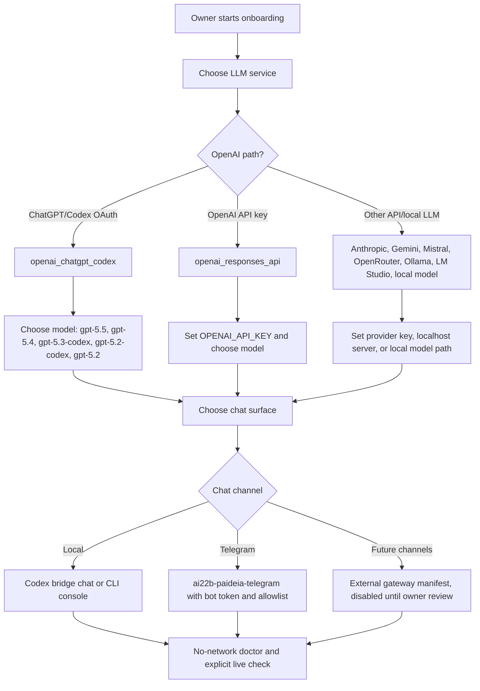

# ChatGPT/Codex OAuth와 채팅 온보딩

영문으로 보고 싶다면 [English handoff](codex_oauth_telegram_handoff.md)를 여세요.

## 목적

Paideia Agent는 보스의 로컬 기억, 학습 기록, 고용 기록을 정체성으로 삼고, LLM은 답변 생성을 돕는 실행 엔진으로만 사용합니다. 이번 변경은 기본 live 채팅 경로를 `OPENAI_API_KEY` 중심에서 Hermes 방식의 ChatGPT/Codex OAuth 경로로 옮기고, 온보딩에서 모델과 채팅 채널을 명시적으로 선택할 수 있게 만든 것입니다.

## 전체 흐름



## 선택 가능한 LLM 경로

- `openai_chatgpt_codex`: 기본 경로입니다. Hermes/Codex OAuth 저장소의 `openai-codex` 인증을 사용합니다.
- `openai_responses_api`: OpenAI API 키 경로입니다. `OPENAI_API_KEY`가 필요합니다.
- `anthropic_claude_api`, `google_gemini_api`, `mistral_api`, `openrouter_api`: 외부 API LLM입니다. 각 provider 키와 모델명을 온보딩에서 확인합니다.
- `ollama_local`, `lm_studio_local`, `bigram_local`, `transformers_local`, `llama_cpp_local`: 로컬 모델 또는 로컬 서버 경로입니다.

## ChatGPT/Codex 모델 선택

기본 모델은 `gpt-5.5`입니다. 온보딩 산출물과 Telegram 브리지에서 다음 모델을 보여줍니다.

- `gpt-5.5`
- `gpt-5.4`
- `gpt-5.3-codex`
- `gpt-5.2-codex`
- `gpt-5.2`

모델은 명령줄에서 `--llm-model <model>`로 지정할 수 있고, Telegram에서는 `/model <model>`로 바꿀 수 있습니다. 목록은 `/models`로 확인합니다. 알 수 없는 모델명도 입력은 허용하지만, 실제 사용 가능 여부는 다음 live check 또는 live call에서 검증됩니다.

## 채팅 채널 연결

온보딩의 `chat_surface` 카탈로그에는 다음 표면이 들어갑니다.

- `codex-bridge-chat`: 로컬 Codex 브리지 채팅입니다.
- `cli-console`: Paideia guided CLI 콘솔입니다.
- `dataflow-job`: 구조화 작업 실행 표면입니다.
- `telegram-bridge`: Telegram private bridge입니다. bot token과 allowlist가 있어야 실행됩니다.
- `external-chat-gateway`: Slack, Discord, webhook 같은 미래 채널을 위한 manifest-only 표면입니다. 기본값은 비활성입니다.

Telegram 브리지는 다음 명령을 지원합니다.

- `/status`: 현재 agent, backend, model, team file 상태 확인
- `/codex`: ChatGPT/Codex OAuth backend 사용
- `/api`: OpenAI API key Responses backend 사용
- `/backend codex_oauth | openai_api | auto`: backend 명시 전환
- `/models`: 선택 가능한 ChatGPT/Codex 모델 목록
- `/model <name>`: 이후 채팅 턴의 모델 변경
- `/team <objective>`: specialist team이 구성된 경우 팀 단위로 dispatch 후 lead가 종합

## 검증 원칙

- 온보딩 산출물은 기본적으로 네트워크 호출을 하지 않습니다.
- 실제 provider 호출은 `--live-check` 또는 live 채팅을 명시했을 때만 발생합니다.
- OAuth token, API key, Telegram bot token은 repo 산출물에 저장하지 않습니다.
- live 실패 시에는 raw provider payload나 hidden reasoning을 저장하지 않고, 공개 안전한 오류 요약만 남깁니다.

## 대표 명령

```powershell
ai22b-talent-foundry list-llm-services --output llm_services.json
```

```powershell
ai22b-talent-foundry build-llm-connection-profile `
  --llm-service openai_chatgpt_codex `
  --llm-model gpt-5.5 `
  --output llm_connection_profile.json
```

```powershell
ai22b-talent-foundry build-llm-connection-profile `
  --llm-service openai_responses_api `
  --llm-model gpt-5.2 `
  --output llm_connection_profile.openai_api.json
```

```powershell
ai22b-paideia-telegram --employment-record <employment_record.json>
```
