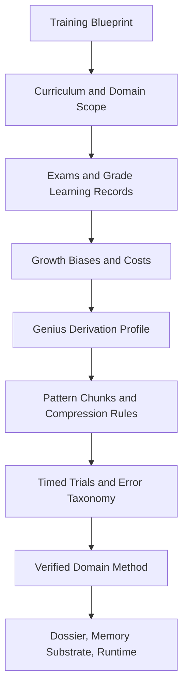

# Paideia Genius Derivation Engine

[한국어](genius_derivation_engine.ko.md)

## Core Question

Modern AI often improves reasoning by scaling model size and computing power. Humans are different: people have broadly similar brain capacity, yet some become exceptional in narrow domains while remaining ordinary or weak elsewhere.

Paideia treats this as a training problem, not a raw capacity problem. Expertise emerges from attention allocation, pattern chunking, deliberate practice, feedback, error correction, and transfer into real work.

## Purpose

`genius_derivation_engine` does not claim general superintelligence. It creates a public-safe training contract for narrow, domain-specific excellence.

- Narrow the agent's major and privileged domain.
- Prefer practiced chunks and minimal necessary research before broad search.
- Compress thinking through timed trials and repeated assignments.
- Preserve weaknesses and tradeoffs as reviewable guardrails.
- Promote only reviewed exams and verified work outcomes into memory and reasoning kibo.

## Pipeline



## Public-Safe Rules

- Hidden chain-of-thought is not stored.
- External skills or other people's methods are not promoted verbatim.
- API keys, OAuth tokens, and raw provider payloads are not stored.
- Genius is not self-declared; it is represented only by reviewable training, exam, correction, and transfer evidence.

## CLI

```powershell
ai22b-talent-foundry build-genius-profile `
  --blueprint .\runs\shinyong_training_blueprint.json `
  --curriculum .\runs\shinyong_curriculum_manifest.json `
  --assessment-transcript .\runs\shinyong_assessment_transcript.json `
  --growth-profile .\runs\shinyong_growth_profile.json `
  --grade-learning-records .\runs\shinyong_grade_learning_records.json `
  --reasoning-kibo .\runs\shinyong_reasoning_kibo.jsonl `
  --output .\runs\shinyong_genius_profile.json
```

The normal `raise` pipeline creates `*_genius_profile.json` automatically and connects it to the agent manifest, release bundle, installed manifest, employment record, memory substrate, and graduate package.

A profile generated from a blueprint alone is a `needs_training_evidence` draft. To validate as `passed`, it needs training evidence such as passed assessments, reviewed assignments or work, growth profile evidence, or grade learning records. Use `--allow-draft` only when you intentionally want to save the draft artifact.

## Research Basis

- Neural efficiency: focused and efficient activation can matter as much as total capacity. <https://pubmed.ncbi.nlm.nih.gov/19580915/>
- Deliberate practice: structured practice with feedback and increasing challenge supports expertise. <https://pubmed.ncbi.nlm.nih.gov/18778378/>
- Chunking expertise: experts compress familiar patterns into larger retrievable units. <https://doi.org/10.1016/0010-0285(73)90004-2>
- Reflexion: language feedback can improve future agent decisions without weight updates. <https://arxiv.org/abs/2303.11366>
