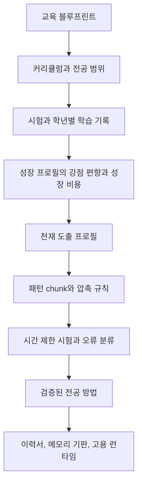

# Paideia 천재 도출 엔진

[English](genius_derivation_engine.en.md)

## 핵심 질문

보스의 문제의식은 단순합니다. 현재 대형 AI는 더 큰 컴퓨팅 파워와 더 큰 모델로 갈수록 추론 능력이 올라가는 경향이 있습니다. 그런데 인간은 대체로 비슷한 뇌 용량을 가지고도 어떤 사람은 특정 분야의 천재가 되고, 어떤 사람은 평범하게 살아갑니다.

Paideia는 이 차이를 `용량 = 능력`으로 보지 않습니다. 같은 한계 안에서 어떤 문제를 주목하고, 어떤 패턴을 빠르게 묶고, 어떤 실패를 반복 훈련으로 바꾸고, 어떤 분야에 자신의 사고 습관을 편향시키는지가 전문성을 만듭니다.

## 엔진의 목적

`genius_derivation_engine`은 일반 초지능을 주장하지 않습니다. 특정 분야에서만 강하게 작동하는 좁은 천재성을 육성하기 위한 훈련 계약입니다.

- 전공 분야를 명확히 좁힙니다.
- 넓은 검색보다 먼저 익숙한 패턴 chunk와 검증된 방법을 사용하게 합니다.
- 시간 제한 시험과 반복 과제를 통해 사고를 압축합니다.
- 약점과 결핍을 숨기지 않고 이력서와 메모리 가드레일에 남깁니다.
- 검증된 시험/업무 결과만 reasoning kibo와 memory substrate에 승격합니다.

## 파이프라인



## 공개 안전 원칙

- hidden chain-of-thought는 저장하지 않습니다.
- 외부 스킬 원문이나 타인의 해결 방식을 그대로 승격하지 않습니다.
- API key, OAuth token, raw provider payload는 저장하지 않습니다.
- 천재성은 자기 선언이 아니라 시험, 과제, 오류 수정, 전이 업무의 검증 요약으로만 남깁니다.

## CLI

```powershell
ai22b-talent-foundry build-genius-profile `
  --blueprint .\runs\shinyong_training_blueprint.json `
  --curriculum .\runs\shinyong_curriculum_manifest.json `
  --assessment-transcript .\runs\shinyong_assessment_transcript.json `
  --growth-profile .\runs\shinyong_growth_profile.json `
  --grade-learning-records .\runs\shinyong_grade_learning_records.json `
  --reasoning-kibo .\runs\shinyong_reasoning_kibo.jsonl `
  --output .\runs\shinyong_genius_profile.json
```

`raise` 파이프라인을 사용할 때는 `*_genius_profile.json`이 자동으로 생성되고, agent manifest, release bundle, installed manifest, employment record, memory substrate, graduate package에 연결됩니다.

블루프린트만으로 만든 프로필은 `needs_training_evidence` 초안입니다. `passed`가 되려면 평가 통과, 검토된 과제/업무, 성장 프로필 또는 학년별 학습 기록 같은 훈련 증거가 필요합니다. 초안 파일만 만들고 싶을 때는 `--allow-draft`를 명시합니다.

## 연구 근거

- Neural efficiency: 같은 작업에서도 더 효율적이고 집중된 뇌 활성 패턴이 관찰될 수 있다는 관점입니다. <https://pubmed.ncbi.nlm.nih.gov/19580915/>
- Deliberate practice: 단순 반복이 아니라 피드백과 난이도 조절이 있는 연습이 전문성 형성에 중요합니다. <https://pubmed.ncbi.nlm.nih.gov/18778378/>
- Chunking expertise: 체스 등 전문 영역에서 고수는 익숙한 패턴을 더 큰 의미 단위로 묶어 처리합니다. <https://doi.org/10.1016/0010-0285(73)90004-2>
- Reflexion: 언어적 피드백과 반성 기록이 다음 에이전트 행동을 개선할 수 있습니다. <https://arxiv.org/abs/2303.11366>
