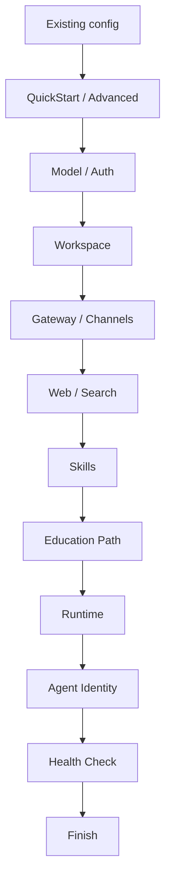

# OpenClaw식 Paideia 온보딩

Paideia의 기존 `start-console`은 질문과 선택지를 한 번에 길게 보여주는 형태라 처음 쓰는 사람이 흐름을 잡기 어려웠습니다. 이제 온보딩은 OpenClaw의 wizard 구조를 Paideia에 맞춰 적용합니다.

## 흐름



## Paideia에 추가된 단계

- `Education Path`: 공개 롤모델, 자기 확장, 커스텀 롤모델 중 선택합니다.
- `Runtime`: 단일 에이전트, 본체 제어 분신 군체, 별도 전문팀, simulation rollout을 선택합니다.
- `Agent Identity`: Agent ID Card 등록용 payload와 Agent_warrent/Agent Identity Layer `ail.v1` envelope를 로컬 파일로만 생성합니다. 외부 등록은 자동으로 하지 않습니다.
- `Health Check`: 산출물, 로컬 전용 정책, 외부 채널 비활성화, 다음 명령을 점검합니다.

## 실행

```powershell
ai22b-talent-foundry onboard
```

기존 명령도 유지됩니다.

```powershell
ai22b-talent-foundry start-console
```

비대화식 실행은 답변 JSON을 사용합니다.

```powershell
ai22b-talent-foundry onboard --answers examples\graham_junior_onboarding.answers.json
```

## 산출물

- `console_session.json`: 전체 온보딩 세션과 health 요약
- `paideia_onboarding_config.json`: OpenClaw식 설정 요약
- `agent_id_card_payload.json`: 외부 등록 전 검토할 Agent ID Card payload
- `agent_identity_envelope.json`: Agent_warrent `ail.v1` 로컬 미등록 envelope
- `agent_identity_verification.json`: Agent ID Card payload와 Agent_warrent envelope의 로컬 사전 검증 보고서
- `agent_identity_registration_receipt.json`: 보스가 외부에서 등록한 결과를 로컬 envelope에 연결한 receipt
- `simulation_rollouts.json`: 병렬 episode rollout 계획
- `onboarding/onboarding_session.json`: 실제 육성, 설치, 고용, 첫 목표 사이클 기록

Agent ID Card payload만 별도로 만들 수도 있습니다.

```powershell
ai22b-talent-foundry export-agent-id-card-payload `
  --installed-manifest <installed_agent_manifest.json> `
  --employment-record <employment_record.json> `
  --output agent_id_card_payload.json
```

Agent_warrent 호환 envelope만 별도로 만들 수도 있습니다.

```powershell
ai22b-talent-foundry export-agent-identity-envelope `
  --installed-manifest <installed_agent_manifest.json> `
  --employment-record <employment_record.json> `
  --output agent_identity_envelope.json
```

외부 등록 전에는 두 산출물을 함께 검증합니다. 이 명령은 네트워크를 사용하지 않고, 필수 필드, credential-like 값, 원문 이메일, 로컬 절대경로, 수동 등록 정책을 검사합니다.

```powershell
ai22b-talent-foundry verify-agent-id-card `
  --payload agent_id_card_payload.json `
  --envelope agent_identity_envelope.json `
  --output agent_identity_verification.json
```

보스가 외부 사이트에서 수동 등록을 완료한 뒤에는 결과 파일을 로컬 envelope에 연결할 수 있습니다. 이 명령도 네트워크를 호출하지 않으며, credential token 원문은 기본적으로 저장하지 않습니다.

```powershell
ai22b-talent-foundry import-agent-id-card-registration `
  --envelope agent_identity_envelope.json `
  --registration-result agent_id_card_registration_result.json `
  --output agent_identity_registration_receipt.json `
  --updated-envelope agent_identity_envelope.registered.json
```

## 중요한 차이

OpenClaw는 에이전트 런타임과 게이트웨이 설정이 중심입니다. Paideia는 여기에 교육 프로그램을 추가합니다. LLM/provider 선택은 시작일 뿐이고, 핵심 정체성은 curriculum, assessment transcript, hiring dossier, Reasoning Ledger, memory substrate에 남습니다.
