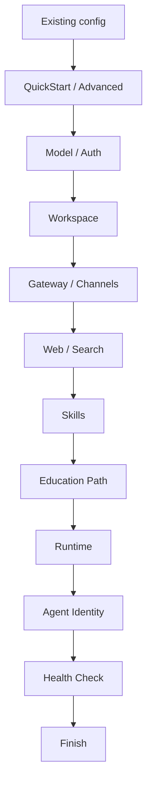

# OpenClaw식 Paideia 온보딩

Paideia의 기존 `start-console`은 질문과 선택지를 한 번에 길게 보여주는 형태라 처음 쓰는 사람이 흐름을 잡기 어려웠습니다. 이제 온보딩은 OpenClaw의 wizard 구조를 Paideia에 맞춰 적용합니다.

## 흐름



## Paideia에 추가된 단계

- `Education Path`: 공개 롤모델, 자기 확장, 커스텀 롤모델 중 선택합니다.
- `Runtime`: 단일 에이전트, 본체 제어 분신 군체, 별도 전문팀, simulation rollout을 선택합니다.
- `Agent Identity`: Agent ID Card 등록용 payload를 로컬 파일로만 생성합니다. 외부 등록은 자동으로 하지 않습니다.
- `Health Check`: 산출물, 로컬 전용 정책, 외부 채널 비활성화, 다음 명령을 점검합니다.

## 실행

```powershell
ai22b-talent-foundry onboard
```

기존 명령도 유지됩니다.

```powershell
ai22b-talent-foundry start-console
```

비대화식 실행은 답변 JSON을 사용합니다.

```powershell
ai22b-talent-foundry onboard --answers examples\graham_junior_onboarding.answers.json
```

## OpenClaw 호환 provider/channel

Paideia는 OpenClaw처럼 `provider/model` 선택을 지원합니다. 예를 들어 `openrouter/meta-llama/llama-3.1-8b`를 `--llm-service`에 직접 넣으면 provider는 `openrouter`, 모델은 `meta-llama/llama-3.1-8b`로 분리되어 고용 기록과 LLM 런타임에 저장됩니다.

```powershell
ai22b-talent-foundry list-openclaw-compat --output openclaw_compat.json
```

현재 직접 호출 가능한 계열은 OpenAI/Codex, Anthropic Messages, Gemini generateContent, OpenAI-compatible provider(OpenRouter, Mistral, DeepSeek, Groq, GMI, NovitaAI, Hugging Face Inference, Kilo Gateway, xAI, Perplexity, Together, Fireworks, DeepInfra, vLLM, SGLang 등), Ollama/Ollama Cloud, Synthetic입니다. Bedrock, Copilot Proxy, Gemini CLI, Vertex, ComfyUI, Volcengine/BytePlus plan, Qwen OAuth 등 provider별 플러그인이 필요한 항목은 온보딩 manifest에는 표시하지만 live 호출은 provider plugin 설정 전까지 비활성으로 둡니다.

OpenClaw의 canonical provider ID를 우선 사용합니다. 예를 들어 LM Studio는 `lmstudio/*`, Z.AI는 `zai/*`, Kilo Gateway는 `kilocode/*`, Ollama Cloud는 `ollama-cloud/*` 형식을 사용합니다. 기존 사용자가 헷갈리지 않도록 `lm-studio`, `z-ai`, `kilo-gateway` 같은 별칭도 계속 해석합니다.

채팅 표면도 OpenClaw channel 이름을 노출합니다. `openclaw-channel-telegram`, `openclaw-channel-discord`, `openclaw-channel-slack`, `openclaw-channel-whatsapp`, `openclaw-channel-signal`, `openclaw-channel-matrix`, `openclaw-channel-webchat` 같은 항목은 Gateway/페어링/허용목록 검토 전까지 manifest-only 상태입니다.

채널 메시지는 로컬 gateway envelope로 실행할 수 있습니다. Paideia core는 실제 Telegram/Discord 토큰을 저장하거나 외부 전송을 직접 수행하지 않고, 채널 플러그인이 보낼 수 있는 outbound envelope를 반환합니다.

```powershell
ai22b-talent-foundry build-openclaw-gateway-config `
  --employment-record "<employment_record.json>" `
  --channel telegram `
  --channel webchat `
  --output openclaw_gateway_config.json

ai22b-talent-foundry run-openclaw-channel-message `
  --employment-record "<employment_record.json>" `
  --channel telegram `
  --conversation-id "telegram-test" `
  --sender-id "boss" `
  --message "채널 gateway로 대답해줘" `
  --output telegram_channel_run.json
```

실제 채널 플러그인이 붙을 때는 단발 명령 대신 HTTP gateway 서버를 띄웁니다.

```powershell
ai22b-talent-foundry run-openclaw-channel-gateway-server `
  --employment-record "<employment_record.json>" `
  --channel telegram `
  --channel discord `
  --channel slack `
  --port 8722 `
  --output-dir channel_gateway_runs
```

플러그인은 `POST /openclaw/channel-message`로 channel, conversation/session key, sender, text를 넘기면 됩니다. Paideia는 모델이 채널을 임의로 고르게 하지 않고, OpenClaw의 routing 철학처럼 원래 들어온 채널/세션으로 답변 envelope를 되돌려줍니다.

외부 채널 토큰 없이 브라우저에서 바로 대화하려면 로컬 WebChat 서버를 실행합니다.

```powershell
ai22b-talent-foundry run-openclaw-webchat-server `
  --employment-record "<employment_record.json>" `
  --port 8722 `
  --output-dir webchat_runs
```

기본값은 `127.0.0.1` 바인딩이므로 로컬 PC 안에서만 열립니다. WebChat 입력은 `webchat` 채널 envelope로 변환된 뒤 Paideia 인재의 memory substrate와 Reasoning Ledger를 거쳐 답변되고, 각 대화는 `webchat_*.json`으로 저장됩니다.

## 산출물

- `console_session.json`: 전체 온보딩 세션과 health 요약
- `paideia_onboarding_config.json`: OpenClaw식 설정 요약
- `agent_id_card_payload.json`: 외부 등록 전 검토할 Agent ID Card payload
- `simulation_rollouts.json`: 병렬 episode rollout 계획
- `simulation_rollout_execution.json`: rollout 에피소드 실행 결과와 Reasoning Ledger 승격/격리 결과
- `llm_service_health.json`: 선택한 LLM 서비스의 키/모델/로컬 서버 준비 상태 점검 결과
- `owner_self_extension_manifest.json`: owner self-extension 선택 시 로컬 비공개 자료의 해시/상대경로 manifest
- `onboarding/onboarding_session.json`: 실제 육성, 설치, 고용, 첫 목표 사이클 기록

Agent ID Card payload만 별도로 만들 수도 있습니다.

```powershell
ai22b-talent-foundry export-agent-id-card-payload `
  --installed-manifest <installed_agent_manifest.json> `
  --employment-record <employment_record.json> `
  --output agent_id_card_payload.json
```

## 중요한 차이

OpenClaw는 에이전트 런타임과 게이트웨이 설정이 중심입니다. Paideia는 여기에 교육 프로그램을 추가합니다. LLM/provider 선택은 시작일 뿐이고, 핵심 정체성은 curriculum, assessment transcript, hiring dossier, Reasoning Ledger, memory substrate에 남습니다.
