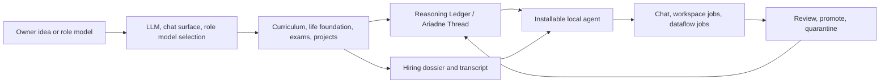

# Paideia Agent 프로젝트 선언문

[English](project_manifesto.md) | [한국어](project_manifesto.ko.md)

## 발단

나 자신을 확장한 AI 에이전트가 있다면 어떨까요? 나의 업무 방식, 관심사, 자료, 노하우를 바탕으로 여러 업무를 동시에 처리할 수 있다면요? 또는 내가 존경하는 분야별 롤모델의 성장 과정과 학습 과정을 참고해, 나를 도와줄 전문 AI 인재를 직접 키울 수 있다면 어떨까요?

Paideia Agent는 이 질문에서 시작한 로컬 우선 AI 인재 육성 프로그램입니다. 목표는 유명인을 그대로 복제하거나 흉내 내는 것이 아닙니다. 공개적으로 확인 가능한 생애, 학습 경로, 전공, 시험, 과제, 실패와 회복의 압력을 커리큘럼으로 재구성하고, AI가 그 과정을 통과하며 자기만의 업무 습관과 판단 기록을 쌓게 하는 것입니다.

## 핵심 가설

학교 이름이나 이력서는 쉽게 만들어낼 수 있습니다. 하지만 사람이 실제 업무에서 발휘하는 통찰력, 판단 습관, 자료를 찾는 방식, 실패 후 수정하는 버릇은 단순 프로필로 복사하기 어렵습니다.

Paideia의 가설은 이렇습니다.

- AI 에이전트의 정체성은 프롬프트 한 줄이 아니라 누적된 교육 기록, 시험, 과제, 피드백, 업무 경험에서 나와야 합니다.
- 롤모델은 성격 키워드를 주입하는 재료가 아니라, 학습 과정과 평가 압력을 설계하는 참고점이어야 합니다.
- 추론기보는 숨은 chain-of-thought가 아니라, 검토 가능한 가설, 근거, 반례, 오답, 수정된 원칙, 업무 습관의 기록이어야 합니다.
- LLM은 언어와 추론을 실행하는 엔진이고, 에이전트의 장기 정체성은 로컬에 축적된 데이터와 기록에서 와야 합니다.

## 만드는 것

Paideia Agent는 먼저 AI 인재를 육성하고, 그 다음에 에이전트로 고용합니다.

현재 공개 저장소에는 프로그램 코드, 공개 메타데이터, 테스트, 문서, 샘플 설정만 포함합니다. 개인 데이터, 생성된 에이전트 번들, 로컬 기억, 모델 체크포인트, 비공개 교재 본문은 공개 저장소에 넣지 않습니다.

## 롤모델과 자기 확장

Paideia는 두 종류의 육성 경로를 지향합니다.

- 공개 롤모델 경로: Benjamin Graham, Grace Hopper, John Tukey 같은 공개 자료가 있는 인물의 학습 과정과 전문 분야를 참고합니다.
- 자기 확장 경로: 사용자가 제공한 개인 자료, 업무 기록, 선호, 문서, 음성, 프로젝트 경험을 로컬 전용 데이터로 다뤄 자신의 보조 인재를 키우는 경로입니다.

자기 확장 경로는 개인정보와 저작권 위험이 크기 때문에 metadata-only 로컬 접수부터 시작합니다. Paideia는 동의 여부, 저작권/사용권 확인 상태, 확장자별 개수, 크기 구간, 경로 fingerprint만 남기고, 파일 본문과 원본 파일명, 절대경로는 내보내지 않습니다. 공개 샘플에는 실제 개인 자료를 포함하지 않습니다.

## 군체능력

Paideia의 군체능력은 여러 독립 의식을 만드는 것이 아닙니다. 하나의 본체 인재가 업무 중 자신을 역할별 작업 투영체로 나누고, 거시 관점, 수치 검증, 리스크 검토, 자료 확인 같은 하위 업무를 나눠 본 뒤, 결과를 다시 본체가 합성하는 방식입니다.

이 구조는 피지컬 AI의 병렬 시뮬레이션과 비슷한 아이디어를 소프트웨어 업무에 적용합니다. 여러 에피소드를 빠르게 시험하되, 검토되지 않은 결과는 곧바로 장기 기억이 되지 않습니다. 승격, 보류, 격리의 절차를 거친 기록만 다음 업무의 노하우로 반영합니다.

## 로컬 노하우와 비용

일반적인 에이전트는 매번 긴 프롬프트와 많은 설정을 넣어 전문가처럼 행동하게 만듭니다. Paideia는 필요한 기억과 원칙만 가까운 컨텍스트로 가져오는 기억기판 구조를 지향합니다. 이렇게 하면 불필요한 토큰 사용을 줄이고, 에이전트별 노하우를 로컬에 계속 축적할 수 있습니다.

P0 실행은 이제 `runtime_observability` 블록에 컨텍스트 크기, 추정 토큰, 선택된 메모리 수, 재검토 카운터, promotion/quarantine 통계를 기록합니다. 다음 제품 과제는 이 기록을 일반 프롬프트형 에이전트와 비교해 비용, 품질, 재작업률 차이를 리포트로 만드는 것입니다.

## 외부 신원

Paideia가 만든 에이전트는 [Agent ID Card](https://www.agentidcard.org/) 같은 외부 신원 시스템과 연동할 수 있어야 합니다. 현재 공개 릴리스는 로컬 payload/envelope export, 등록 전 검증, 보스가 직접 수행한 외부 등록 receipt import를 지원합니다. 이 경우 고유 ID, 소유자, 역할, 범위, 검증 상태를 dossier와 설치 매니페스트에 연결해, 에이전트가 누구이고 누가 책임지는지 확인할 수 있게 합니다.

현재 공개 버전에서는 이 연동을 계획으로 다루며, 실제 등록이나 외부 업로드는 사용자의 명시적 실행 없이 수행하지 않습니다.

## 프로젝트 성격

이 프로젝트는 실험적인 연구 개발 프로젝트입니다. 전문 개발자가 완성품을 낸다는 태도보다, AI와 함께 로컬에서 검증 가능한 프로그램을 만들고, 실패와 개선점을 공개적으로 고쳐가는 쪽에 가깝습니다.

문제점, 개선사항, 새로운 롤모델 제안은 편하게 이슈나 코멘트로 남겨주세요. 직접 연락이 필요하다면 `sinm82@gmail.com`으로 보낼 수 있습니다.
