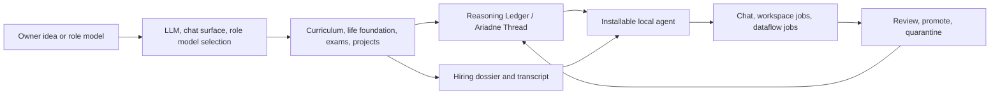

# Paideia Agent Project Manifesto

[English](project_manifesto.md) | [한국어](project_manifesto.ko.md)

## Origin

What if an AI agent could extend you? What if your work style, documents, habits, and know-how could support several tasks at once? What if your heroes and field role models could become the starting point for local AI talents that help you work?

Paideia Agent starts from that question. It does not claim to clone real people or impersonate famous figures. Instead, it reconstructs public learning paths, curricula, assessments, stressors, failures, and recovery loops so an AI talent can be raised through a process before being hired as an agent.

## Core Hypothesis

A school name or resume can be generated easily. Real insight is harder. The useful parts are the habits formed through study, feedback, exams, projects, mistakes, source searching, and revised principles.

Paideia's hypothesis is:

- An AI agent's identity should come from accumulated education records, assessments, work history, and memory, not from a prompt mask.
- A role model should provide learning conditions and curriculum pressure, not injected personality keywords.
- The Reasoning Ledger is not hidden chain-of-thought. It is a reviewable record of hypotheses, evidence, counterexamples, mistakes, corrected principles, study habits, and work patterns.
- The connected LLM is the language and reasoning engine. Long-term identity lives in local records.

## What It Builds

Paideia raises an AI talent first, then hires it as a local agent.

The public repository contains program code, public metadata, tests, documentation, and safe sample settings. Private memories, generated agent bundles, local run outputs, model checkpoints, personal data, and copyrighted textbook bodies stay out of the public source tree.

## Role Models And Self-Extension

Paideia targets two paths:

- Public role-model path: use sourced public facts and education-process metadata from people such as Benjamin Graham, Grace Hopper, or John Tukey.
- Self-extension path: use owner-provided documents, work records, preferences, voice assets, and project experience as local-only private material for a personal assistant talent.

The self-extension path needs stronger consent, privacy, and copyright controls, so public samples should use safe templates rather than private owner data.

## Projection Swarm

Paideia's swarm feature does not create separate conscious agents. One hired talent can create parent-controlled task projections during work. Each projection focuses on a role such as evidence review, quantitative checking, macro context, or risk review. The parent talent synthesizes the results and only reviewed summaries can become future learning.

This borrows a useful idea from physical-AI simulation: run many bounded variations from the same checkpoint, then promote only verified outcomes.

## Local Know-How And Cost

Many expert agents rely on long prompts and repeated setup. Paideia aims to keep reusable know-how in local records and route only the most relevant memory into each task. That should reduce unnecessary token use and let each agent become more specialized over time.

P0 runs now record an initial `runtime_observability` block with context size, estimated tokens, selected-memory count, review counters, and promotion/quarantine statistics. The next product step is comparing those records against generic prompt-wrapper agents for cost, quality, and rework rate.

## External Identity

Long term, generated agents should be able to connect to external identity systems such as [Agent ID Card](https://www.agentidcard.org/). A public identity layer can bind display name, owner, role, scope, credential status, and verification state to the local hiring dossier and install manifest.

The current public release treats this as a planned integration. It should not register agents or upload data without explicit user action.

## Project Nature

Paideia Agent is an experimental research and development project. It is built with AI-assisted development and local verification, with mistakes expected and corrected openly.

Issues, comments, role-model suggestions, and improvement requests are welcome. For direct feedback, contact `sinm82@gmail.com`.
