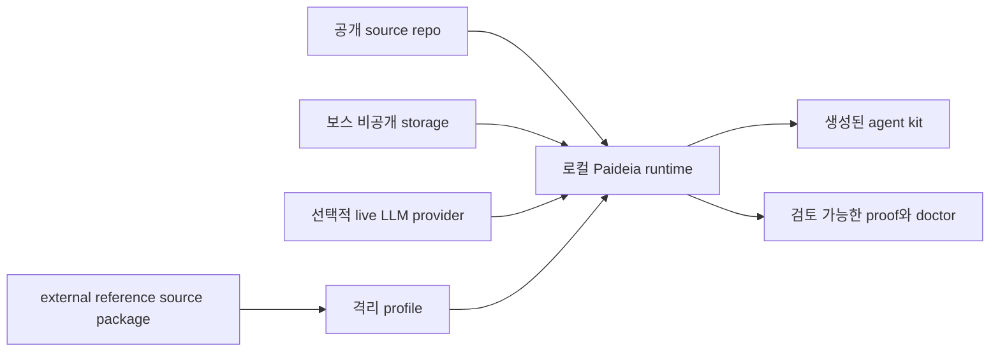

# 보안 위협모델

[English](security_threat_model.md) | [한국어](security_threat_model.ko.md)

Paideia Agent는 로컬 우선 AI 인재 육성 프로그램입니다. 보안 모델의 목표는 보스의 비공개 자료, 생성된 기억, 에이전트 kit, provider credential, 학습 과정을 우발적 노출이나 악성 영향으로부터 보호하는 것입니다.

## 보호 자산

| 자산 | 중요한 이유 | 기본 정책 |
| --- | --- | --- |
| 보스 문서와 비공개 커리큘럼 | 개인, 저작권, 기밀 자료가 포함될 수 있습니다. | 공개 source 밖에 두고 metadata-first intake만 수행합니다. |
| 로컬 기억과 Reasoning Ledger | 미래 답변과 업무 습관을 형성합니다. | 승격 전 검토하고 hidden chain-of-thought는 저장하지 않습니다. |
| 생성된 agent kit와 dossier | 학습 요약과 runtime 설정을 포함할 수 있습니다. | ignored run/storage 위치에 저장합니다. |
| API key와 provider credential | 비용 발생 또는 계정 노출 위험이 있습니다. | 공개 artifact에 쓰지 않고 live check는 명시 실행만 허용합니다. |
| external reference source | 안전하지 않은 코드나 과도한 권한을 포함할 수 있습니다. | 검토 전까지 격리 및 비활성 상태를 유지합니다. |
| Tool execution proof | 무엇이 실행되고 무엇이 생성됐는지 증명합니다. | public-safe summary, 상대경로, digest만 기록합니다. |

## 공격자 모델

Paideia는 다음 입력이 악성이거나 오염될 수 있다고 가정합니다.

- 연구자료, 로컬 파일, 채팅, 작업 설명에 포함된 prompt injection.
- 잘못된 규칙이나 secret을 장기 기억에 승격시키려는 poisoned memory candidate.
- 악성 Hermes/OpenClaw/generic external reference source.
- 안전하지 않은 지시, hidden reasoning 요청, 데이터 유출 시도를 포함한 provider 응답.
- ignored local artifact를 노출시키는 dependency 또는 packaging 실수.
- 원래 로컬 맥락 없이 다른 기기로 복사된 generated agent kit.

공개 프리뷰는 application-level check가 OS, container, VM 격리와 동일하다고 보지 않습니다.

## 신뢰 경계

| 경계 | 기본 허용 | 기본 차단 |
| --- | --- | --- |
| 공개 repo -> 로컬 runtime | source code, 공개 metadata, fixture. | 비공개 데이터, run output, credential, checkpoint. |
| 비공개 storage -> runtime | 보스가 검토해 선택한 로컬 자료. | raw path나 비공개 본문 공개 export. |
| runtime -> live LLM | 명시 설정된 provider 호출. | 기본 network call, raw payload 저장, secret export. |
| external reference source -> runtime | reference manifest, risk flags, Paideia rewrite requirements. | 보스 검토 전 직접 실행. |
| runtime -> memory ledger | 검토된 요약과 수정된 원칙. | hidden chain-of-thought, raw provider payload, 미검토 secret. |

## 권한 모델

Tool capability는 filesystem, network, subprocess, memory, side-effect 정책을 선언해야 합니다. 기본 offline check는 다음을 증명해야 합니다.

- network access가 수행되지 않았습니다.
- 특정 doctor가 명시적으로 허용하지 않는 한 subprocess execution이 수행되지 않았습니다.
- file artifact는 선언된 runtime/output path 안에만 기록되었습니다.
- tool output은 raw private content 대신 schema name, summary, digest를 포함합니다.
- memory promotion은 review-gated입니다.

미래에 network 또는 subprocess tool이 필요해지면 먼저 disposable workspace에서 실행해야 합니다. 공개 제품 수준의 고위험 tool은 restricted user, container, VM 격리를 사용해야 합니다.

## 기억 승격 정책

Paideia memory는 transcript dump가 아닙니다. memory candidate는 다음을 기록할 때만 승격되어야 합니다.

- 작업 또는 커리큘럼 맥락.
- 근거와 불확실성.
- 실수 또는 실패한 가정.
- 수정된 원칙이나 재사용 가능한 습관.
- 안전/개인정보 검토 상태.

secret, 개인 로컬 경로, raw provider payload, hidden reasoning trace가 포함된 candidate는 거절하거나 redaction해야 합니다.

## 사고 대응 절차

1. 영향을 받은 generated kit 또는 external reference source 사용을 중지합니다.
2. public-safe doctor report와 재현 절차를 보존합니다.
3. 영향을 받은 local runtime output을 제거하거나 격리합니다.
4. 노출 가능성이 있는 credential을 교체합니다.
5. source를 수정하고 regression test 또는 doctor check를 추가한 뒤 public hygiene를 다시 실행합니다.
6. 공개 프리뷰에 영향을 주는 문제라면 비공개 데이터 없이 security note를 게시합니다.

## 릴리스 무결성

공개 프리뷰는 현재 source hygiene, package smoke test, first-run doctor, runtime doctor, source SBOM에 의존합니다. 향후 signed release에는 다음을 추가해야 합니다.

- source archive checksum.
- wheel/sdist checksum.
- signed release note.
- generated-kit checksum manifest.
- 사용자가 실행할 수 있는 verification command.

