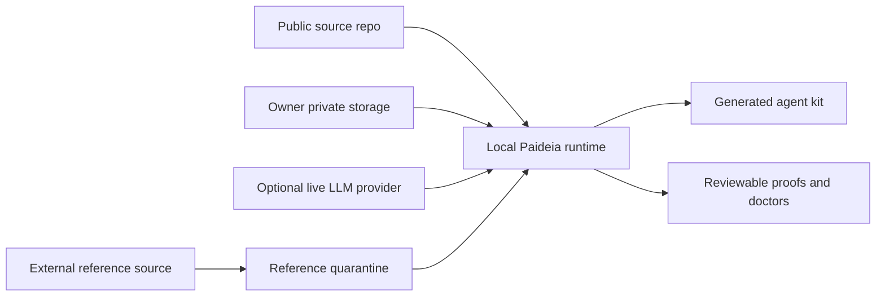

# Security Threat Model

[English](security_threat_model.md) | [한국어](security_threat_model.ko.md)

Paideia Agent is a local-first AI talent foundry. Its security model protects the owner's private materials, generated memories, agent kits, provider credentials, and learning process from accidental disclosure or malicious influence.

## Assets

| Asset | Why it matters | Default policy |
| --- | --- | --- |
| Owner documents and private curricula | May contain personal, copyrighted, or confidential material. | Stay outside public source; metadata-first intake only. |
| Local memories and Reasoning Ledger records | Shape future answers and work habits. | Review before promotion; no hidden chain-of-thought storage. |
| Generated agent kits and dossiers | Can contain learned summaries and runtime configuration. | Stored in ignored run/storage locations. |
| API keys and provider credentials | Can spend money or expose accounts. | Never written to public artifacts; live checks require explicit action. |
| External reference sources | Can contain unsafe code, broad permissions, or identity-poisoning instructions. | Quarantined as reference-only; direct execution and skill activation are forbidden. |
| Tool execution proofs | Show what ran and what was produced. | Public-safe summaries, relative paths, and digests only. |

## Attacker Model

Paideia assumes the following can be hostile or corrupted:

- Prompt-injection content in research sources, local files, chat messages, or task descriptions.
- Poisoned memory candidates that try to promote false rules or secrets.
- Malicious Hermes/OpenClaw/generic procedures copied into external-reference quarantine.
- Provider responses that include unsafe instructions, hidden reasoning requests, or data exfiltration attempts.
- Dependency or packaging mistakes that expose ignored local artifacts.
- A generated agent kit copied to a different machine without its intended local context.

The public preview does not assume that application-level checks are equivalent to OS, container, or VM isolation.

## Trust Boundaries

| Boundary | Allowed by default | Blocked by default |
| --- | --- | --- |
| Public repo to local runtime | Source code, public metadata, fixtures. | Private data, run outputs, credentials, checkpoints. |
| Private storage to runtime | Owner-selected local material after review. | Public export of raw paths or private bodies. |
| Runtime to live LLM | Explicitly configured provider calls. | Default network calls, raw payload persistence, secret export. |
| External reference to runtime | Reference manifest, risk flags, and Paideia rewrite requirements. | Direct execution, memory import, reasoning-kibo import, or active skill descriptor creation. |
| Runtime to memory ledger | Reviewed summaries and corrected principles. | Hidden chain-of-thought, raw provider payloads, unreviewed secrets. |

## Permission Model

Tool capabilities must declare their filesystem, network, subprocess, memory, and side-effect posture. Default offline checks should prove:

- Network access was not performed.
- Subprocess execution was not performed unless a specific doctor explicitly allows it.
- File artifacts were written only into declared runtime/output paths.
- Tool outputs include schema names, summaries, and digests rather than raw private content.
- Memory promotion is review-gated.

When future Paideia-native tools require network or subprocess access, they should be rewritten, reviewed, and tested in a disposable workspace first. Production-grade high-risk tools should use restricted users, containers, or VM isolation.

## Memory Promotion Policy

Paideia memory is not a transcript dump. A memory candidate should be promoted only when it records:

- The task or curriculum context.
- Evidence and uncertainty.
- Mistakes or failed assumptions.
- A corrected principle or reusable habit.
- Safety and privacy review status.

Candidates containing secrets, personal local paths, raw provider payloads, or hidden reasoning traces must be rejected or redacted.

## Incident Process

1. Stop using the affected generated kit or external reference source.
2. Preserve public-safe doctor reports and reproduction steps.
3. Remove or quarantine affected local runtime outputs.
4. Rotate any credential that may have been exposed.
5. Patch the source, add a regression test or doctor check, then rerun public hygiene.
6. Publish a security note without private data if the issue affects the public preview.

## Release Integrity

The public preview currently relies on source hygiene, package smoke tests, first-run doctors, runtime doctors, and source SBOM generation. Future signed releases should add:

- Source archive checksums.
- Wheel/sdist checksums.
- Signed release notes.
- A generated-kit checksum manifest.
- A documented verification command for users.
