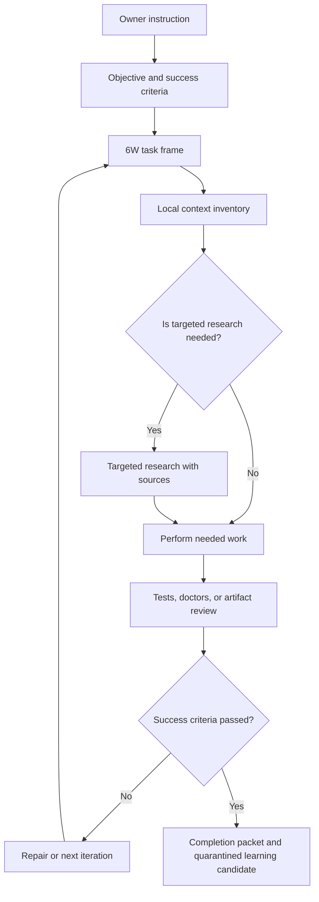

# Paideia Task Pursuit Mode

Korean: [Paideia 6하 원칙 목표추진 모드](task_pursuit_mode.ko.md)

Paideia Agent is not a chatbot that immediately answers an instruction. It is a local AI talent runtime that frames the task, performs only the work that is needed, verifies the result, repairs failures, and keeps going until the objective is complete or clearly blocked.

This mode is implemented through `paideia-task-pursuit-contract/v1` and `paideia-task-pursuit-plan/v1`.

## Purpose

- Frame each owner instruction through 6W: who, what, when, where, why, and how.
- Avoid broad search as the default method. Inspect local files, records, tests, and memory first, then research only missing facts.
- Perform necessary work or development, verify the result, and repair failures before claiming completion.
- Continue until the objective is verified or a clear stop condition is reached.
- Keep work-derived learning as a review-gated candidate, never as automatic memory promotion.

## Flow



## Code Surfaces

- `src/ai22b/talent_foundry/task_pursuit.py`
  - Contract: `build_task_pursuit_contract`
  - Plan: `build_task_pursuit_plan`
  - Validation: `validate_task_pursuit_contract`, `validate_task_pursuit_plan`
- `run-agent`
  - Every run includes `task_pursuit_plan`.
  - `agent_runtime_status_card.task_pursuit` exposes validation status.
- `chat-hired-agent` / `run-agent-program-chat`
  - Chat context and chat output include `task_pursuit_plan`.
  - Live LLMs receive only the reviewable 6W plan and work queue, not hidden reasoning.
- `onboard` / `onboard-agent`
  - Onboarding writes `task_pursuit_plan.json`.
  - The OpenClaw-style dashboard exposes a `Task Pursuit` card and `task_pursuit_plan` next action.

## CLI

```powershell
ai22b-talent-foundry build-task-pursuit-plan `
  --request "Build a verified local report and keep improving it until tests pass." `
  --output .\task_pursuit_plan.json
```

The output is no-network and includes:

- `six_w_frame`
- `necessary_research_plan`
- `work_queue`
- `iteration_policy`
- `completion_packet_required`

## Closed Growth Connection

Task pursuit is part of Paideia's closed-growth philosophy. External methods and skills are reference material only. They become Paideia behavior only after framing, practice, testing, feedback, verified work, and review. The closed-growth contract therefore registers this capability as `task_pursuit_engine`.

## Research Perspective

The implementation is informed by ReAct-style reasoning/action loops, Reflexion-style feedback memory, and deliberate-practice research. Paideia does not copy those systems directly; it translates the useful principles into its own education-first, review-gated local runtime.
