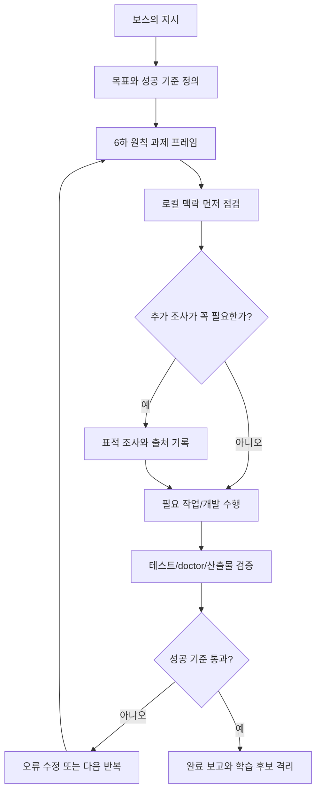

# Paideia 6하 원칙 목표추진 모드

English: [Task Pursuit Mode](task_pursuit_mode.en.md)

Paideia Agent는 사용자의 지시를 받으면 곧바로 답을 내는 챗봇이 아니라, 과제를 먼저 구조화하고 끝까지 추진하는 로컬 AI 인재 런타임입니다. 이 문서는 `paideia-task-pursuit-contract/v1`과 `paideia-task-pursuit-plan/v1`로 구현된 계획/목표추진 모드를 설명합니다.

## 핵심 의도

- 과제를 6하 원칙으로 먼저 잡습니다: 누가, 무엇을, 언제, 어디서, 왜, 어떻게.
- 광범위 검색을 1차 방법으로 삼지 않습니다. 먼저 로컬 문서, 코드, 테스트, 기억 기록을 확인하고, 부족한 사실만 표적 조사합니다.
- 필요한 작업과 개발을 수행하고, 검증이 실패하면 고친 뒤 다시 시도합니다.
- 완료 조건을 만족하거나 명확한 차단 조건이 생길 때까지 반복합니다.
- 실행 경험은 곧바로 기억에 승격하지 않고, 검증과 보스/위원회 검토를 거친 후보로만 남깁니다.

## 실행 흐름



## 코드에서 보이는 위치

- `src/ai22b/talent_foundry/task_pursuit.py`
  - 계약 생성: `build_task_pursuit_contract`
  - 계획 생성: `build_task_pursuit_plan`
  - 검증: `validate_task_pursuit_contract`, `validate_task_pursuit_plan`
- `run-agent`
  - 모든 에이전트 실행 결과에 `task_pursuit_plan`이 포함됩니다.
  - `agent_runtime_status_card.task_pursuit`에서 검증 상태를 확인할 수 있습니다.
- `chat-hired-agent` / `run-agent-program-chat`
  - 채팅 컨텍스트와 채팅 결과에도 `task_pursuit_plan`이 포함됩니다.
  - 라이브 LLM에는 숨은 추론이 아니라 6하 원칙 계획 요약과 검증 가능한 작업 큐만 전달됩니다.
- `onboard` / `onboard-agent`
  - 온보딩 산출물에 `task_pursuit_plan.json`이 생성됩니다.
  - OpenClaw-style 대시보드에는 `Task Pursuit` 카드와 `task_pursuit_plan` 다음 액션이 표시됩니다.

## CLI 사용

```powershell
ai22b-talent-foundry build-task-pursuit-plan `
  --request "로컬 리포트를 만들고 테스트가 통과할 때까지 보완한다." `
  --output .\task_pursuit_plan.json
```

산출물은 네트워크를 호출하지 않으며 다음 항목을 포함합니다.

- `six_w_frame`: 과제의 6하 원칙 프레임
- `necessary_research_plan`: 로컬 우선, 필요한 경우에만 표적 조사하는 정책
- `work_queue`: 계획, 맥락 수집, 실행, 검증, 수정/완료 큐
- `iteration_policy`: 완료 또는 차단까지 반복하는 조건
- `completion_packet_required`: 완료 보고에 필요한 증거 항목

## 폐쇄 성장 철학과의 연결

이 모드는 Paideia의 폐쇄성 철학을 실행 루프에 반영합니다. 외부 자료나 다른 에이전트의 스킬은 참고자료일 뿐이며, Paideia 인재의 방식이 되려면 과제 프레임, 연습, 시험, 피드백, 검증된 업무 경험을 통과해야 합니다. 그래서 이 모드는 `closed_growth_contract`의 `task_pursuit_engine`으로도 등록됩니다.

## 참고 관점

- ReAct는 추론과 행동을 결합해 도구 사용과 계획 갱신을 함께 다루는 관점을 제공합니다.
- Reflexion은 실패 피드백을 언어적 기억으로 남겨 다음 시도에 반영하는 관점을 제공합니다.
- deliberate practice 연구는 전문성이 단순 반복이 아니라 집중된 과제, 피드백, 오류 교정, 점진적 난이도 상승을 통해 형성된다는 관점을 제공합니다.

Paideia는 이 관점들을 그대로 복사하지 않고, 보스가 설계한 교육과 검증 중심의 폐쇄 성장 시스템 안에서 자체 계약으로 구현합니다.
