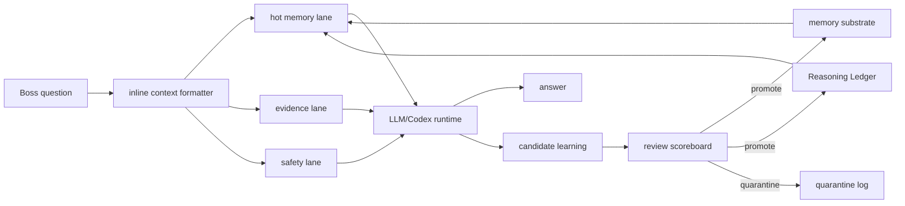

# Tesla식 데이터플로우 기판 벤치마킹 메모

이 문서는 보스가 제안한 "테슬라 AI 칩의 기판/데이터 이동 최적화" 비유를 Paideia Agent의 소프트웨어 구조로 번역한 설계 메모입니다. Tesla의 실제 하드웨어를 복제한다는 뜻이 아니라, 공개 자료에서 확인 가능한 원칙을 **기억기판, Reasoning Ledger, LLM 컨텍스트 패킹, 병렬 episode rollout** 설계에 반영한다는 뜻입니다.

## 확인한 공개 근거

- Tesla AI & Robotics 페이지는 FSD Chip을 "최대 성능/와트"를 짜내기 위한 inference hardware로 설명하고, 코드 기반에서는 throughput, latency, correctness, determinism, memory-efficient low-level code, sensor data sharing을 강조합니다.
- Tesla Hot Chips 31 FSD Computer 발표는 FSD Chip의 Neural Net Accelerator가 96x96 MAC array, 각 NNA 32MB SRAM, data aligner, weight buffer, cache/DMA 구조를 갖고, data sharing, DRAM read/write 제거, SRAM read 최소화, in-place data reuse를 설계 철학으로 삼았음을 보여줍니다.
- Mark Horowitz의 "Computing's Energy Problem" 계열 논의는 범용 연산보다 데이터 이동과 에너지 비용이 병목이 되므로, 목적에 맞는 특화 구조와 데이터 지역성이 중요하다는 배경을 제공합니다.

## Paideia에 반영할 핵심 원칙

| 하드웨어 쪽 원칙 | Paideia 소프트웨어 번역 |
| --- | --- |
| 데이터가 멀리 왕복하지 않게 한다. | 모든 과거 대화와 학습자료를 매번 LLM에 넣지 않고, `memory_substrate`가 필요한 기억, 과목, 시험, dossier, 최근 대화만 가까운 컨텍스트로 고릅니다. |
| 입력을 계산하기 좋은 형태로 먼저 정렬한다. | `context_packer`가 원자료를 바로 프롬프트에 넣지 않고, 출처, 근거, 반례, 현재 질문 의도, 안전 경계를 LLM이 처리하기 쉬운 구조로 정렬합니다. |
| 인접 계산 단위끼리 겹치는 데이터를 공유한다. | 같은 학년, 같은 과목, 같은 실패 유형, 같은 리서치 습관을 graph node로 연결하고, 이웃 노드의 검증된 근거를 재사용합니다. |
| 결과 이동보다 제자리 재사용을 우선한다. | Reasoning Ledger는 긴 사고 전문을 저장하지 않고, 검토 가능한 원칙, 수정된 습관, 실패 회복 규칙만 남겨 다음 작업에서 재사용합니다. |
| main path와 shadow/staging path를 분리한다. | 대화 응답은 즉시 만들되, 학습 승격은 `candidate -> review -> promote/quarantine` 단계로 분리합니다. 검증 전 기억은 본체에 바로 섞지 않습니다. |
| redundancy와 scoreboard가 필요하다. | 공개 저장소 위생 검사, doctor, assessment transcript, dossier review가 학습 승격과 배포 전 점검판 역할을 합니다. |
| batch size one에 최적화한다. | Paideia의 실제 사용자는 보스 한 명의 질문에서 시작하므로, "한 번의 실제 대화"에 필요한 기억을 낮은 지연으로 꺼내는 것을 우선합니다. |

## Memory Board Architecture

Paideia에서 이 비유는 **Memory Board Architecture**로 부릅니다.

## 실제 구현 방향

1. `memory_substrate`는 모든 기록을 한꺼번에 불러오는 창고가 아니라, 현재 질문에 필요한 hot lane을 만드는 기판이어야 합니다.
2. `Reasoning Ledger / Ariadne Thread`는 회로의 배선처럼, 어떤 학습 경험에서 어떤 해결 습관으로 이어졌는지를 검토 가능한 노드와 경로로 남깁니다.
3. `learning_ledger`는 시험, 과제, 업무 결과를 검토한 뒤에만 승격합니다. 이 과정은 shadow register처럼 본 응답 경로와 분리됩니다.
4. `parallel_life_sim`은 같은 성장 체크포인트에서 여러 episode clone을 돌리되, 검증된 요약만 본체에 되돌립니다.
5. Codex는 로컬 파일, 테스트, 브라우징, 검증을 수행하는 실행 관문이고, 연결 LLM은 언어/추론 연산을 맡습니다.

## 주의할 점

- Tesla 하드웨어의 세부 구조를 Paideia가 그대로 구현한다고 주장하지 않습니다.
- FSD Chip은 차량 inference 중심이고, Dojo는 training infrastructure 성격이므로 문서에서는 섞어서 단정하지 않습니다.
- 공개되지 않은 특허/내부 구현, 블로그식 과장 표현은 Paideia의 사실 근거로 쓰지 않습니다.
- 보스의 비유는 제품 설계의 영감으로 사용하고, 실제 구현은 검증 가능한 소프트웨어 구조와 테스트로 확인합니다.

## 참고 링크

- Tesla AI & Robotics: https://www.tesla.com/AI?redirect=no
- Tesla Hot Chips 31 FSD Computer presentation: https://old.hotchips.org/hc31/HC31_2.3_Tesla_Hotchips_ppt_Final_0817.pdf
- Mark Horowitz, Computing's Energy Problem: https://doi.org/10.1109/ISSCC.2014.6757323
