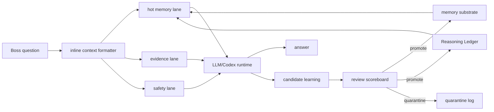

# Tesla-Style Dataflow Board Benchmark

This note translates Boss's Tesla AI-chip board analogy into Paideia Agent software architecture. Paideia does not claim to reproduce Tesla silicon. It borrows public, verifiable systems principles and applies them to the memory substrate, Reasoning Ledger, LLM context packing, and parallel episode rollout.

## Public Basis

- Tesla's AI & Robotics page describes FSD Chip work as inference-hardware work focused on performance per watt. The same page emphasizes throughput, latency, correctness, determinism, memory-efficient low-level code, and sharing high-volume sensor data without starving critical code paths.
- Tesla's Hot Chips 31 FSD Computer presentation describes the Neural Net Accelerator with a 96x96 MAC array, 32MB SRAM per NNA, data aligners, weight buffers, cache/DMA structures, maximum data sharing, reduced SRAM/DRAM activity, minimized data shifting power, and in-place data reuse.
- Mark Horowitz's "Computing's Energy Problem" frames why data movement and energy dominate modern compute design, motivating specialized engines and data locality.

## Paideia Translation

| Hardware Principle | Paideia Software Translation |
| --- | --- |
| Keep data close to compute. | Do not send every past chat or learning file to the LLM. `memory_substrate` selects only the identity, course, exam, dossier, recent dialogue, and evidence records needed for the current question. |
| Format inputs before compute. | A context packer turns raw records into source-aware, evidence-aware, safety-aware prompt slices before the LLM sees them. |
| Share overlapping local data. | Age stages, courses, exam failures, research habits, and work patterns become graph nodes whose neighboring evidence can be reused. |
| Prefer in-place reuse over result movement. | The Reasoning Ledger stores reviewable principles and repaired habits, not hidden chain-of-thought transcripts. |
| Separate main and staging paths. | The chat answer can be produced immediately, while learning updates move through `candidate -> review -> promote/quarantine`. |
| Add redundancy and scoreboards. | Doctor checks, public hygiene audits, assessments, transcript records, and dossier review work as deployment scoreboards. |
| Optimize for batch size one. | Paideia prioritizes low-latency retrieval for one real Boss question, not a generic batch benchmark. |

## Memory Board Architecture

## Implementation Direction

1. `memory_substrate` should act like a board that builds a hot lane for the current question, not a warehouse that dumps all records into the prompt.
2. `Reasoning Ledger / Ariadne Thread` should preserve reviewable routes from learning experiences to problem-solving habits.
3. `learning_ledger` should promote exam, assignment, and work results only after review; unreviewed candidates stay staged.
4. `parallel_life_sim` should roll out multiple episode clones from the same growth checkpoint, then merge only verified summaries back into the main talent.
5. Codex remains the local execution gateway for files, tests, browsing, and verification; the selected LLM provides language and reasoning compute.

## Boundaries

- Paideia does not claim to implement Tesla's proprietary hardware details.
- FSD Chip is an inference system and Dojo is training infrastructure; Paideia keeps those roles distinct.
- Unverified blog claims, patent speculation, and private implementation details are not treated as product evidence.

## Links

- Tesla AI & Robotics: https://www.tesla.com/AI?redirect=no
- Tesla Hot Chips 31 FSD Computer presentation: https://old.hotchips.org/hc31/HC31_2.3_Tesla_Hotchips_ppt_Final_0817.pdf
- Mark Horowitz, Computing's Energy Problem: https://doi.org/10.1109/ISSCC.2014.6757323
